“后台开发”指的是“服务端的网 络程序开

发”，从功能上可以具体描述为 ：服务器收到客户端发来的

请求数据，解析请求数据后处理，最后返回结果


# 	计算机网络


## 输入网址后发生了什么

https://mp.weixin.qq.com/s/I6BLwbIpfGEJnxjDcPXc1A

1.浏览器做的第一步工作是解析 URL

对 `URL` 进行解析之后，浏览器确定了 Web 服务器和文件名，接下来就是根据这些信息来生成 HTTP 请求消息了。

2 真实地址查询 —— DNS 


3 协议栈

通过 DNS 获取到 IP 后，就可以把 HTTP 的传输工作交给操作系统中的**协议栈**。

04 可靠传输 —— TCP 

TCP 传输数据之前，要先三次握手建立连接

TCP 分割数据

TCP 报文生成

05  远程定位 —— IP 

TCP 模块在执行连接、收发、断开等各阶段操作时，都需要委托 IP 模块将数据封装成网络包发送给通信对象。

06 两点传输 —— MAC 

用于两点之间的传输

07 出口 —— 网卡 

08 送别者 —— 交换机 

交换机的设计是将网络包原样转发到目的地。交换机工作在 MAC 层，也称为二层网络设备。


首先浏览器做的第一步工作就是要对 `URL` 进行解析，从而获得发送给 `Web` 服务器的请求信息。

对 `URL` 进行解析之后，浏览器确定了 Web 服务器和文件名，接下来就是根据这些信息来生成 HTTP 请求消息了。

但在发送之前，还有一项工作需要完成，那就是**查询服务器域名对应的 IP 地址**，因为委托操作系统发送消息时，必须提供通信对象的 IP 地址。

首先会先查找浏览器上面的缓存，再查找.host文件的缓存。如果没有会发送一个DNS请求给本地DNS域名服务器。

本地域名服务器收到客户端的请求后，如果缓存里的表格能找到。则它直接返回 IP 地址。如果没有，本地 DNS 会去问它的根域名服务器

根 DNS 收到来自本地 DNS 的请求后，发现后置是 .com。根域名服务器告诉本地域名服务器.com 顶级域名服务器地址。

本地DNS再去问顶级域名服务器，顶级域名服务器地址告诉本地DNS 权威DNS服务器地址，本地DNS再去问 这就拿到了ip地址了

通过 DNS 获取到 IP 后，就可以把 HTTP 的传输工作交给操作系统中的**协议栈**。

接下来就建立TCP的三次握手

TCP 模块在执行连接、收发、断开等各阶段操作时，都需要委托 IP 模块将数据封装成**网络包**发送给通信对象。

生成了 IP 头部之后，接下来网络包还需要在 IP 头部的前面加上 **MAC 头部**。

最后我们需要将**数字信息转换为电信号**，才能在网线上传输

负责执行这一操作的是**网卡**，要控制网卡还需要靠**网卡驱动程序**。

网卡驱动从 IP 模块获取到包之后，会将其**复制**到网卡内的缓存区中，接着会其**开头加上报头和起始帧分界符，在末尾加上用于检测错误的帧校验序列**。

包通过交换机。交换机是将网络包**原样**转发到目的地

网络包经过交换机之后，现在到达了**路由器**，并在此被转发到下一个路由器或目标设备。

数据包抵达服务器后，服务器会先扒开数据包的 MAC 头部，查看是否和服务器自己的 MAC 地址符合，符合就将包收起来。

接着继续扒开数据包的 IP 头，发现 IP 地址符合，根据 IP 头中协议项，知道自己上层是 TCP 协议。

于是，扒开 TCP 的头，里面有序列号，需要看一看这个序列包是不是我想要的，如果是就放入缓存中然后返回一个 ACK，如果不是就丢弃。TCP头部里面还有端口号， HTTP 的服务器正在监听这个端口号。

于是，服务器自然就知道是 HTTP 进程想要这个包，于是就将包发给 HTTP 进程。

最后浏览器获得数据后进行渲染就能呈现出页面出来了


## 为什么DNS用udp

https://www.zhihu.com/question/310145373

采用TCP传输，则域名解析时间为：

DNS域名解析时间 = TCP连接时间 + DNS交易时间

采用UDP传输，则域名解析时间为：

DNS域名解析时间 = DNS交易时间

很显然，采用UDP传输，DNS域名解析时间更小。

在很多时候，用户在访问一些冷门网站时，由于DNS服务器没有冷门网站的解析缓存，需要到域名根服务器、一级域名服务器、二级域名服务器迭代查询，直到查询到冷门网站的权威服务器，这中间可能涉及到多次的查询。

如果使用TCP传输，多几次查询，就多几次TCP连接时间，这多出来的时间不容小觑


## 网络协议为什么分层

(1)各层之间是独立的。某一层并不需要知道它的下一层是如何实现的，而仅仅需要知道该层通过层间的接口所提供的服务。这样，整个问题的复杂程度就下降了。也就是说上一层的工作如何进行并不影响下一层的工作，这样我们在进行每一层的工作[设计](https://www.applysquare.com/fos-cn/design/)时只要保证接口不变可以随意调整层内的工作方式。

(2)灵活性好。当任何一层发生变化时，只要层间接口关系保持不变，则在这层以上或以下各层均不受影响。当某一层出现技术革新或者某一层在工作中出现问题时不会连累到其他层的工作，排除问题时也只需要考虑这一层单独的问题即可。

(3)结构上可分割开。各层都可以采用最合适的技术来实现。技术的发展往往是不对称的，层次化的划分有效避免了木桶效应，不会因为某一方面技术的不完善而影响整体的工作效率。

(4)易于实现和维护。这种结构使得实现和调试一个庞大又复杂的系统变得易于处理，因为整个的系统已被分解为若干个相对独立的子系统。进行调试和维护时，可以对每一层进行单独的调试，避免了出现找不到问题、解决错问题的情况。

(5 能促进标准化工作。因为每一层的功能及其所提供的服务都已有了精确的说明。标准化的好处就是可以随意替换其中的某几层，对于使用和科研来说十分方便。


## TCP粘包

https://juejin.im/post/5b67902f6fb9a04fc67c1a24#comment

TCP 是一个面向字节流的协议，它是性质是流式的，所以它并没有分段。就像水流一样，你没法知道什么时候开始，什么时候结束。


解决：

- 在报文末尾增加换行符表明一条完整的消息，这样在接收端可以根据这个换行符来判断消息是否完整。
- 将消息分为消息头、消息体。可以在消息头中声明消息的长度，根据这个长度来获取报文（比如 808 协议）。
- 规定好报文长度，不足的空位补齐，取的时候按照长度截取即可。

https://mp.weixin.qq.com/s?__biz=MzU5NTAzNjc3Mg==&mid=2247484248&idx=1&sn=d6da8dfb81b73149d6c2b9c0a2e6b3d4&chksm=fe795c53c90ed545ed78376136b12af1124c127ebfbdb3d03358b8514739dd1e54126cae3e78&mpshare=1&scene=1&srcid=0927i9FIXufky4QfACZShI2i&sharer_sharetime=1601216771975&sharer_shareid=7c323ad8a0150d2a639a51a5c8978bfb&key=acec999da27edd257825b74f6aeb1bfaa451205483a76076abbc597c5c80c475da90ed25efd12ae61bedf1a3b9a95d56c628fa4f35086b28e9ab8f35fc6599fa8246356159801ce5725e2f3ae52ca7ca6d73e8f7935cfd775805c101cbdddf76409a6ebe845b381ce548385150b197e51d4ba3c4ba8deaaad6fd71352e62d07d&ascene=1&uin=MjkxNjk0ODI0Mw%3D%3D&devicetype=Windows+10+x64&version=62090529&lang=zh_CN&exportkey=A3lJat8CcGw45LpAnlsW%2FGM%3D&pass_ticket=VppEGP1B0AfJWYqYwdM8pPyMH7m4OryaKADCKmwWeWw0Aqb6p0ZsQHgTfx%2BwvxF%2F&wx_header=0

Nagle 算法是一种通过减少数据包的方式提高 TCP 传输性能的算法[^4]。因为网络 带宽有限，它不会将小的数据块直接发送到目的主机，而是会在本地缓冲区中等待更多待发送的数据，这种批量发送数据的策略虽然会影响实时性和网络延迟，但是能够降低网络拥堵的可能性并减少额外开销。

TCP 协议粘包问题是因为应用层协议开发者的错误设计导致的，他们忽略了 TCP 协议数据传输的核心机制 — 基于字节流，其本身不包含消息、数据包等概念，所有数据的传输都是流式的，需要应用层协议自己设计消息的边界，即消息帧（Message Framing），我们重新回顾一下粘包问题出现的核心原因：

1. TCP 协议是基于字节流的传输层协议，其中不存在消息和数据包的概念；
2. 应用层协议没有使用基于长度或者基于终结符的消息边界，导致多个消息的粘连；

## UDP实现可靠

https://zhuanlan.zhihu.com/p/30770889


**TCP属于是通过增大延迟和传输成本来保证质量的通信方式，UDP是通过牺牲质量来保证时延和成本的通信方式，所以在一些特定场景下RUDP更容易找到这样的平衡点。**RUDP是怎么去找这个平衡点的

可靠的概念

在实时通信过程中，不同的需求场景对可靠的需求是不一样的，我们在这里总体归纳为三类定义：

l **尽力可靠**：通信的接收方要求发送方的数据**尽量完整**到达，但业务本身的数据是可以允许缺失的。例如：音视频数据、幂等性状态数据。

l **无序可靠**：通信的接收方要求发送方的数据**必须完整到达，但可以不管到达先后顺序**。例如：文件传输、白板书写、图形实时绘制数据、日志型追加数据等。

l **有序可靠**：通信接收方要求发送方的数据必须**按顺序完整到达**。

RUDP是根据这三类需求和图1的三角制约关系来确定自己的通信模型和机制的，也就是找通信的平衡点。 

UDP为什么要可靠

TCP是个基于公平性的可靠通信协议，在一些苛刻的网络条件下TCP要么不能提供正常的通信质量保证，要么成本过高。为什么要在UDP之上做可靠保证，究其原因就是在保证通信的时延和质量的条件下尽量降低成本

实现：

重传模式 窗口与拥塞控制

## TCP

https://mp.weixin.qq.com/s/tH8RFmjrveOmgLvk9hmrkw

TCP 是**面向连接的、可靠的、基于字节流**的传输层通信协议。

https://www.jianshu.com/p/65605622234b


### TCP UDP头部


SYN(synchronous)： 发送/同步标志，用来建立连接，和下面的第二个标志位ACK搭配使用。连接开始时，SYN=1，ACK=0，代表连接开始但是未获得响应。当连接被响应的时候，标志位会发生变化，其中ACK会置为1，代表确认收到连接请求，此时的标志位变成了 SYN=1，ACK=1。

ACK(acknowledgement)：确认标志，表示确认收到请求。

PSH(push) ：表示推送操作，就是指数据包到达接收端以后，不对其进行队列处理，而是尽可能的将数据交给应用程序处理；

FIN(finish)：结束标志，用于结束一个TCP会话；

RST(reset)：重置复位标志，用于复位对应的TCP连接。

URG(urgent)：紧急标志，用于保证TCP连接不被中断，并且督促中间层设备尽快处理。


### tcp慢开始，为什么指数级别还叫慢开始

tcp/ip卷一上有说，虽然窗口是指数增加，但是相比于一开始就选择大窗口，仍然较慢

### 三次握手报文丢失问题

https://mp.weixin.qq.com/s/bHZ2_hgNQTKFZpWMCfUH9A

第一次

客户端发起了 SYN 包后，一直没有收到服务端的 ACK ，所以一直超时重传了 5 次，并且每次 RTO 超时时间是不同的：

- 第一次是在 1 秒超时重传
- 第二次是在 3 秒超时重传
- 第三次是在 7 秒超时重传
- 第四次是在 15 秒超时重传
- 第五次是在 31 秒超时重传

可以发现，每次超时时间 RTO 是**指数（翻倍）上涨的**，当超过最大重传次数后，客户端不再发送 SYN 包。

在 Linux 中，第一次握手的 `SYN` 超时重传次数，是如下内核参数指定的：

```
$ cat /proc/sys/net/ipv4/tcp_syn_retries
5
```

`tcp_syn_retries` 默认值为 5，也就是 SYN 最大重传次数是 5 次。


第二次握手丢失

**当第二次握手的 SYN、ACK 丢包时，客户端会超时重发 SYN 包，服务端也会超时重传 SYN、ACK 包。**

第三次

在建立 TCP 连接时，如果第三次握手的 ACK，服务端无法收到，则服务端就会短暂处于`SYN_RECV` 状态，而客户端会处于 `ESTABLISHED` 状态。

由于服务端一直收不到 TCP 第三次握手的 ACK，则会一直重传 SYN、ACK 包，直到重传次数超过 `tcp_synack_retries` 值（默认值 5 次）后，服务端就会断开 TCP 连接。

而客户端则会有两种情况：

- 如果客户端没发送数据包，一直处于 `ESTABLISHED` 状态，然后经过 2 小时 11 分 15 秒才可以发现一个「死亡」连接，于是客户端连接就会断开连接。
- 如果客户端发送了数据包，一直没有收到服务端对该数据包的确认报文，则会一直重传该数据包，直到重传次数超过 `tcp_retries2` 值（默认值 15 次）后，客户端就会断开 TCP 连接。


### 三次握手初始序列号

 RFC 793 [RFC0793]建议使用全局32位ISN生成器
   大约每4微秒增加1。

为了防止序列号猜测攻击

#### TCP序列号预测攻击原理

https://blog.csdn.net/AlimSah/article/details/52725331


建议的初始序号生成算法

   TCP应该使用以下表达式生成其初始序列号：

      ISN = M + F（localip，localport，remoteip，remoteport，密钥）

   其中M是4微秒计时器，而F（）是伪随机
   连接ID的功能（PRF）。F（）绝对不能从
   外面，否则攻击者仍然可以猜测序列号
   从ISN用于其他一些连接。PRF可能是
   实现为的级联的加密哈希
   连接ID和一些秘密数据；MD5 [RFC1321]会很好
   哈希函数的选择。

### 为什么客户端关闭连接前要等待2MSL时间？

原因1：为了保证客户端发送的最后1个连接释放确认报文 能到达服务器，从而使得服务器能正常释放连接

原因2：防止 上文提到的早已失效的连接请求报文 出现在本连接中
 客户端发送了最后1个连接释放请求确认报文后，再经过2`MSL`时间，则可使本连接持续时间内所产生的所有报文段都从网络中消失。

即 在下1个新的连接中就不会出现早已失效的连接请求报文

### 拥塞控制


### 流量控制


死锁


### TCP 快速建立连接

https://mp.weixin.qq.com/s/bHZ2_hgNQTKFZpWMCfUH9A


- 在第一次建立连接的时候，服务端在第二次握手产生一个 `Cookie` （已加密）并通过 SYN、ACK 包一起发给客户端，于是客户端就会缓存这个 `Cookie`，所以第一次发起 HTTP Get 请求的时候，还是需要 2 个 RTT 的时延；
- 在下次请求的时候，客户端在 SYN 包带上 `Cookie` 发给服务端，就提前可以跳过三次握手的过程，因为 `Cookie` 中维护了一些信息，服务端可以从 `Cookie` 获取 TCP 相关的信息，这时发起的 HTTP GET 请求就只需要 1 个 RTT 的时延；


### TCP和UDP区别


UDP不存在发送缓存

因为UDP是不可靠的，它不必保存应用进程数据的一个副本，因此无需一个真正的发送缓冲区。

所以UDP不存在short write

[^这里解释下什么是short write]: 对于一个非阻塞的TCP套接口，如果其发送缓冲区中根本没有空间，输出函数调用将立即返回一个EWOULDBLOCK错误。如果其发送缓冲区中有一些空间，返回值将是内核能够拷贝到该缓冲区中的字节数。这个字节数也称为不足计数(应该就是short write的意思)

https://www.cnblogs.com/wangshaowei/p/10598608.html


### 确保传输可靠性的方式

TCP协议保证数据传输可靠性的方式主要有：

- 校验和
- 序列号**用来解决网络包乱序问题。**

接收方可以去除重复的数据；

接收方可以根据数据包的序列号按序接收；

可以标识发送出去的数据包中， 哪些是已经被对方收到的；

- 确认应答**用来解决不丢包的问题**
- 超时重传
- 连接管理
- 流量控制
- 拥塞控制

### 有一个 IP 的服务器监听了一个端口，它的 TCP 的最大连接数是多少？

服务器通常固定在某个本地端口上监听，等待客户端的连接请求。

因此，客户端 IP 和 端口是可变的，其理论值计算公式如下:


对 IPv4，客户端的 IP 数最多为 `2` 的 `32` 次方，客户端的端口数最多为 `2` 的 `16` 次方，也就是服务端单机最大 TCP 连接数，约为 `2` 的 `48` 次方。

当然，服务端最大并发 TCP 连接数远不能达到理论上限。

- 首先主要是**文件描述符限制**，Socket 都是文件，所以首先要通过 `ulimit` 配置文件描述符的数目；
- 另一个是**内存限制**，每个 TCP 连接都要占用一定内存，操作系统是有限的。

### TCP为什么是三次握手

同步机制需要发送自己的初始化序列号给对方，并且接收对方发送过来的确认信息。连接的两端必须接收对方发送过来的初始序列号并且发回确认信息。

```
    1) A --> B  SYN my sequence number is X
    2) A <-- B  ACK your sequence number is X
    3) A <-- B  SYN my sequence number is Y
    4) A --> B  ACK your sequence number is Y
```

因为第二步和第三步可以合并成一步，所以一般称为三次握手。


*避免历史连接*

客户端连续发送多次 SYN 建立连接的报文，在网络拥堵等情况下：

- 一个「旧 SYN 报文」比「最新的 SYN 」 报文早到达了服务端；
- 那么此时服务端就会回一个 `SYN + ACK` 报文给客户端；
- 客户端收到后可以根据自身的上下文，判断这是一个历史连接（序列号过期或超时），那么客户端就会发送 `RST` 报文给服务端，表示中止这一次连接。

如果是两次握手连接，就不能判断当前连接是否是历史连接，三次握手则可以在客户端（发送方）准备发送第三次报文时，客户端因有足够的上下文来判断当前连接是否是历史连接：

- 如果是历史连接（序列号过期或超时），则第三次握手发送的报文是 `RST` 报文，以此中止历史连接；
- 如果不是历史连接，则第三次发送的报文是 `ACK` 报文，通信双方就会成功建立连接；

*同步双方初始序列号*

序列号在 TCP 连接中占据着非常重要的作用，所以当客户端发送携带「初始序列号」的 `SYN` 报文的时候，需要服务端回一个 `ACK` 应答报文，表示客户端的 SYN 报文已被服务端成功接收，那当服务端发送「初始序列号」给客户端的时候，依然也要得到客户端的应答回应，**这样一来一回，才能确保双方的初始序列号能被可靠的同步。**

*避免资源浪费*

如果客户端的 `SYN` 阻塞了，重复发送多次 `SYN` 报文，那么服务器在收到请求后就会**建立多个冗余的无效链接，造成不必要的资源浪费。**

「四次握手」：三次握手就已经理论上最少可靠连接建立，所以不需要使用更多的通信次数。

### TCP 半连接队列和全连接队列


- 0 ：如果全连接队列满了，那么 server 扔掉 client 发过来的 ack ；
- 1 ：如果全连接队列满了，server 发送一个 `reset` 包给 client，表示废掉这个握手过程和这个连接；

只要服务器没有为请求回复 ACK，请求就会被多次**重发**。如果服务器上的进程只是**短暂的繁忙造成 accept 队列满，那么当 TCP 全连接队列有空位时，再次接收到的请求报文由于含有 ACK，仍然会触发服务器端成功建立连接。**

### 为什么挥手需要四次？

- 关闭连接时，客户端向服务端发送 `FIN` 时，仅仅表示客户端不再发送数据了但是还能接收数据。
- 服务器收到客户端的 `FIN` 报文时，先回一个 `ACK` 应答报文，而服务端可能还有数据需要处理和发送，等服务端不再发送数据时，才发送 `FIN` 报文给客户端来表示同意现在关闭连接。

从上面过程可知，服务端通常需要等待完成数据的发送和处理，所以服务端的 `ACK` 和 `FIN` 一般都会分开发送，从而比三次握手导致多了一次。

### 挥手一定需要四次吗？

假设 client 已经没有数据发送给 server 了，所以它发送 FIN 给 server 表明自己数据发完了，不再发了，如果这时候 server 还是有数据要发送给 client 那么它就是先回复 ack ，然后继续发送数据。

等 server 数据发送完了之后再向 client 发送 FIN 表明它也发完了，然后等 client 的 ACK 这种情况下就会有四次挥手。

那么假设 client 发送 FIN 给 server 的时候 server 也没数据给 client，那么 server 就可以将 ACK 和它的 FIN 一起发给client ，然后等待 client 的 ACK，这样不就三次挥手了？

### 服务器主动中断

当服务器进程被终止时，会关闭其打开的所有文件描述符，此时就会向客户端发送一个**FIN** 的报文,客户端则响应一个**ACK** 报文,但是这样只完成了**“四次挥手”**的前两次挥手，也就是说这样只实现了半关闭，客户端仍然可以向服务器写入数据。
但是当客户端向服务器写入数据时，由于服务器端的套接字进程已经终止，此时连接的状态已经异常了，所以服务端进程不会向客户端发送**ACK** 报文，而是发送了一个**RST** 报文请求将处于异常状态的连接复位； **如果客户端此时还要向服务端发送数据，将诱发服务端TCP向服务端发送SIGPIPE信号，因为向接收到RST的套接口写数据都会收到此信号.** 所以说，这就是为什么我们主动关闭服务端后，用客户端向服务端写数据，还必须是写两次后连接才会关闭的原因。	

### 为什么还需要快速重传机制？

超时重传是按时间来驱动的，如果是网络状况真的不好的情况，超时重传没问题，但是如果网络状况好的时候，只是恰巧丢包了，那等这么长时间就没必要。

于是又引入了数据驱动的重传叫快速重传，什么意思呢？就是发送方如果连续三次收到对方相同的确认号，那么马上重传数据。

因为连续收到三次相同 ACK 证明当前网络状况是 ok 的，那么确认是丢包了，于是立马重发，没必要等这么久。


### TCP Socket 编程

- 服务端和客户端初始化 `socket`，得到文件描述符；
- 服务端调用 `bind`，将绑定在 IP 地址和端口;
- 服务端调用 `listen`，进行监听；
- 服务端调用 `accept`，等待客户端连接；
- 客户端调用 `connect`，向服务器端的地址和端口发起连接请求；
- 服务端 `accept` 返回用于传输的 `socket` 的文件描述符；
- 客户端调用 `write` 写入数据；服务端调用 `read` 读取数据；
- 客户端断开连接时，会调用 `close`，那么服务端 `read` 读取数据的时候，就会读取到了 `EOF`，待处理完数据后，服务端调用 `close`，表示连接关闭。


### TCP、UDP数据包大小的限制

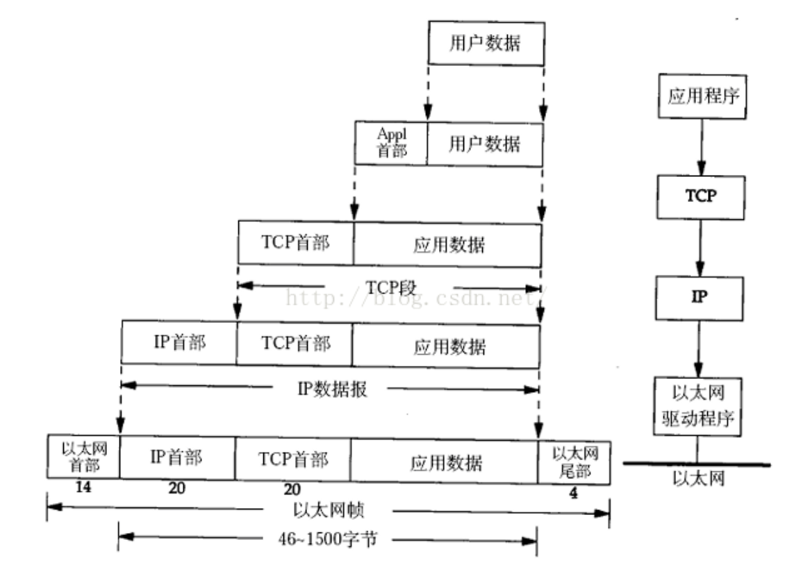

我们从下到上分析一下： 　　
1.在链路层，由以太网的物理特性决定了数据帧的长度为(46＋18)－(1500＋18)，其中的18是数据帧的头和尾，也就是说数据帧的内容最大为1500(不包括帧头和帧尾)，即MTU(Maximum Transmission Unit)为1500； 　
2.在网络层，因为IP包的首部要占用20字节，所以这的MTU为1500－20＝1480；　
3.在传输层，对于UDP包的首部要占用8字节，所以这的MTU为1480－8＝1472； 　　
所以，在应用层，你的Data最大长度为1472。当我们的UDP包中的数据多于MTU(1472)时，发送方的IP层需要分片fragmentation进行传输，而在接收方IP层则需要进行数据报重组，由于UDP是不可靠的传输协议，如果分片丢失导致重组失败，将导致UDP数据包被丢弃。 　　
从上面的分析来看，在普通的局域网环境下，UDP的数据最大为1472字节最好(避免分片重组)。

UDP 包的大小就应该是 1500 - IP头(20) - UDP头(8) = 1472(Bytes)
TCP 包的大小就应该是 1500 - IP头(20) - TCP头(20) = 1460 (Bytes)

### BBR

BBR算法是个主动的闭环反馈系统，通俗来说就是根据带宽和RTT延时来不断动态探索寻找合适的发送速率和发送量。

先说一下链路的buffer，如果发送得会多，buffer的数据也会多，这就需要排队。那这样就会增加RTT的时间。我们可以根据RTT时间的增加来判断现在是否还能发送数据。

那怎么判断最大发送速率，收到的包X接受到的数量就是目前的网络宽带

如果RTT增大证明现在不能够发了，应该减少发送

BBR算法是个主动的闭环反馈系统，通俗来说就是根据带宽和RTT延时来不断动态探索寻找合适的发送速率和发送量。


### 快速重传解决的问题

**每当遇到一次超时重传的时候，都会将下一次超时时间间隔设为先前值的两倍。两次超时，就说明网络环境差，不宜频繁反复发送。**

超时触发重传存在的问题是，超时周期可能相对较长。那是不是可以有更快的方式呢？

于是就可以用「快速重传」机制来解决超时重发的时间等待。

因为我现在连续收到三个包，说明现在网络是好的

但是它依然面临着另外一个问题。就是**重传的时候，是重传之前的一个，还是重传所有的问题。**

还有一种实现重传机制的方式叫：`SACK`（ Selective Acknowledgment 选择性确认）。

这种方式需要在 TCP 头部「选项」字段里加一个 `SACK` 的东西，它**可以将缓存的地图发送给发送方**，这样发送方就可以知道哪些数据收到了，哪些数据没收到，知道了这些信息，就可以**只重传丢失的数据**。

Duplicate SACK 又称 `D-SACK`，其主要**使用了 SACK 来告诉「发送方」有哪些数据被重复接收了。**

`	D-SACK` 有这么几个好处：

1. 可以让「发送方」知道，是发出去的包丢了，还是接收方回应的 ACK 包丢了;
2. 可以知道是不是「发送方」的数据包被网络延迟了;
3. 可以知道网络中是不是把「发送方」的数据包给复制了;

### 糊涂窗口综合症

**如果接收方腾出几个字节并告诉发送方现在有几个字节的窗口，而发送方会义无反顾地发送这几个字节，这就是糊涂窗口综合症**。

要解决糊涂窗口综合症，

- 让接收方不通告小窗口给发送方
- 让发送方避免发送小数据

### 为什么要 TCP，IP 层实现控制不行么？

我举个例子，假如 A 要传输给 F 一个积木，但是无法直接传输到，需要经过 B、C、D、E 这几个中转站之手。这里有两种情况：

- 假设 BCDE 都需要关心这个积木搭错了没，都拆开包裹仔细的看看，没问题了再装回去，最终到了 F 的手中。
- 假设 BCDE 都不关心积木的情况，来啥包裹只管转发就完事了，由最终的 F 自己来检查这个积木答错了没。

你觉得哪种效率高？明显是第二种，转发的设备不需要关心这些事，只管转发就完事！

所以把控制的逻辑独立出来成 TCP 层，让真正的接收端来处理，这样网络整体的传输效率就高了。


### 大量的 TIME_WAIT 状态 TCP 连接

https://jishuin.proginn.com/p/763bfbd29315

https://zhuanlan.zhihu.com/p/40013724   写得好

危害：

- 第一是内存资源占用；
- 第二是对端口资源的占用，一个 TCP 连接至少消耗一个本地端口；

大量的 `TIME_WAIT` 状态 TCP 连接存在，其本质原因是什么？

- 大量的**短连接**存在

解决办法

解决上述 `time_wait` 状态大量存在，导致新连接创建失败的问题，一般解决办法：

1、**客户端**，HTTP 请求的头部，connection 设置为 keep-alive，保持存活一段时间：现在的浏览器，一般都这么进行了 2、**服务器端**，

- 允许 `time_wait` 状态的 socket 被**重用**
- 缩减 `time_wait` 时间，设置为 `1 MSL`（即，2 mins）


解决方案

> ```
> a、修改TIME_WAIT连接状态的上限值
> b、启动快速回收机制
> c、开启复用机制
> d、修改短连接为长连接方式
> ```

快速回收

什么是快速回收机制？既然前面说了TIME_WAIT等待2*MSL时长是有必要的，怎么又可以快速回收了？ 快速回收机制是系统对tcp连接通过一种方式进行快速回收的机制，对应内核参数中的net.ipv4.tcp_tw_recycle，要搞清楚这个参数，就不得不提一下另一个内核参数：net.ipv4.tcp_timestamps

> ```
> net.ipv4.tcp_timestamps是在RFC 1323中定义的一个TCP选项。
> tcp_timestamps的本质是记录数据包的发送时间
> TCP作为可靠的传输协议，一个重要的机制就是超时重传。因此如何计算一个准确(合适)的RTO对于TCP性能有着重要的影响。而tcp_timestamp选项正是*主要*为此而设计的。 
> ```

**当timestamp和tw_recycle两个选项同时开启的情况下，开启per-host的PAWS机制。从而能快速回收处于TIME-WAIT状态的TCP流。**

> PAWS — Protect Againest Wrapped Sequence numbers 目的是解决在高带宽下，TCP序号可能被重复使用而带来的问题。 PAWS同样依赖于timestamp，并且假设在一个TCP流中，按序收到的所有TCP包的timestamp值都是线性递增的。而在正常情况下，每条TCP流按序发送的数据包所带的timestamp值也确实是线性增加的。 如果针对per-host的使用PAWS中的机制，则会解决TIME-WAIT中考虑的上一个流的数据包在下一条流中被当做有效数据包的情况，这样就没有必要等待2*MSL来结束TIME-WAIT了。只要等待足够的RTO，解决好需要重传最后一个ACK的情况就可以了。因此Linux就实现了这样一种机制： 当timestamp和tw_recycle两个选项同时开启的情况下，开启per-host的PAWS机制。从而能快速回收处于TIME-WAIT状态的TCP流。

重用机制

```
net.ipv4.tcp_tw_reuse = 1
```

如果能保证以下任意一点，一个TW状态的四元组(即一个socket连接)可以重新被新到来的SYN连接使用：

1. 初始序列号比TW老连接的末序列号大
2. 如果使能了时间戳，那么新到来的连接的时间戳比老连接的时间戳大

如何理解这2个条件？

> 既然TIME_WAIT不是为了阻止新连接，那么只要能证明自己确实属于新连接而不是老连接的残留数据，那么该连接即使匹配到了TIME_WAIT的四元组也是可以接受的，即可以重用TIME_WAIT的连接。如何来保证呢？很简单，只需要把老的数据丢在窗口外即可。为此，只要新连接的初始序列号比老连接的FIN包末尾序列号大，那么老连接的所有数据即使迟到也会落在窗口之外，从而不会破坏新建连接！ 即使不使用序列号，还是可以使用时间戳，因为TCP/IP规范规定IP地址要是唯一的，根据这个唯一性，欲重用TIME_WAIT连接的新连接的必然发自同一台机器，而机器时间是单调递增不能倒流的，因此只要新连接带有时间戳且其值比老连接FIN时的时间戳大，就认为该新连接是可以接受的，时间戳重用TW连接的机制的前提是IP地址唯一性导出的发起自同一台机器，那么不满足该前提的则不能基于此来重用TIME_WAIT连接，因此NAT环境不能这么做遍成了自然而然的结论。

所以我给出的建议是**服务端不要主动关闭，把主动关闭方放到客户端**。毕竟咱们服务器是一对很多很多服务，我们的资源比较宝贵。

### SYN Cookies

> 在最常见的SYN Flood攻击中，攻击者在短时间内发送大量的TCP SYN包给受害者。受害者(服务器)为每个TCP SYN包分配一个特定的数据区，只要这些SYN包具有不同的源地址(攻击者很容易伪造)。这将给TCP服务器造成很大的系统负担，最终导致系统不能正常工作。

>  SYN Cookie是对TCP服务器端的三次握手做一些修改，专门用来防范SYN Flood攻击的一种手段。它的原理是，在TCP服务器接收到TCP SYN包并返回TCP SYN + ACK包时，**不分配一个专门的数据区，而是根据这个SYN包计算出一个cookie值**。这个cookie作为将要返回的SYN ACK包的初始序列号。当[客户端]()返回一个ACK包时，根据包头信息计算cookie，与返回的确认序列号(初始序列号 + 1)进行对比，如果相同，则是一个正常连接，然后，分配资源，建立连接。
>
> cookie的计算：服务器收到一个SYN包，计算一个消息摘要mac。

作者：OFFER—PLSxD
链接：https://www.nowcoder.com/discuss/530380?type=2&channel=1009&source_id=discuss_terminal_discuss_hot
来源：牛客网


### tcp 异常

试图与一个不存在的端口建立连接

> 这符合触发发送RST分节的条件，目的为某端口的SYN分节到达，而端口没有监听，那么内核会立即响应一个RST，表示出错。[客户端]()TCP收到这个RST之后则放弃这次连接的建立，并且返回给应用程序一个错误。正如上面所说的，建立连接的过程对应用程序来说是不可见的，这是操作系统帮我们来完成的，所以即使进程没有启动，也可以响应[客户端]()。

试图与一个不存在的主机上面的某端口建立连接

> 这也是一种比较常见的情况，当某台服务器主机宕机了，而[客户端]()并不知道，仍然尝试去与其建立连接。根据上面的经验，这次主机已经处于未启动状态，操作系统也帮不上忙了，那么也就是连RST也不能响应给[客户端]()，此时服务器端是一种完全没有响应的状态。那么此时[客户端]()的TCP会怎么办呢？据书上介绍，如果[客户端]()TCP没有得到任何响应，那么等待6s之后再发一个SYN，若无响应则等待24s再发一个，若总共等待了75s后仍未收到响应就会返回ETIMEDOUT错误。这是TCP建立连接自己的一个保护机制，但是我们要等待75s才能知道这个连接无法建立，对于我们所有服务来说都太长了。更好的做法是在代码中给connect设置一个超时时间，使它变成我们可控的，让等待时间在毫秒级还是可以接收的。

Server进程被阻塞

> 由于某些情况，服务器端进程无法响应任何请求，比如所在主机的硬盘满了，导致进程处于完全阻塞，通常我们测试时会用gdb模拟这种情况。上面提到过，建立连接的过程对应用程序是不可见的，那么，这时连接可以正常建立。当然，[客户端]()进程也可以通过这个连接给服务器端发送请求，服务器端TCP会应答ACK表示已经收到这个分节（这里的收到指的是数据已经在内核的缓冲区里准备好，由于进程被阻塞，无法将数据从内核的缓冲区复制到应用程序的缓冲区），但永远不会返回结果。

我们杀死server

>  这是线上最常见的操作，当一个模块上线时，OP同学总是会先把旧的进程杀死，然后再启动新的进程。那么在这个过程中TCP连接发生了什么呢。在进程正常退出时会自动调用close函数来关闭它所打开的文件描述符，这相当于服务器端来主动关闭连接——会发送一个FIN分节给[客户端]()TCP；[客户端]()要做的就是配合对端关闭连接，TCP会自动响应一个ACK，然后再由[客户端]()应用程序调用close函数，也就是我们上面所描述的关闭连接的4次挥手过程。接下来，[客户端]()还需要定时去重连，以便当服务器端进程重新启动好时[客户端]()能够继续与之通信。

>  当然，我们要保证[客户端]()随时都可以响应服务器端的断开连接请求，就必须不能让[客户端]()进程再任何时刻阻塞在任何其他的输入上面。比如，书上给的例子是[客户端]()进程会阻塞在标准输入上面，这时如果服务器端主动断开连接，显然[客户端]()不能立刻响应，因为它还在识图从标准输入读一段文本……当然这在实际中很少遇到，如果有多输入源这种情况的话开通通常会用类似select功能的函数来处理，可以同时监控多个输入源是否准备就绪，可以避免上述所说的不能立即响应对端关闭连接的情况。

Server进程所在的主机关机

> 实际上这种情况不会带来什么更坏的后果。在系统关闭时，init进程会给所有进程发送SIGTERM信号，等待一段时间（5~20秒），然后再给所有仍在运行的进程发送SIGKILL信号。当服务器进程死掉时，会关闭所有文件描述符。带来的影响和上面杀死server相同。

Server进程所在的主机宕机

>  这是我们线上另一种比较常见的状况。即使宕机是一个小概率事件，线上几千台服务器动不动一两台挂掉也是常有的事。主机崩溃不会像关机那样会预先杀死上面的进程，而是突然性的。那么此时我们的[客户端]()准备给服务器端发送一个请求，它由write写入内核，由TCP作为一个分节发出，随后客户阻塞于read的调用（等待接收结果）。对端TCP显然不会响应这个分节，因为主机已经挂掉，于是[客户端]()TCP持续重传分节，试图从服务器上接收一个ACK，然而服务器始终不能应答，重传数次之后，大约4~10分钟才停止，之后返回一个ETIMEDOUT错误。

> 这样尽管最后还是知道对方不可达，但是很多时候我们希望比等待4~10分钟更快的知道这个结果。可以为read设置一个超时时间，就得到了一个较好的解决方法。但是这样还是需要等待一个超时时间，事实上TCP为我们提供了更好的方法，用SO_KEEPALIVE的套接字选项——相当于心跳包，每隔一段时间给对方发送一个心跳包，当对方没有响应时会一更短的时间间隔发送，一段时间后仍然无响应的话就断开这个连接。

服务器进程所在的主机宕机后重启

>  在[客户端]()发出请求前，服务器端主机经历了宕机——重启的过程。当[客户端]()TCP把分节发送到服务器端所在的主机，服务器端所在主机的TCP丢失了崩溃前所有连接信息，即TCP收到了一个根本不存在连接上的分节，所以会响应一个RST分节。如果开发的代码足够健壮的话会试图重新建立连接，或者把这个请求转发给其他服务器。
>
> 当TCP连接的进程在忘记关闭Socket而退出、程序崩溃、或非正常方式结束进程的情况下（Windows[客户端]()），会导致TCP连接的对端进程产生“104: Connection reset by peer”（Linux下）或“10054: An existing connection was forcibly closed by the remote host”（Windows下）错误
>
> 当TCP连接的进程机器发生死机、系统突然重启、网线松动或网络不通等情况下，连接的对端进程可能检测不到任何异常，并最后等待“超时”才断开TCP连接
>
> 当TCP连接的进程正常关闭Socket时，对端进程在检查到TCP关闭事件之前仍然向TCP发送消息，则在Send消息时会产生“32: Broken pipe”（Linux下）或“10053: An established connection was aborted by the software in your host machine”（Windows下）错误
>
> 当TCP连接的对端进程已经关闭了Socket的情况下，本端进程再发送数据时，第一包可以发送成功（但会导致对端发送一个RST包过来）：
> 之后如果再继续发送数据会失败，错误码为“10053: An established connection was aborted by the software in your host machine”（Windows下）或“32: Broken pipe，同时收到SIGPIPE信号”（Linux下）错误；
> 之后如果接收数据，则Windows下会报10053的错误，而Linux下则收到正常关闭消息
>
> TCP连接的本端接收缓冲区中还有未接收数据的情况下close了Socket，则本端TCP会向对端发送RST包，而不是正常的FIN包，这就会导致对端进程提前（RST包比正常数据包先被收到）收到“10054: An existing connection was forcibly closed by the remote host”（Windows下）或“104: Connection reset by peer”（Linux下）错误

## http的理解

https://mp.weixin.qq.com/s/amOya0M00LwpL5kCS96Y6w

（http好文）

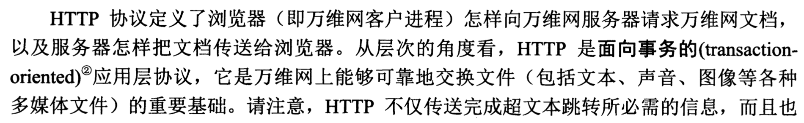


## HTTP 优缺点

优点

*1. 简单*

HTTP 基本的报文格式就是 `header + body`，头部信息也是 `key-value` 简单文本的形式，**易于理解**，降低了学习和使用的门槛。

*2. 灵活和易于扩展*

HTTP协议里的各类请求方法、URI/URL、状态码、头字段等每个组成要求都没有被固定死，都允许开发人员**自定义和扩充**。

同时 HTTP 由于是工作在应用层（ `OSI` 第七层），则它**下层可以随意变化**。

HTTPS 也就是在 HTTP 与 TCP 层之间增加了 SSL/TLS 安全传输层，HTTP/3 甚至把 TCPP 层换成了基于 UDP 的 QUIC。

*3. 应用广泛和跨平台*

互联网发展至今，HTTP 的应用范围非常的广泛，从台式机的浏览器到手机上的各种 APP，从看新闻、刷贴吧到购物、理财、吃鸡，HTTP 的应用**片地开花**，同时天然具有**跨平台**的优越性。

缺点

*1. 无状态双刃剑*

无状态的**好处**，因为服务器不会去记忆 HTTP 的状态，所以不需要额外的资源来记录状态信息，这能减轻服务器的负担，能够把更多的 CPU 和内存用来对外提供服务。

无状态的**坏处**，既然服务器没有记忆能力，它在完成有关联性的操作时会非常麻烦。

*2. 明文传输双刃剑*

明文意味着在传输过程中的信息，是可方便阅读的，通过浏览器的 F12 控制台或 Wireshark 抓包都可以直接肉眼查看，为我们调试工作带了极大的便利性。

但是这正是这样，HTTP 的所有信息都暴露在了光天化日下，相当于**信息裸奔**。在传输的漫长的过程中，信息的内容都毫无隐私可言，很容易就能被窃取，如果里面有你的账号密码信息，那**你号没了**。

*3. 不安全*

HTTP 比较严重的缺点就是不安全：

- 通信使用明文（不加密），内容可能会被窃听。比如，**账号信息容易泄漏，那你号没了。**
- 不验证通信方的身份，因此有可能遭遇伪装。比如，**访问假的淘宝、拼多多，那你钱没了。**
- 无法证明报文的完整性，所以有可能已遭篡改。比如，**网页上植入垃圾广告，视觉污染，眼没了。**

> ## HTTP 与 HTTPS 有哪些区别？

1. HTTP 是超文本传输协议，信息是明文传输，存在安全风险的问题。HTTPS 则解决 HTTP 不安全的缺陷，在 TCP 和 HTTP 网络层之间加入了 SSL/TLS 安全协议，使得报文能够加密传输。
2. HTTP 连接建立相对简单， TCP 三次握手之后便可进行 HTTP 的报文传输。而 HTTPS 在 TCP 三次握手之后，还需进行 SSL/TLS 的握手过程，才可进入加密报文传输。
3. HTTP 的端口号是 80，HTTPS 的端口号是 443。
4. HTTPS 协议需要向 CA（证书权威机构）申请数字证书，来保证服务器的身份是可信的。

## https过程

https://mp.weixin.qq.com/s/amOya0M00LwpL5kCS96Y6w

https://mp.weixin.qq.com/s/21JaXwdfSjItj5SgOwhapg


1. 用户在浏览器发起HTTPS请求（如 https://www.mogu.com/），默认使用服务端的443端口进行连接；
2. HTTPS需要使用一套**CA数字证书**，证书内会附带一个**公钥Pub**，而与之对应的**私钥Private**保留在服务端不公开；
3. 服务端收到请求，返回配置好的包含**公钥Pub**的证书给客户端；
4. 客户端收到**证书**，校验合法性，主要包括是否在有效期内、证书的域名与请求的域名是否匹配，上一级证书是否有效（递归判断，直到判断到系统内置或浏览器配置好的根证书），如果不通过，则显示HTTPS警告信息，如果通过则继续；
5. 客户端生成一个用于对称加密的**随机Key**，并用证书内的**公钥Pub**进行加密，发送给服务端；
6. 服务端收到**随机Key**的密文，使用与**公钥Pub**配对的**私钥Private**进行解密，得到客户端真正想发送的**随机Key**；
7. 服务端使用客户端发送过来的**随机Key**对要传输的HTTP数据进行对称加密，将密文返回客户端；
8. 客户端使用**随机Key**对称解密密文，得到HTTP数据明文；
9. 后续HTTPS请求使用之前交换好的**随机Key**进行对称加解密。


### 怎么保证证书有效

私钥除了解密外的真正用途其实还有一个，就是**数字签名**，其实就是一种防伪技术，只要有人篡改了证书，那么数字签名必然校验失败。具体过程如下

1. CA机构拥有自己的一对公钥和私钥
2. CA机构在颁发证书时对证书明文信息进行哈希
3. 将哈希值用私钥进行**加签**，得到数字签名

##### 明文数据和数字签名组成证书，传递给客户端。

1. 客户端得到证书，分解成明文部分Text和数字签名Sig1
2. 用CA机构的公钥进行**解签**，得到Sig2（由于CA机构是一种公信身份，因此在系统或浏览器中会内置CA机构的证书和公钥信息）
3. 用证书里声明的哈希算法对明文Text部分进行哈希得到H
4. 当自己计算得到的哈希值T与**解签**后的Sig2**相等**，表示证书可信，**没有被篡改**


验证过程

https://www.cnblogs.com/handsomeBoys/p/6556336.html

https://blog.csdn.net/baidu_36649389/article/details/53240579

**1，数字证书有效期验证**

   **就是说证书的使用时\**间要在起始时间\**和结束时间之内。通过解析证书很容易得到证书的有效期**

**2，根证书验证**

   **先来理解一下什么是根证书？** 根证书已经在浏览器中

   **普通的证书一般包括三部分：用户信息，用户公钥，以及CA签名** 

   **那么我们要验证这张证书就需要验证CA签名的真伪。那么就需要CA公钥。而CA公钥存在于另外一张证书（称这张证书是对普通证书签名的证书）中。因此我们又需要验证这另外一张证书的真伪。因此又需要验证另另外证书（称这张证书是对另外一张证书签名的证书）的真伪。依次往下回溯，就得到一条证书链。那么这张证书链从哪里结束呢？就是在根证书结束（即验证到根证书结束）。根证书是个很特别的证书，它是CA中心自己给自己签名的证书（即这张证书是用CA公钥对这张证书进行签名）。信任这张证书，就代表信任这张证书下的证书链。**

  **所有用户在使用自己的证书之前必须先下载根证书。**

  **所谓根证书验证就是：用根证书公钥来验证该证书的颁发者签名。所以首先必须要有根证书，并且根证书必须在受信任的证书列表（即信任域）**


 读取证书中的相关的明文信息，采用相同的散列函数计算得到信息摘要，然后，利用对应 CA 的公钥解密签名数据，对比证书的信息摘要，如果一致，则可以确认证书的合法性，即公钥合法；

客户端然后验证证书相关的域名信息、有效时间等信息；

证书包含以下信息：申请者公钥、申请者的组织信息和个人信息、签发机构 CA 的信息、有效时间、证书序列号等信息的明文，同时包含一个签名；

签名的产生算法：首先，使用散列函数计算公开的明文信息的信息摘要，然后，采用 CA 的私钥对信息摘要进行加密，密文即签名；


## HTTP格式

请求


响应


## HTTP 与 HTTPS 的区别

https://juejin.im/entry/58d7635e5c497d0057fae036

 1、https协议需要到ca申请证书，一般免费证书较少，因而需要一定费用。

 2、http是超文本传输协议，信息是明文传输，https则是具有安全性的ssl加密传输协议。

 3、http和https使用的是完全不同的连接方式，用的端口也不一样，前者是80，后者是443。

 4、http的连接很简单，是无状态的；HTTPS协议是由SSL+HTTP协议构建的可进行加密传输、身份认证的网络协议，比http协议安全。

## HTTP中Get与Post的区别

　**1**.根据HTTP规范，GET用于信息获取，而且应该是安全的和幂等的。

​	**2**.根据HTTP规范，POST表示可能修改变服务器上的资源的请求。

HTTP 并未规定不可以 GET 中发送 Body 内容，但却不少知名的工具不能用 GET 发送 Body 数据，所以大致的讲我们仍然不推荐使用 GET 携带 Body 内容，还有可能某些应用服务器也会忽略掉 GET 的 Body 数据

## HTTP1.0、HTTP1.1、HTTP2.0的关系和区别

https://mp.weixin.qq.com/s/bUy220-ect00N4gnO0697A


HTTP/1.1 相比 HTTP/1.0 性能上的改进：

- 使用 TCP 长连接的方式改善了 HTTP/1.0 短连接造成的性能开销。
- 支持 管道（pipeline）网络传输，只要第一个请求发出去了，不必等其回来，就可以发第二个请求出去，可以减少整体的响应时间。

但 HTTP/1.1 还是有性能瓶颈：

- 请求 / 响应头部（Header）未经压缩就发送，首部信息越多延迟越大。只能压缩 `Body` 的部分；
- 发送冗长的首部。每次互相发送相同的首部造成的浪费较多；
- 服务器是按请求的顺序响应的，如果服务器响应慢，会招致客户端一直请求不到数据，也就是队头阻塞；
- 没有请求优先级控制；
- 请求只能从客户端开始，服务器只能被动响应。

那 HTTP/2 相比 HTTP/1.1 性能上的改进：

*1. 头部压缩*

HTTP/2 会**压缩头**（Header）如果你同时发出多个请求，他们的头是一样的或是相似的，那么，协议会帮你**消除重复的分**。

这就是所谓的 `HPACK` 算法：在客户端和服务器同时维护一张头信息表，所有字段都会存入这个表，生成一个索引号，以后就不发送同样字段了，只发送索引号，这样就**提高速度**了。

*2. 二进制格式*

HTTP/2 不再像 HTTP/1.1 里的纯文本形式的报文，而是全面采用了**二进制格式。**

头信息和数据体都是二进制，并且统称为帧（frame）：**头信息帧和数据帧**。

报文区别

这样虽然对人不友好，但是对计算机非常友好，因为计算机只懂二进制，那么收到报文后，无需再将明文的报文转成二进制，而是直接解析二进制报文，这**增加了数据传输的效率**。

*3. 数据流*

HTTP/2 的数据包不是按顺序发送的，同一个连接里面连续的数据包，可能属于不同的回应。因此，必须要对数据包做标记，指出它属于哪个回应。

每个请求或回应的所有数据包，称为一个数据流（`Stream`）。

每个数据流都标记着一个独一无二的编号，其中规定客户端发出的数据流编号为奇数， 服务器发出的数据流编号为偶数

客户端还可以**指定数据流的优先级**。优先级高的请求，服务器就先响应该请求。


> *数据流*
>
> http://www.blogjava.net/yongboy/archive/2015/03/19/423611.html

*4. 多路复用*

HTTP/2 是可以在**一个连接中并发多个请求或回应，而不用按照顺序一一对应**。

移除了 HTTP/1.1 中的串行请求，不需要排队等待，也就不会再出现「队头阻塞」问题，**降低了延迟，大幅度提高了连接的利用率**。

举例来说，在一个 TCP 连接里，服务器收到了客户端 A 和 B 的两个请求，如果发现 A 处理过程非常耗时，于是就回应 A 请求已经处理好的部分，接着回应 B 请求，完成后，再回应 A 请求剩下的部分。

多路复用

*5. 服务器推送*

HTTP/2 还在一定程度上改善了传统的「请求 - 应答」工作模式，服务不再是被动地响应，也可以**主动**向客户端发送消息。

举例来说，在浏览器刚请求 HTML 的时候，就提前把可能会用到的 JS、CSS 文件等静态资源主动发给客户端，**减少延时的等待**，也就是服务器推送（Server Push，也叫 Cache Push）。

## [解析HTTP请求报文](https://segmentfault.com/a/1190000007403846)

https://segmentfault.com/a/1190000007403846

### 解析思想

遍历recv接受到的请求字符串，检查是否遇到回车符**r**判断一行数据。

对于起始行，检查是否遇到空格分隔不同的字段；对于首部，检查是否遇到冒号分隔键值对的字段值；对于实体的主体部分，则先判断是否遇到CRLF字符串，然后将剩余内容全部作为实体的主体部分。

返回值是告知程序下一次遍历的起始位置。

如果遇到非法请求行则返回400的响应。

## http劫持

https://juejin.im/post/6844903991764058126#comment

## HTTP缓存机制及原理

https://juejin.im/post/6844903801778864136

1、对于强制缓存，服务器通知浏览器一个缓存时间，在缓存时间内，下次请求，直接用缓存，不在时间内，执行比较缓存策略。

2、对于比较缓存，将缓存信息中的Etag和Last-Modified通过请求发送给服务器，由服务器校验，返回304状态码时，浏览器直接使用缓存。

总结流程图如下所示：


验证是否能使用缓存（`协商缓存策略`）主要有两种方式：

1、`Last-Modified` ：最后一次修改时间

2、`Etag`: 数据签名

配合`If-Match`或者`If-Non-Match`使用 对比资源的签名判断是否使用缓存 `ETag`也是首次请求的时候


## 为什么帧最小要64字节


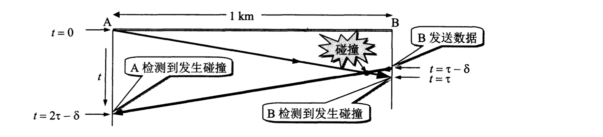

因为需要冲突检测	 

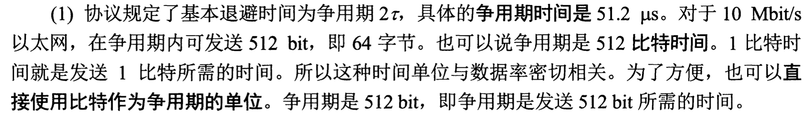

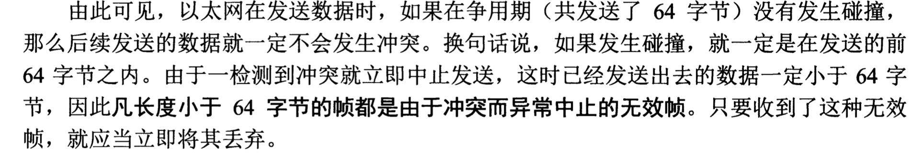

## MTU最大传输单元

https://developer.aliyun.com/article/222535

其实一个标准的以太网数据帧大小是：`1518`，头信息有14字节，尾部校验和FCS占了4字节，所以真正留给上层协议传输数据的大小就是：1518 - 14 - 4 = 1500

太大会一直占用发送端口，导致其他数据不能及时发送

又因为最小的64字节，数据链路层占用18字节，所以Ip层是64-1500字节

## 正向代理和反向代理的区别

就看HTTP请求的访问域名，是不是指向代理服务器。指向代理服务器时，就是反向代理，否则就是正向代理。

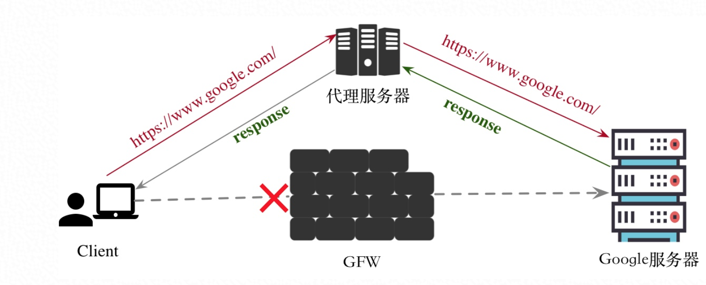

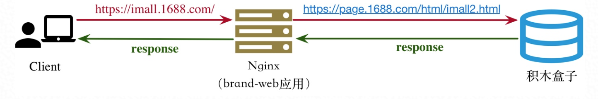

## 负载均衡算法

权重法（weight轮询）

给集群中的每台机器设置权重值weight，按照请求访问的时间顺序，指定一台机器访问。当某台机器宕机，自动剔除，不再给其分配请求，避免用户访问受到影响。weight越大，被分配的概率越高。

这种方式的缺点很明显：机械的根据权重分配请求，无法考虑每台机器的load情况，容易导致热点不均衡，旱的旱死，涝的涝死。

IP Hash法：根据请求IP的Hash值分配机器

缺点同权重法，无法智能感知每台机器的负载情况。
优点也很明显：解决动态网页存在的session连接问题。

- fair：第三方工具，相比于前两者，考虑响应时间、页面大小智能做负载均衡。
- url hash法：按照请求url的hash值分配机器，可有效利用缓存。

## WebSocket

https://zhuanlan.zhihu.com/p/161661750

首先 WebSocket 是基于 HTTP 协议的，或者说借用了 HTTP 协议来完成一部分握手。

首先我们来看个典型的 WebSocket 握手

```text
GET /chat HTTP/1.1
Host: server.example.com
Upgrade: websocket
Connection: Upgrade
Sec-WebSocket-Key: x3JJHMbDL1EzLkh9GBhXDw==
Sec-WebSocket-Protocol: chat, superchat
Sec-WebSocket-Version: 13
Origin: http://example.com
```

熟悉 HTTP 的童鞋可能发现了，这段类似 HTTP 协议的握手请求中，多了这么几个东西。

```text
Upgrade: websocket
Connection: Upgrade
```

这个就是 WebSocket 的核心了，告诉 Apache 、 Nginx 等服务器：注意啦，我发起的请求要用 WebSocket 协议，快点帮我找到对应的助理处理~而不是那个老土的 HTTP。

```text
Sec-WebSocket-Key: x3JJHMbDL1EzLkh9GBhXDw==
Sec-WebSocket-Protocol: chat, superchat
Sec-WebSocket-Version: 13
```

首先， Sec-WebSocket-Key 是一个 Base64 encode 的值，这个是浏览器随机生成的，告诉服务器：泥煤，不要忽悠我，我要验证你是不是真的是 WebSocket 助理。

然后， Sec_WebSocket-Protocol 是一个用户定义的字符串，用来区分同 URL 下，不同的服务所需要的协议。简单理解：今晚我要服务A，别搞错啦~

最后， Sec-WebSocket-Version 是告诉服务器所使用的 WebSocket Draft （协议版本），在最初的时候，WebSocket 协议还在 Draft 阶段，各种奇奇怪怪的协议都有，而且还有很多期奇奇怪怪不同的东西，什么 Firefox 和 Chrome 用的不是一个版本之类的，当初 WebSocket 协议太多可是一个大难题。。不过现在还好，已经定下来啦~大家都使用同一个版本：服务员，我要的是13岁的噢→_→

然后服务器会返回下列东西，表示已经接受到请求， 成功建立 WebSocket 啦！

```text
HTTP/1.1 101 Switching Protocols
Upgrade: websocket
Connection: Upgrade
Sec-WebSocket-Accept: HSmrc0sMlYUkAGmm5OPpG2HaGWk=
Sec-WebSocket-Protocol: chat
```

这里开始就是 HTTP 最后负责的区域了，告诉客户，我已经成功切换协议啦~

```text
Upgrade: websocket
Connection: Upgrade
```

依然是固定的，告诉客户端即将升级的是 WebSocket 协议，而不是 mozillasocket，lurnarsocket 或者 shitsocket。

然后， Sec-WebSocket-Accept 这个则是经过服务器确认，并且加密过后的 Sec-WebSocket-Key 。服务器：好啦好啦，知道啦，给你看我的 ID CARD 来证明行了吧。

后面的， Sec-WebSocket-Protocol 则是表示最终使用的协议。

至此，HTTP 已经完成它所有工作了，接下来就是完全按照 WebSocket 协议进行了。

## ping工作原理

**1）**假设有两个主机，主机A（192.168.0.1）和主机B（192.168.0.2），现在我们要监测主机A和主机B之间网络是否可达，那么我们在主机A上输入命令：ping 192.168.0.2；

**2）**此时，ping命令会在主机A上构建一个 ICMP的请求数据包（数据包里的内容后面再详述），然后 ICMP协议会将这个数据包以及目标IP（192.168.0.2）等信息一同交给IP层协议；

**3）**IP层协议得到这些信息后，将源地址（即本机IP）、目标地址（即目标IP：192.168.0.2）、再加上一些其它的控制信息，构建成一个IP数据包；

**4）**IP数据包构建完成后，还不够，还需要加上MAC地址，因此，还需要通过ARP映射表找出目标IP所对应的MAC地址。当拿到了目标主机的MAC地址和本机MAC后，一并交给数据链路层，组装成一个数据帧，依据以太网的介质访问规则，将它们传送出出去；

**5）**当主机B收到这个数据帧之后，会首先检查它的目标MAC地址是不是本机，如果是就接收下来处理，接收之后会检查这个数据帧，将数据帧中的IP数据包取出来，交给本机的IP层协议，然后IP层协议检查完之后，再将ICMP数据包取出来交给ICMP协议处理，当这一步也处理完成之后，就会构建一个ICMP应答数据包，回发给主机A；

**6）**在一定的时间内，如果主机A收到了应答包，则说明它与主机B之间网络可达，如果没有收到，则说明网络不可达。除了监测是否可达以外，还可以利用应答时间和发起时间之间的差值，计算出数据包的延迟耗时。

## 线程同步机制

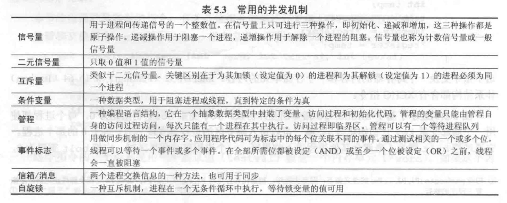

3. #用信号量实现阻塞队列)

## SYN Flood

TCP首包丢弃方案，利用TCP协议的重传机制识别正常用户和攻击报文。当防御设备接到一个IP地址的SYN报文后，简单比对该IP是否存在于白名单中，存在则转发到后端。如不存在于白名单中，检查是否是该IP在一定时间段内的首次SYN报文，不是则检查是否重传报文，是重传则转发并加入白名单，不是则丢弃并加入黑名单。是首次SYN报文则丢弃并等待一段时间以试图接受该IP的SYN重传报文，等待超时则判定为攻击报文加入黑名单。

作者：知乎用户
链接：https://www.zhihu.com/question/26741164/answer/52776074
来源：知乎
著作权归作者所有。商业转载请联系作者获得授权，非商业转载请注明出处。

**黑名单**

面对火锅店里面的流氓，我一怒之下将他们拍照入档，并禁止他们踏入店铺，但是有的时候遇到长得像的人也会禁止他进入店铺。这个就是设置黑名单，此方法秉承的就是“错杀一千，也不放一百”的原则，会封锁正常流量，影响到正常业务。

**DDoS 清洗**

DDos 清洗，就是我发现客人进店几分钟以后，但是一直不点餐，我就把他踢出店里。

DDoS 清洗会对用户请求数据进行实时监控，及时发现DOS攻击等异常流量，在不影响正常业务开展的情况下清洗掉这些异常流量。

**[CDN 加速](https://link.zhihu.com/?target=https%3A//www.upyun.com/products/cdn%3Futm_source%3Dzhihu%26utm_medium%3Dreferral%26utm_campaign%3D386244476%26utm_term%3Dddos)**

CDN 加速，我们可以这么理解：为了减少流氓骚扰，我干脆将火锅店开到了线上，承接外卖服务，这样流氓找不到店在哪里，也耍不来流氓了。


作者：又拍云
链接：https://www.zhihu.com/question/22259175/answer/386244476
来源：知乎
著作权归作者所有。商业转载请联系作者获得授权，非商业转载请注明出处。

## 使用UDP发送大文件，需要注意什么？

1. 需要在客户端对发送的我呢见进行编码
2. 服务端接收到发送的数据后根据客户端的数据编码进行排序
3. 发送数据时采用较小的数据块，数据块如果太大会造成服务端网卡中的缓存太大，丢失问题

## http协议 301和302的原理及实现  重定向

https://www.cnblogs.com/zengguowang/p/5737002.html

## 网络攻击

### [常见web攻击手段及其防御方式](https://www.cnblogs.com/-new/p/7135814.html)

https://www.cnblogs.com/-new/p/7135814.html

xss攻击（关键是脚本，利用恶意脚本发起攻击），CSRF攻击（关键是借助本地cookie进行认证，伪造发送请求），SQL注入（关键是通过用sql语句伪造参数发出攻击），DDOS攻击（关键是通过手段发出大量请求，最后令服务器崩溃）

## 本文简单介绍几种常见的攻击手段及其防

### [XSS跨站脚本攻击](https://www.cnblogs.com/phpstudy2015-6/p/6767032.html)

https://www.cnblogs.com/phpstudy2015-6/p/6767032.html

**主要原因：**过于信任客户端提交的数据！

**解决办法：**不信任任何客户端提交的数据，只要是客户端提交的数据就应该先进行相应的过滤处理然后方可进行下一步的操作。

**进一步分析细节：**

　　客户端提交的数据本来就是应用所需要的，但是恶意攻击者利用网站对客户端提交数据的信任，在数据中插入一些符号以及javascript代码，那么这些数据将会成为应用代码中的一部分了。那么攻击者就可以肆无忌惮地展开攻击啦。

【不相应用户提交的数据，**过滤过滤过滤！**】

1、将重要的cookie标记为http only, 这样的话Javascript 中的document.cookie语句就不能获取到cookie了.

2、表单数据规定值的类型，例如：年龄应为只能为int、name只能为字母数字组合。。。。

4、对数据进行Html Encode 处理

5、过滤或移除特殊的Html标签， 例如: <script>, <iframe> , &lt; for <, &gt; for >, &quot for

6、过滤JavaScript 事件的标签。例如 "onclick=", "onfocus" 等等。

【特别注意：】

在有些应用中是允许html标签出现的，甚至是javascript代码出现。因此我们在过滤数据的时候需要仔细分析哪些数据是有特殊要求（例如输出需要html代码、javascript代码拼接、或者此表单直接允许使用等等），然后区别处理！

### cookie 和 token 都存放在 header 中，为什么不会劫持 token？

https://github.com/Advanced-Frontend/Daily-Interview-Question/issues/31

> cookie：登陆后后端生成一个sessionid放在cookie中返回给客户端，并且服务端一直记录着这个sessionid，客户端以后每次请求都会带上这个sessionid，服务端通过这个sessionid来验证身份之类的操作。所以别人拿到了cookie拿到了sessionid后，就可以完全替代你。

> token：登陆后后端不返回一个token给客户端，客户端将这个token存储起来，然后每次客户端请求都需要开发者手动将token放在header中带过去，服务端每次只需要对这个token进行验证就能使用token中的信息来进行下一步操作了。

> xss：用户通过各种方式将恶意代码注入到其他用户的页面中。就可以通过脚本获取信息，发起请求，之类的操作。

> csrf：跨站请求攻击，简单地说，是攻击者通过一些技术手段欺骗用户的浏览器去访问一个自己曾经认证过的网站并运行一些操作（如发邮件，发消息，甚至财产操作如转账和购买商品）。由于浏览器曾经认证过，所以被访问的网站会认为是真正的用户操作而去运行。这利用了web中用户身份验证的一个漏洞：**简单的身份验证只能保证请求发自某个用户的浏览器，却不能保证请求本身是用户自愿发出的**。csrf并不能够拿到用户的任何信息，它只是欺骗用户浏览器，让其以用户的名义进行操作。

> csrf例子：假如一家银行用以运行转账操作的URL地址如下： http://www.examplebank.com/withdraw?account=AccoutName&amount=1000&for=PayeeName
> 那么，一个恶意攻击者可以在另一个网站上放置如下代码： `">`
> 如果有账户名为Alice的用户访问了恶意站点，而她之前刚访问过银行不久，登录信息尚未过期，那么她就会损失1000资金。

上面的两种攻击方式，如果被xss攻击了，不管是token还是cookie，都能被拿到，所以对于xss攻击来说，cookie和token没有什么区别。但是对于csrf来说就有区别了。

以上面的csrf攻击为例：

- cookie：用户点击了链接，cookie未失效，导致发起请求后后端以为是用户正常操作，于是进行扣款操作。
- token：用户点击链接，由于浏览器不会自动带上token，所以即使发了请求，后端的token验证不会通过，所以不会进行扣款操作。

XSS： 通过客户端脚本语言（最常见如：JavaScript）
在一个论坛发帖中发布一段恶意的JavaScript代码就是脚本注入，如果这个代码内容有请求外部服务器，那么就叫做XSS！

CSRF：又称XSRF，冒充用户发起请求（在用户不知情的情况下）,完成一些违背用户意愿的请求（如恶意发帖，删帖，改密码，发邮件等）。

https://segmentfault.com/a/1190000007059639


## COOKIE和SESSION有什么区别？

作者：轩辕志远
链接：https://www.zhihu.com/question/19786827/answer/28752144
来源：知乎
著作权归作者所有。商业转载请联系作者获得授权，非商业转载请注明出处。


\1. 由于HTTP协议是无状态的协议，所以服务端需要记录用户的状态时，就需要用某种机制来识具体的用户，这个机制就是Session.典型的场景比如购物车，当你点击下单按钮时，由于HTTP协议无状态，所以并不知道是哪个用户操作的，所以服务端要为特定的用户创建了特定的Session，用用于标识这个用户，并且跟踪用户，这样才知道购物车里面有几本书。这个Session是保存在服务端的，有一个唯一标识。在服务端保存Session的方法很多，内存、数据库、文件都有。集群的时候也要考虑Session的转移，在大型的网站，一般会有专门的Session服务器集群，用来保存用户会话，这个时候 Session 信息都是放在内存的，使用一些缓存服务比如Memcached之类的来放 Session。
\2. 思考一下服务端如何识别特定的客户？这个时候Cookie就登场了。每次HTTP请求的时候，客户端都会发送相应的Cookie信息到服务端。实际上大多数的应用都是用 Cookie 来实现Session跟踪的，第一次创建Session的时候，服务端会在HTTP协议中告诉客户端，需要在 Cookie 里面记录一个Session ID，以后每次请求把这个会话ID发送到服务器，我就知道你是谁了。有人问，如果客户端的浏览器禁用了 Cookie 怎么办？一般这种情况下，会使用一种叫做URL重写的技术来进行会话跟踪，即每次HTTP交互，URL后面都会被附加上一个诸如 sid=xxxxx 这样的参数，服务端据此来识别用户。
\3. Cookie其实还可以用在一些方便用户的场景下，设想你某次登陆过一个网站，下次登录的时候不想再次输入账号了，怎么办？这个信息可以写到Cookie里面，访问网站的时候，网站页面的脚本可以读取这个信息，就自动帮你把用户名给填了，能够方便一下用户。这也是Cookie名称的由来，给用户的一点甜头。
所以，总结一下：
Session是在服务端保存的一个数据结构，用来跟踪用户的状态，这个数据可以保存在集群、数据库、文件中；
Cookie是客户端保存用户信息的一种机制，用来记录用户的一些信息，也是实现Session的一种方式。

**session 认证流程：**

- 用户第一次请求服务器的时候，服务器根据用户提交的相关信息，创建对应的 Session
- 请求返回时将此 Session 的唯一标识信息 SessionID 返回给浏览器
- 浏览器接收到服务器返回的 SessionID 信息后，会将此信息存入到 Cookie 中，同时 Cookie 记录此 SessionID 属于哪个域名
- 当用户第二次访问服务器的时候，请求会自动判断此域名下是否存在 Cookie 信息，如果存在自动将 Cookie 信息也发送给服务端，服务端会从 Cookie 中获取 SessionID，再根据 SessionID 查找对应的 Session 信息，如果没有找到说明用户没有登录或者登录失效，如果找到 Session 证明用户已经登录可执行后面操作。


作者：秋天不落叶
链接：https://juejin.im/post/6844904034181070861
来源：掘金
著作权归作者所有。商业转载请联系作者获得授权，非商业转载请注明出处。

## [请求转发（Forward）和重定向（Redirect）的区别](https://www.cnblogs.com/Qian123/p/5345527.html)

https://www.cnblogs.com/Qian123/p/5345527.html

**forward（转发）**：

是服务器请求资源,服务器直接访问目标地址的URL,把那个URL的响应内容读取过来,然后把这些内容再发给浏览器.浏览器根本不知道服务器发送的内容从哪里来的,因为这个跳转过程实在服务器实现的，并不是在客户端实现的所以客户端并不知道这个跳转动作，所以它的地址栏还是原来的地址.

**redirect（重定向）**：

是服务端根据逻辑,发送一个状态码,告诉浏览器重新去请求那个地址.所以地址栏显示的是新的URL.

转发是服务器行为，重定向是客户端行为。

# Redis

## 数据结构

9种数据结构及其适用场景，string-对象json，hash-对象，list-消息队列，set-共同爱好，zset-排行榜，bitmap-活跃用户在线状态，hyperloglog（基数统计）-月活，bloom filter-解决缓存穿透 

## 主从复制实现

1.设置主服务器的地址和端口

2.建立套接字连接

3.发送Ping命令

4.身份验证

5.从服务器向主服务器发送端口信息，主服务器保存在自己的状态中

6.同步     第一次的话是全量同步，之后可以进行部分同步

全量同步  发送  PSYNC ? -1 

部分重同步    PSYNC<runid> <offset>  如果offset在主服务器的复制积压缓冲区中，就不能发起全量同步

7.命令传播

从服务器一直接受主服务器发来的写命令就行了


## 故障转移

1.选出新的主服务器 

有优先级的，如偏移量

领头哨兵对选择的主节点发送成为主节点的命令，当这个主节点返回的心跳信息包含自己是主节点的信息，证明选举成功

2.修改从服务器的复制目标

领头哨兵向其他从服务器发送命令

3.将旧的主服务器变为从服务器

## Redis为什么是单线程

CPU不是Redis的瓶颈。Redis的瓶颈最有可能是机器内存或者网络带宽，既然单线程容易实现，而且CPU不会成为瓶颈，那就顺理成章地采用单线程的方案了

## Redis为什么这么快

1、完全基于内存，绝大部分请求是纯粹的内存操作，非常快速。数据存在内存中，类似于HashMap，HashMap的优势就是查找和操作的时间复杂度都是O(1)；

2、数据结构简单，对数据操作也简单，Redis中的数据结构是专门进行设计的；

比如Redis 使用SDS而不是C字符串  这样可以减少修改字符串长度时所需的内存重新分配的次数

3、采用单线程，避免了不必要的上下文切换和竞争条件，也不存在多进程或者多线程导致的切换而消耗 CPU，不用去考虑各种锁的问题，不存在加锁释放锁操作，没有因为可能出现死锁而导致的性能消耗；

4、使用多路I/O复用模型，非阻塞IO；

Reactor模式

5、使用底层模型不同，它们之间底层实现方式以及与客户端之间通信的应用协议不一样，Redis直接自己构建了VM 机制 ，因为一般的系统调用系统函数的话，会浪费一定的时间去移动和请求；

## 缓存一致性

延时双删

在写库前后都进行redis.del(key)操作，并且设定合理的超时时间。具体步骤是：

1）先删除缓存

2）再写数据库

3）休眠500毫秒（根据具体的业务时间来定）

4）再次删除缓存。

**那么，这个500毫秒怎么确定的，具体该休眠多久呢？**

需要评估自己的项目的读数据业务逻辑的耗时。这么做的目的，就是确保读请求结束，写请求可以删除读请求造成的缓存脏数据。

当然，这种策略还要考虑 redis 和数据库主从同步的耗时。最后的写数据的休眠时间：则在读数据业务逻辑的耗时的基础上，加上几百ms即可。比如：休眠1秒。

2.加锁

3.定时拉取 最终一致性

## **skiplist与平衡树、哈希表的比较**

- skiplist和各种平衡树（如AVL、红黑树等）的元素是有序排列的，而哈希表不是有序的。因此，在哈希表上只能做单个key的查找，不适宜做范围查找。所谓范围查找，指的是查找那些大小在指定的两个值之间的所有节点。

- 在做范围查找的时候，平衡树比skiplist操作要复杂。在平衡树上，我们找到指定范围的小值之后，还需要以中序遍历的顺序继续寻找其它不超过大值的节点。如果不对平衡树进行一定的改造，这里的中序遍历并不容易实现。而在skiplist上进行范围查找就非常简单，只需要在找到小值之后，对第1层链表进行若干步的遍历就可以实现。

- 平衡树的插入和删除操作可能引发子树的调整，逻辑复杂，而skiplist的插入和删除只需要修改相邻节点的指针，操作简单又快速。

- 从内存占用上来说，skiplist比平衡树更灵活一些。一般来说，平衡树每个节点包含2个指针（分别指向左右子树），而skiplist每个节点包含的指针数目平均为1/(1-p)，具体取决于参数p的大小。如果像Redis里的实现一样，取p=1/4，那么平均每个节点包含1.33个指针，比平衡树更有优势。

- 查找单个key，skiplist和平衡树的时间复杂度都为O(log n)，大体相当；而哈希表在保持较低的哈希值冲突概率的前提下，查找时间复杂度接近O(1)，性能更高一些。所以我们平常使用的各种Map或dictionary结构，大都是基于哈希表实现的。

- 从算法实现难度上来比较，skiplist比平衡树要简单得多。

  


## Redis的缺点

redis是基于内存的单线程，在操作不当的情况（比如删除大key）容易发送阻塞现象

1.单线程，无法充分利用多核服务器的cpu。

由于 Redis 是内存数据库，所以，单台机器，存储的数据量，跟机器本身的内存大小。虽然 Redis 本身有 Key 过期策略，但是还是需要提前预估和节约内存。如果内存增长过快，需要定期删除数据。

2.8之前的版本同步需要全量同步，2.8之后如果偏移量不在缓冲区内也会发生全量同步

修改配置文件，进行重启，将硬盘中的数据加载进内存，时间比较久。在这个过程中，redis不能提供服务。

## Redis的内存淘汰

既然可以设置Redis最大占用内存大小，那么配置的内存就有用完的时候。那在内存用完的时候，还继续往Redis里面添加数据不就没内存可用了吗？

实际上Redis定义了几种策略用来处理这种情况：

**noeviction(默认策略)**：对于写请求不再提供服务，直接返回错误（DEL请求和部分特殊请求除外）

**allkeys-lru**：从所有key中使用LRU算法进行淘汰

**volatile-lru**：从设置了过期时间的key中使用LRU算法进行淘汰

**allkeys-random**：从所有key中随机淘汰数据

**volatile-random**：从设置了过期时间的key中随机淘汰

**volatile-ttl**：在设置了过期时间的key中，根据key的过期时间进行淘汰，越早过期的越优先被淘汰

> 当使用**volatile-lru**、**volatile-random**、**volatile-ttl**这三种策略时，如果没有key可以被淘汰，则和**noeviction**一样返回错误

作者：千山qianshan
链接：https://juejin.im/post/6844903927037558792
来源：掘金
著作权归作者所有。商业转载请联系作者获得授权，非商业转载请注明出处。


## 为什么 Redis 不支持回滚

以下是这种做法的优点：

- Redis 命令只会因为错误的语法而失败（并且这些问题不能在入队时发现），或是命令用在了错误类型的键上面：这也就是说，从实用性的角度来说，失败的命令是由编程错误造成的，而这些错误应该在开发的过程中被发现，而不应该出现在生产环境中。
- 因为不需要对回滚进行支持，所以 Redis 的内部可以保持简单且快速。

## 雪崩

**同一时间大面积失效，那一瞬间Redis跟没有一样**

处理缓存雪崩简单，在批量往**Redis**存数据的时候，把每个Key的失效时间都加个随机值就好了

## 缓存穿透

缓存穿透是指缓存和数据库中都没有的数据，而用户不断发起请求

**缓存穿透**我会在接口层增加校验，比如用户鉴权校验，参数做校验，不合法的参数直接代码Return，比如：id 做基础校验，id <=0的直接拦截等。

**布隆过滤器**

## 缓存击穿解决方案

1.缓存击穿

互斥锁
第一个拿到锁的去数据库取数据，其他 等待


2.永不过期

需要用异步来操作， 最终一致性

3.多级缓存
优先拿本地的缓存，这样Redis 不会发生击穿

4.默认值
没有数据返回默认值

# MyBatis

## 一二级缓存

https://www.jianshu.com/p/16ff1fc9e13c

https://www.jianshu.com/p/16ff1fc9e13c

一级


二级


## Mybatis 映射器(Mapper)工作原理

https://cloud.tencent.com/developer/article/1430026

简单总结就是一句话：通过JDK动态代理，根据映射器接口+当前要执行的方法，确定要执行的sql，对sql的类型进行处理，最后还是委派给SqlSession来完成。

**当接口方法执行时，首先通过反射拿到当前接口的全路径当做namespace，然后把执行的方法名当成id，拼接成namespace.id，最后在xml映射文件中寻找对应的sql**。 

SQL与Mapper接口的绑定关系是如何建立的？

这个过程在mybatis初始化阶段，解析xml配置文件的时候就确定了。具体逻辑是，当解析一个xml配置文件时，会尝试根据<mapper namespace="....">的namespace属性值，判断classpath下有没有这样一个接口的全路径与namespace属性值完全相同，如果有，则建立二者之间的映射关系。

# 数据结构

## 有哪些数据结构

1. 数组
2. 栈
3. 队列
4. 链表
5. 图
6. 树
7. 前缀树
8. 哈希表

## 排序

https://juejin.im/post/5b95da8a5188255c775d8124#comment


### 冒泡排序

```
package com.fufu.algorithm.sort;

import java.util.Arrays;

/**
 * 冒泡排序
 * Created by zhoujunfu on 2018/8/2.
 */
public class BubbleSort {
    public static void sort(int[] array) {
        if (array == null || array.length == 0) {
            return;
        }

        int length = array.length;
        //外层：需要length-1次循环比较
        for (int i = 0; i < length - 1; i++) {
            //内层：每次循环需要两两比较的次数，每次比较后，都会将当前最大的数放到最后位置，所以每次比较次数递减一次
            for (int j = 0; j < length - 1 - i; j++) {
                if (array[j] > array[j+1]) {
                    //交换数组array的j和j+1位置的数据
                    swap(array, j, j+1);
                }
            }
        }
    }

    /**
     * 交换数组array的i和j位置的数据
     * @param array 数组
     * @param i 下标i
     * @param j 下标j
     */
    public static void swap(int[] array, int i, int j) {
        int temp = array[i];
        array[i] = array[j];
        array[j] = temp;
    }
}


```

### 冒泡排序优点

1.时间复杂度

当数组是有序时，那么它只要遍历它一次即可，所以最好时间复杂度是O(n)；如果数据是逆序时，这时就是最坏时间复杂度O(n^2)

2.空间复杂度

由于冒泡排序只需要常量级的临时空间，所以空间复杂度为O(1)，是一个原地排序算法。

3.稳定性

在冒泡排序中，只有当两个元素不满足条件的时候才会需要交换，所以只有后一个元素大于前一个元素时才进行交换，这时的冒泡排序是一个稳定的排序算法。

### 快速排序

```
/**
 * 快速排序
 * Created by zhoujunfu on 2018/8/6.
 */
public class QuickSort {
    /**
     * 快速排序（左右指针法）
     * @param arr 待排序数组
     * @param low 左边界
     * @param high 右边界
     */
    public static void sort2(int arr[], int low, int high) {
        if (arr == null || arr.length <= 0) {
            return;
        }
        if (low >= high) {
            return;
        }

        int left = low;
        int right = high;

        int key = arr[left];

        while (left < right) {
            while (left < right && arr[right] >= key) {
                right--;
            }
            while (left < right && arr[left] <= key) {
                left++;
            }
            if (left < right) {
                swap(arr, left, right);
            }
        }
        swap(arr, low, left);
        System.out.println("Sorting: " + Arrays.toString(arr));
        sort2(arr, low, left - 1);
        sort2(arr, left + 1, high);
    }

    public static void swap(int arr[], int low, int high) {
        int tmp = arr[low];
        arr[low] = arr[high];
        arr[high] = tmp;
    }
}

```

### 快速排序优化

https://blog.csdn.net/hacker00011000/article/details/48252131

**插值查找算法**

插值查找算法对二分查找算法的改进主要体现在mid的计算上，其计算公式如下：

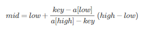

而原来的二分查找公式是这样的：

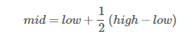


### 直接插入排序

```
public static void sort(int[] a) {
        if (a == null || a.length == 0) {
            return;
        }

        for (int i = 1; i < a.length; i++) {
            int j = i - 1;
            int temp = a[i]; // 先取出待插入数据保存，因为向后移位过程中会把覆盖掉待插入数
            while (j >= 0 && a[j] > temp) { // 如果待是比待插入数据大，就后移
                a[j+1] = a[j];
                j--;
            }
            a[j+1] = temp; // 找到比待插入数据小的位置，将待插入数据插入
        }
    }


```

### 希尔排序

```
 /**
     * 希尔排序
     *
     * @param num
     */
    public static void ShellSort(int num[]) {
        int temp;
        //默认步长为数组长度除以2
        int step = num.length;
        while (true) {
            step = step / 2;
            //确定分组数
            for (int i = 0; i < step; i++) {
                //对分组数据进行直接插入排序
                for ( int j = i + step; j < num.length; j = j + step) {
                    temp=num[j];
                    int k;
                   for( k=j-step;k>=0;k=k-step){
                       if(num[k]>temp){
                           num[k+step]=num[k];
                       }else{
                           break;
                       }
                   }
                   num[k+step]=temp;
                }
            }
            if (step == 1) {
                break;
            }
        }
    }


```

### 选择排序

```
public class SelectSort {
    public static void sort(int[] arr) {
        for (int i = 0; i < arr.length - 1; i++) {
            int min = i;
            for (int j = i+1; j < arr.length; j ++) { //选出之后待排序中值最小的位置
                if (arr[j] < arr[min]) {
                    min = j;
                }
            }
            if (min != i) {
                arr[min] = arr[i] + arr[min];
                arr[i] = arr[min] - arr[i];
                arr[min] = arr[min] - arr[i];
            }
        }
    }

```

### 堆排序

```
//声明全局变量，用于记录数组array的长度；
static int len;
    /**
     * 堆排序算法
     *
     * @param array
     * @return
     */
    public static int[] HeapSort(int[] array) {
        len = array.length;
        if (len < 1) return array;
        //1.构建一个最大堆
        buildMaxHeap(array);
        //2.循环将堆首位（最大值）与末位交换，然后在重新调整最大堆
        while (len > 0) {
            swap(array, 0, len - 1);
            len--;
            adjustHeap(array, 0);
        }
        return array;
    }
    /**
     * 建立最大堆
     *
     * @param array
     */
    public static void buildMaxHeap(int[] array) {
        //从最后一个非叶子节点开始向上构造最大堆
        for (int i = (len/2 - 1); i >= 0; i--) { //感谢 @让我发会呆 网友的提醒，此处应该为 i = (len/2 - 1) 
            adjustHeap(array, i);
        }
    }
    /**
     * 调整使之成为最大堆
     *
     * @param array
     * @param i
     */
    public static void adjustHeap(int[] array, int i) {
        int maxIndex = i;
        //如果有左子树，且左子树大于父节点，则将最大指针指向左子树
        if (i * 2 < len && array[i * 2] > array[maxIndex])
            maxIndex = i * 2;
        //如果有右子树，且右子树大于父节点，则将最大指针指向右子树
        if (i * 2 + 1 < len && array[i * 2 + 1] > array[maxIndex])
            maxIndex = i * 2 + 1;
        //如果父节点不是最大值，则将父节点与最大值交换，并且递归调整与父节点交换的位置。
        if (maxIndex != i) {
            swap(array, maxIndex, i);
            adjustHeap(array, maxIndex);
        }
    }
```


### 排序算法稳定性的作用

举个例子，一个班的学生已经按照学号大小排好序了，我现在要求按照年龄从小到大再排个序，如果年龄相同的，必须按照学号从小到大的顺序排列。那么问题来了，你选择的年龄排序方法如果是不稳定的，是不是排序完了后年龄相同的一组学生学号就乱了，你就得把这组年龄相同的学生再按照学号拍一遍。如果是稳定的排序算法，我就只需要按照年龄排一遍就好了。

从一个键上排序，然后再从另一个键上排序，第一个键排序的结果可以为第二个键排序所用。要排序的内容是一个复杂对象的多个数字属性，且其原本的初始顺序存在意义，那么我们需要在二次排序的基础上保持原有排序的意义，才需要使用到稳定性的算法。

有很多算法你现在看着没啥，但是当放在大数据云计算的条件下它的稳定性非常重要。举个例子来说，对淘宝网的商品进行排序，按照销量，价格等条件进行排序，它的数据服务器中的数据非常多，因此，当时用一个稳定性效果不好的排序算法，如堆排序、shell排序，当遇到最坏情形，会使得排序的效果非常差，严重影响服务器的性能，影响到用户的体验。

### 外排序

1TB数据使用32GB内存如何排序
　　①、把磁盘上的1TB数据分割为40块（chunks），每份25GB。（注意，要留一些系统空间！）
　　②、顺序将每份25GB数据读入内存，使用quick sort算法排序。
　　③、把排序好的数据（也是25GB）存放回磁盘。
　　④、循环40次，现在，所有的40个块都已经各自排序了。（剩下的工作就是如何把它们合并排序！）
　　⑤、从40个块中分别读取25G/40=0.625G入内存（40 input buffers）。
　　⑥、执行40路合并，并将合并结果临时存储于2GB 基于内存的输出缓冲区中。当缓冲区写满2GB时，写入硬盘上最终文件，并清空输出缓冲区；当40个输入缓冲区中任何一个处理完毕时，写入该缓冲区所对应的块中的下一个0.625GB，直到全部处理完成。
————————————————
版权声明：本文为CSDN博主「无鞋童鞋」的原创文章，遵循CC 4.0 BY-SA版权协议，转载请附上原文出处链接及本声明。
原文链接：https://blog.csdn.net/FX677588/article/details/72471357

### 为什么在平均情况下快速排序比堆排序要优秀？

https://www.zhihu.com/question/23873747

堆排比较的几乎都不是相邻元素，对cache极不友好，这才是很少被采用的原因。

### 快排的最差情况什么时候发生

这个答案还得看枢轴（pivot）的选择策略。在快速排序的早期版本中呢，最左面或者是最右面的那个元素被选为枢轴，那最坏的情况就会在下面的情况下发生啦：

1）数组已经是正序（same order）排过序的。
2）数组已经是倒序排过序的。
3）所有的元素都相同（1、2的特殊情况）

因为这些案例在用例中十分常见，所以这个问题可以通过要么选择一个随机的枢轴，或者选择一个分区中间的下标作为枢轴，或者（特别是对于相比更长的分区）选择分区的第一个、中间、最后一个元素的中值作为枢轴。有了这些修改，那快排的最差的情况就不那么容易出现了，但是如果输入的数组最大（或者最小元素）被选为枢轴，那最坏的情况就又来了。

## MD5算法原理


### 对分治算法和动态规划的理解

动态规划也是一种将复杂问题分解成更小的子问题来解决。但是它和分治策略不同的是，首先它分解的子问题之间是**相互依赖**的，大规模问题的解依赖小规模问题的解，其次它是从最简单最小的规模问题开始解，问题的规模逐渐增大。是一种**自底向上**求解的方法（分治策略是**自顶向下**的）。还是吃自助（可能是太久没出去想吃自助了），这次那几个服务员没有进行分类拿取，需要互相看看都拿了什么，拿了多少，自己再决定如何去拿。

分而治之是解决问题的典型策略，它的思想在于将问题分为若干**互相独立**更小规模的部分，通过解决每一个小规模的问题，并将结果汇总从而得到问题的解。咱们还拿吃自助来做比喻，分治就像是吃自助的时候需要先把菜都端上来，你分配几个服务员（当然现实中是不太现实的），一个去拿肉类、一个去拿海鲜、一个去拿蔬菜、一个去接饮料......最后放在一起开吃，他们之间拿东西是互相独立的。

作者：差得远呢
链接：https://juejin.im/post/6844904119098966030
来源：掘金
著作权归作者所有。商业转载请联系作者获得授权，非商业转载请注明出处。


## **哈夫曼（Huffman）编码算法**

https://blog.csdn.net/FX677588/article/details/70767446

**哈夫曼（Huffman）编码算法**是基于二叉树构建编码压缩结构的，它是数据压缩中经典的一种算法。算法根据文本字符出现的频率，重新对字符进行编码。因为为了缩短编码的长度，我们自然希望频率越高的词，编码越短，这样最终才能最大化压缩存储文本数据的空间。

## 红黑树为什么综合性能好？


缺点：与AVL相比高度更大，所以查询比AVL慢一丢丢

## Log Structured Merge Trees(LSM) 原理

https://www.open-open.com/lib/view/open1424916275249.html

## 高性能无锁队列Disruptor

https://juejin.im/post/6844903648875528206#heading-8

- CAS
- 消除伪共享

cup缓存会加载一行数据，如果是数组的话，会加载数组的几个数据如a b c,假如我只对a进行修改，但是不改其他的。这时如果其他cup对b c修改，那我这行缓存就无效就得从内存拿，这就是伪共享。因为每次只拿一条修改，像计数器一样，这就要消除伪共享

- RingBuffer 


# 操作系统

## 中断

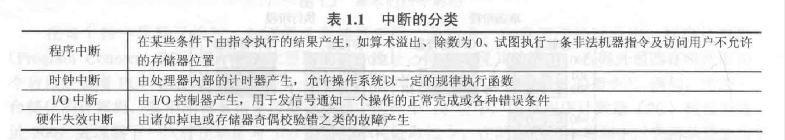

## 操作系统基本组成

最基本的有几个部分：
1 bootloader, 你是用个现成的grub还是自己写，很多人就倒在这一步了。
2 内存管理
3 进程管理
4 中断和系统调用
5 文件系统		


## 信号量

信号量（Semaphore）是一种控制多线程（进程）访问共享资源的同步机制

https://juejin.im/post/6844903822465187847

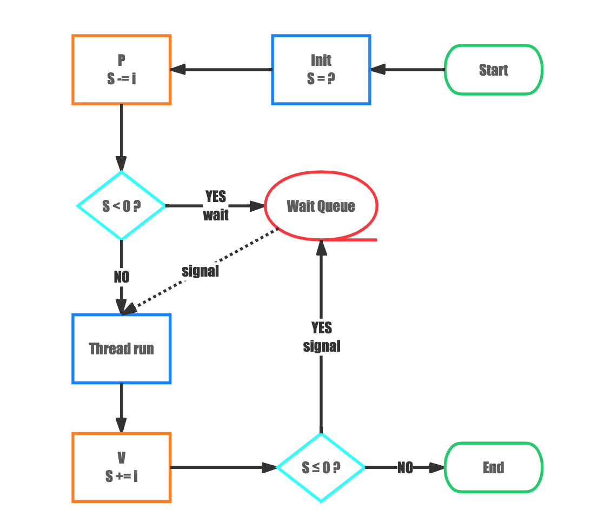

那么信号量可以用来干什么呢？

1. 信号量似乎天生就是为限流而生的，我们可以很容易用信号量实现一个[限流器](#用信号量限流)。
2. 信号量可以用来实现[互斥锁](#用信号量实现互斥锁)，初始化信号量`S = 1`，这样就只能有一个线程能访问临界区。很明显这是一个不可重入的锁。
3. 信号量甚至能够实现条件变量，比如[阻塞队列](

## top命令

https://www.cnblogs.com/ggjucheng/archive/2012/01/08/2316399.html

## 死锁

死锁是指两个或两个以上的进程在执行过程中，由于竞争资源或者由于彼此通信而造成的一种阻塞的现象，若无外力作用，它们都将无法推进下去。

互斥条件。一个资源只能被一个进程占用

不可剥夺条件。某个进程占用了资源，就只能他自己去释放。

请求和保持条件。某个经常之前申请了资源，我还想再申请资源，之前的资源还是我占用着，别人别想动。除非我自己不想用了，释放掉。

循环等待条件。一定会有一个环互相等待。


## 段页

https://mp.weixin.qq.com/s/oexktPKDULqcZQeplrFunQ

段


- 外部内存碎片，也就是产生了多个不连续的小物理内存，导致新的程序无法被装载；
- 内部内存碎片，程序所有的内存都被装载到了物理内存，但是这个程序有部分的内存可能并不是很常使用，这也会导致内存的浪费；

解决外部内存碎片的问题就是**内存交换**。

页


有空间上的缺陷。

因为操作系统是可以同时运行非常多的进程的，那这不就意味着页表会非常的庞大。

这时用多级页


段页


- 第一次访问段表，得到页表起始地址；
- 第二次访问页表，得到物理页号；
- 第三次将物理页号与页内位移组合，得到物理地址。

## 多线程和多进程

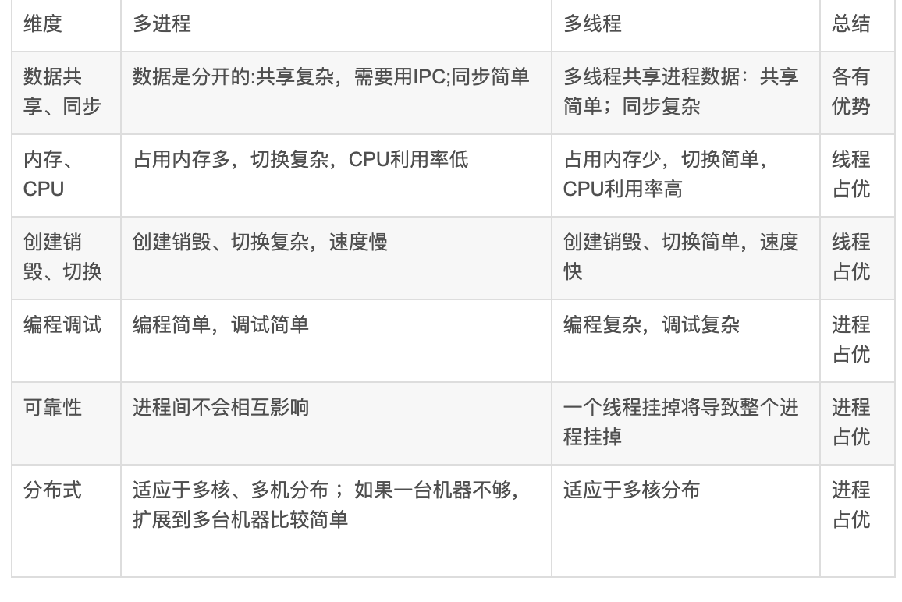


线程的缺点：

- 当进程中的一个线程奔溃时，会导致其所属进程的所有线程奔溃。

举个例子，对于游戏的用户设计，则不应该使用多线程的方式，否则一个用户挂了，会影响其他同个进程的线程。

线程与进程的比较如下：

- 进程是资源（包括内存、打开的文件等）分配的单位，线程是 CPU 调度的单位；
- 进程拥有一个完整的资源平台，而线程只独享必不可少的资源，如寄存器和栈；
- 线程同样具有就绪、阻塞、执行三种基本状态，同样具有状态之间的转换关系；
- 线程能减少并发执行的时间和空间开销；

对于，线程相比进程能减少开销，体现在：

- 线程的创建时间比进程快，因为进程在创建的过程中，还需要资源管理信息，比如内存管理信息、文件管理信息，而线程在创建的过程中，不会涉及这些资源管理信息，而是共享它们；
- 线程的终止时间比进程快，因为线程释放的资源相比进程少很多；
- **同一个进程内的线程切换比进程切换快，因为线程具有相同的地址空间（虚拟内存共享），这意味着同一个进程的线程都具有同一个页表，那么在切换的时候不需要切换页表。而对于进程之间的切换，切换的时候要把页表给切换掉，而页表的切换过程开销是比较大的；**
- 由于同一进程的各线程间共享内存和文件资源，那么在线程之间数据传递的时候，就不需要经过内核了，这就使得线程之间的数据交互效率更高了；

所以，线程比进程不管是时间效率，还是空间效率都要高。

## 设置线程数

最佳线程数目 = （（线程等待时间+线程CPU时间）/线程CPU时间 ）* CPU数目

## 进程间通信的方式

https://mp.weixin.qq.com/s/mblyh6XrLj1bCwL0Evs-Vg

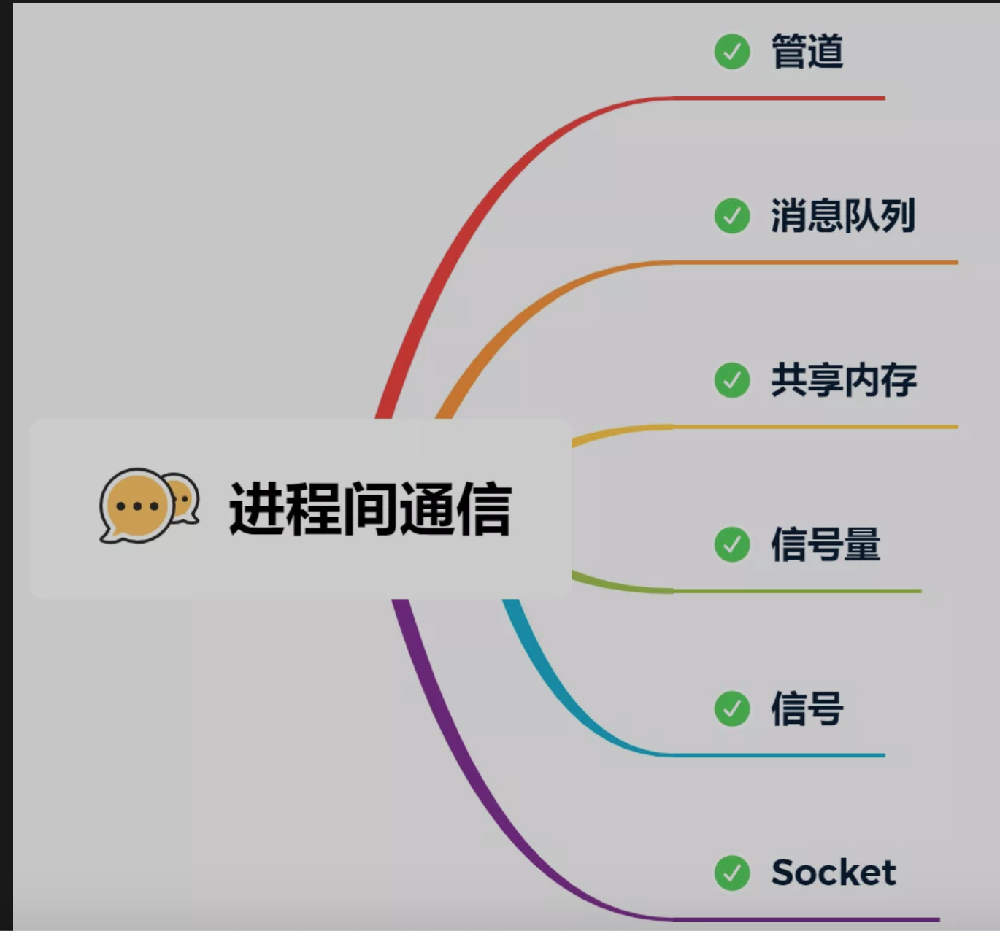

**匿名管道**顾名思义，它没有名字标识，匿名管道是特殊文件只存在于内存，没有存在于文件系统中，shell 命令中的「`|`」竖线就是匿名管道，通信的数据是**无格式的流并且大小受限**，通信的方式是**单向**的，数据只能在一个方向上流动，如果要双向通信，需要创建两个管道，再来**匿名管道是只能用于存在父子关系的进程间通信**，匿名管道的生命周期随着进程创建而建立，随着进程终止而消失。

**命名管道**突破了匿名管道只能在亲缘关系进程间的通信限制，因为使用命名管道的前提，需要在文件系统创建一个类型为 p 的设备文件，那么毫无关系的进程就可以通过这个设备文件进行通信。另外，不管是匿名管道还是命名管道，进程写入的数据都是**缓存在内核**中，另一个进程读取数据时候自然也是从内核中获取，同时通信数据都遵循**先进先出**原则，不支持 lseek 之类的文件定位操作。

管道的通信方式是效率低的，因此管道不适合进程间频繁地交换数据。

**消息队列**的通信模式就可以解决。比如，A 进程要给 B 进程发送消息，A 进程把数据放在对应的消息队列后就可以正常返回了，B 进程需要的时候再去读取数据就可以了

消息队列实际上是保存在内核的「消息链表」，消息队列的消息体是可以用户自定义的数据类型，发送数据时，会被分成一个一个独立的消息体，当然接收数据时，也要与发送方发送的消息体的数据类型保持一致，这样才能保证读取的数据是正确的。消息队列通信的速度不是最及时的，毕竟**每次数据的写入和读取都需要经过用户态与内核态之间的拷贝过程。**

**共享内存**可以解决消息队列通信中用户态与内核态之间数据拷贝过程带来的开销，**它直接分配一个共享空间，每个进程都可以直接访问**，就像访问进程自己的空间一样快捷方便，不需要陷入内核态或者系统调用，大大提高了通信的速度，享有**最快**的进程间通信方式之名。但是便捷高效的共享内存通信，**带来新的问题，多进程竞争同个共享资源会造成数据的错乱。**

那么，就需要**信号量**来保护共享资源，以确保任何时刻只能有一个进程访问共享资源，这种方式就是互斥访问。**信号量不仅可以实现访问的互斥性，还可以实现进程间的同步**，信号量其实是一个计数器，表示的是资源个数，其值可以通过两个原子操作来控制，分别是 **P 操作和 V 操作**。

与信号量名字很相似的叫**信号**，它俩名字虽然相似，但功能一点儿都不一样。信号是进程间通信机制中**唯一的异步通信机制**，信号可以在应用进程和内核之间直接交互，内核也可以利用信号来通知用户空间的进程发生了哪些系统事件，信号事件的来源主要有硬件来源（如键盘 Cltr+C ）和软件来源（如 kill 命令），一旦有信号发生，**进程有三种方式响应信号 1. 执行默认操作、2. 捕捉信号、3. 忽略信号**。有两个信号是应用进程无法捕捉和忽略的，即 `SIGKILL` 和 `SEGSTOP`，这是为了方便我们能在任何时候结束或停止某个进程。

前面说到的通信机制，都是工作于同一台主机，如果**要与不同主机的进程间通信，那么就需要 Socket 通信了**。Socket 实际上不仅用于不同的主机进程间通信，还可以用于本地主机进程间通信，可根据创建 Socket 的类型不同，分为三种常见的通信方式，一个是基于 TCP 协议的通信方式，一个是基于 UDP 协议的通信方式，一个是本地进程间通信方式。


### 共享内存实现原理

1.shm 基于 key 来标识一块共享内存区域, 使用 `shmget` 来创建或获取一段已经存在的共享内存. 当多个进程通过同一个 key 调用 `shmget` 时, 它们会把同一块内存区域映射到自己的地址空间中.

2.不同于 shm , mmap 并不是专门为共享内存设计的. 它的主要作用是把文件内容映射到内存地址空间中, 可以像访问内存一样访问文件, 从而避免调用 `read` `write` 等高开销的系统调用, 提高文件的访问效率.

https://hiberabyss.github.io/2018/03/13/shared-memory/

## Sleep(0)

**调用sleep（0）可以释放cpu时间，让线程马上重新回到就绪队列而非等待队列，sleep(0)释放当前线程所剩余的时间片（如果有剩余的话），这样可以让操作系统切换其他线程来执行，提升效率。**

## 虚拟内存

**虚拟内存为每个进程提供了一个一致的、私有的地址空间，它让每个进程产生了一种自己在独享主存的错觉（每个进程拥有一片连续完整的内存空间）**。

理解不深刻的人会认为虚拟内存只是“使用硬盘空间来扩展内存“的技术，这是不对的。**虚拟内存的重要意义是它定义了一个连续的虚拟地址空间**，使得程序的编写难度降低。并且，**把内存扩展到硬盘空间只是使用虚拟内存的必然结果，虚拟内存空间会存在硬盘中，并且会被内存缓存（按需），有的操作系统还会在内存不够的情况下，将某一进程的内存全部放入硬盘空间中，并在切换到该进程时再从硬盘读取**（这也是为什么Windows会经常假死的原因...）。

好处

- 避免用户直接访问物理内存地址，防止一些破坏性操作，保护操作系统
- 每个进程都被分配了4GB的虚拟内存，用户程序可使用比实际物理内存更大的地址空间

作者：SylvanasSun
链接：https://juejin.im/post/59f8691b51882534af254317
来源：掘金
著作权归作者所有。商业转载请联系作者获得授权，非商业转载请注明出处。

## 虚拟地址到物理地址的映射  分页


页表实际上存储在 CPU 的**内存管理单元** （*MMU*） 中，于是 CPU 就可以直接通过 MMU，找出要实际要访问的物理内存地址。

而当进程访问的虚拟地址在页表中查不到时，系统会产生一个**缺页异常**，进入系统内核空间分配物理内存、更新进程页表，最后再返回用户空间，恢复进程的运行。

## 信号与信号量的区别

1.信号：（signal）是一种处理异步事件的方式。信号是比较复杂的通信方式，

用于通知接受进程有某种事件发生，除了用于进程外，还可以发送信号给进程本身。

 

2.信号量：（Semaphore）进程间通信处理同步互斥的机制。

是在多线程环境下使用的一种设施, 它负责协调各个线程, 以保证它们能够正确、合理的使用公共资源。

## Cache一致性协议之MESI  原子操作

https://blog.csdn.net/muxiqingyang/article/details/6615199

https://zhuanlan.zhihu.com/p/33445834


当运行在某个cpu核的线程准备读取某个cache line的内容时，如果状态处于M,E,S，直接读取即可。如果状态处于I，则需要向其他cpu核广播读消息，在接受到其他cpu核的读响应后，更新cache line，并将状态设置为S。而当线程准备写入某个cache line时，如果处于M状态，直接写入。如果处于E状态，写入并将cache line状态改为M。如果处于S，则需要向其他cpu核广播使无效消息，并进入E状态，写入修改，后进入M状态。如果处于I，则需要向其他cpu核广播读消息核使无效消息，在收集到读响应后，更新cache line。在收集到使无效响应后，进入E状态，写入修改，后进入M状态。

## 进程切换与线程切换

**进程切换分两步：**

**1.切换页目录以使用新的地址空间**

**2.切换内核栈和硬件上下文**

对于linux来说，线程和进程的最大区别就在于地址空间，对于线程切换，第1步是不需要做的，第2是进程和线程切换都要做的。

## 进程和线程的主要区别

根本区别：进程是操作系统资源分配的基本单位，而线程是任务调度和执行的基本单位

在开销方面：每个进程都有独立的代码和数据空间（程序上下文），程序之间的切换会有较大的开销；线程可以看做轻量级的进程，同一类线程共享代码和数据空间，每个线程都有自己独立的运行栈和程序计数器（PC），线程之间切换的开销小。

所处环境：在操作系统中能同时运行多个进程（程序）；而在同一个进程（程序）中有多个线程同时执行（通过CPU调度，在每个时间片中只有一个线程执行）

内存分配方面：系统在运行的时候会为每个进程分配不同的内存空间；而对线程而言，除了CPU外，系统不会为线程分配内存（线程所使用的资源来自其所属进程的资源），线程组之间只能共享资源。

包含关系：没有线程的进程可以看做是单线程的，如果一个进程内有多个线程，则执行过程不是一条线的，而是多条线（线程）共同完成的；线程是进程的一部分，所以线程也被称为轻权进程或者轻量级进程。

https://juejin.im/post/5d5df6b35188252ae10bdf42#comment


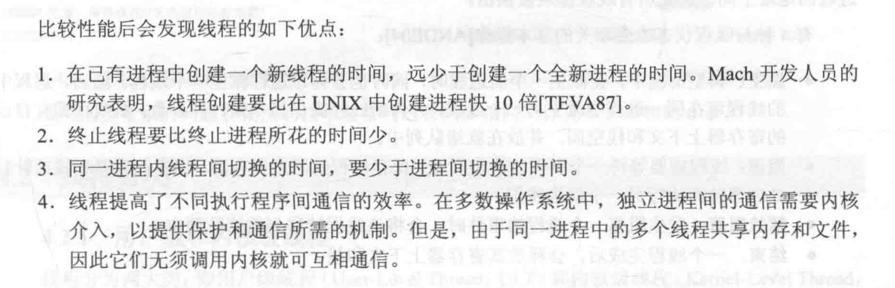

进程和线程的主要差异在内存数据共享模式不同，切换更轻量

## Linux 系统启动过程

https://www.runoob.com/linux/linux-system-boot.html

    内核的引导。
    运行 init。
    系统初始化。
    建立终端 。
    用户登录系统。

##  Reactor模式详解

https://juejin.im/post/6844903682509635598#comment

​	


## **5种IO模型对比**

https://mp.weixin.qq.com/s?__biz=Mzg3MjA4MTExMw==&mid=2247484746&idx=1&sn=c0a7f9129d780786cabfcac0a8aa6bb7&source=41#wechat_redirect


## 用户态和内核态

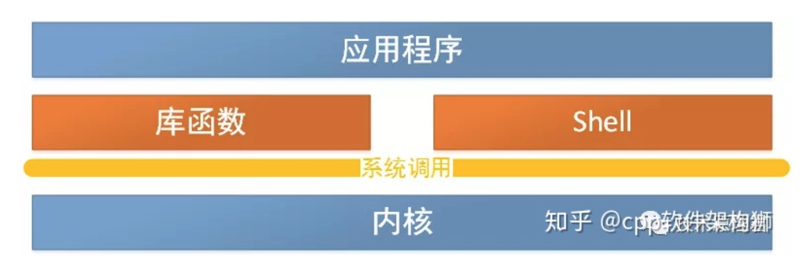

通过**系统调用**将Linux整个体系分为用户态和内核态（或者说内核空间和用户空间）。那内核态到底是什么呢？其实从本质上说就是我们所说的内核，它是一种**特殊的软件程序**，特殊在哪儿呢？**控制计算机的硬件资源，例如协调CPU资源，分配内存资源，并且提供稳定的环境供应用程序运行**。

从用户态到内核态切换可以通过三种方式：

1. 系统调用，这个上面已经讲解过了，在我公众号之前的文章也有讲解过。其实系统调用本身就是中断，但是软件中断，跟硬中断不同。
2. 异常：如果当前进程运行在用户态，如果这个时候发生了异常事件，就会触发切换。例如：缺页异常。
3. 外设中断：当外设完成用户的请求时，会向CPU发送中断信号。

## 内核空间和用户空间

https://www.cnblogs.com/sparkdev/p/8410350.html

操作系统的核心是内核(kernel)，它独立于普通的应用程序，可以访问受保护的内存空间，也有访问底层硬件设备的所有权限。为了保证内核的安全，现在的操作系统一般都强制用户进程不能直接操作内核。这部分为内核空间 其他是用户空间

在内核态下，进程运行在内核地址空间中，此时 CPU 可以执行任何指令。运行的代码也不受任何的限制，可以自由地访问任何有效地址，也可以直接进行端口的访问。
在用户态下，进程运行在用户地址空间中，被执行的代码要受到 CPU 的诸多检查，它们只能访问映射其地址空间的页表项中规定的在用户态下可访问页面的虚拟地址

**区分内核空间和用户空间本质上是要提高操作系统的稳定性及可用性**

## 什么是 CPU 上下文切换

https://zhuanlan.zhihu.com/p/52845869

就是先把前一个任务的 CPU 上下文（也就是 CPU 寄存器和程序计数器）保存起来，然后加载新任务的上下文到这些寄存器和程序计数器，最后再跳转到程序计数器所指的新位置，运行新任务。

而这些保存下来的上下文，会存储在系统内核中，并在任务重新调度执行时再次加载进来。这样就能保证任务原来的状态不受影响，让任务看起来还是连续运行。

“上下文”，以程序员的角度来看，是 方法调用过程中的各种局部的变量与资源;以线程的角度来看，是方法的调用栈中存储的各类信息; 而以操作系统和硬件的角度来看，则是存储在内存、缓存和寄存器中的一个个具体数值。

## CPU 上下文切换的类型

根据任务的不同，可以分为以下三种类型 - 进程上下文切换 - 线程上下文切换 - 中断上下文切换

进程上下文切换

**进程的上下文切换不仅包含了虚拟内存、栈、全局变量等用户空间的资源，还包括了内核堆栈、寄存器等内核空间的资源。**

通常，会把交换的信息保存在进程的 PCB，当要运行另外一个进程的时候，我们需要从这个进程的 PCB 取出上下文，然后恢复到 CPU 中，这使得这个进程可以继续执行，如下图所示：


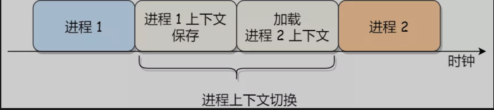

## 系统调用

从用户态到内核态的转变，需要通过**系统调用**来完成。比如，当我们查看文件内容时，就需要多次系统调用来完成：首先调用 open() 打开文件，然后调用 read() 读取文件内容，并调用 write() 将内容写到标准输出，最后再调用 close() 关闭文件。

在这个过程中就发生了 CPU 上下文切换，整个过程是这样的：
1、保存 CPU 寄存器里原来用户态的指令位
2、为了执行内核态代码，CPU 寄存器需要更新为内核态指令的新位置。
3、跳转到内核态运行内核任务。
4、当系统调用结束后，CPU 寄存器需要恢复原来保存的用户态，然后再切换到用户空间，继续运行进程。

所以，**一次系统调用的过程，其实是发生了两次 CPU 上下文切换**。（用户态-内核态-用户态）

不过，需要注意的是，**系统调用过程中，并不会涉及到虚拟内存等进程用户态的资源，也不会切换进程**。这跟我们通常所说的进程上下文切换是不一样的：**进程上下文切换，是指从一个进程切换到另一个进程运行；而系统调用过程中一直是同一个进程在运行。**

所以，**系统调用过程通常称为特权模式切换，而不是上下文切换。系统调用属于同进程内的 CPU 上下文切换**。但实际上，系统调用过程中，CPU 的上下文切换还是无法避免的。

## IO多路复用select/poll/epoll

https://cloud.tencent.com/developer/article/1005481

https://blog.csdn.net/daaikuaichuan/article/details/83862311

https://www.bilibili.com/video/BV1qJ411w7du?from=search&seid=4343876570196268087

select

```

 
int main()
{
  char buffer[MAXBUF];
  int fds[5];
  struct sockaddr_in addr;
  struct sockaddr_in client;
  int addrlen, n,i,max=0;;
  int sockfd, commfd;
  fd_set rset;
  for(i=0;i<5;i++)
  {
  	if(fork() == 0)
  	{
  		child_process();
  		exit(0);
  	}
  }
 
  sockfd = socket(AF_INET, SOCK_STREAM, 0);
  memset(&addr, 0, sizeof (addr));
  addr.sin_family = AF_INET;
  addr.sin_port = htons(2000);
  addr.sin_addr.s_addr = INADDR_ANY;
  bind(sockfd,(struct sockaddr*)&addr ,sizeof(addr));
  listen (sockfd, 5); 
 
  for (i=0;i<5;i++) 
  {
    memset(&client, 0, sizeof (client));
    addrlen = sizeof(client);
    fds[i] = accept(sockfd,(struct sockaddr*)&client, &addrlen);
    if(fds[i] > max)
    	max = fds[i];
  }
  
  while(1){
	FD_ZERO(&rset);
  	for (i = 0; i< 5; i++ ) {
  		FD_SET(fds[i],&rset);
  	}
 
   	puts("round again");
	select(max+1, &rset, NULL, NULL, NULL);
 
	for(i=0;i<5;i++) {
		if (FD_ISSET(fds[i], &rset)){
			memset(buffer,0,MAXBUF);
			read(fds[i], buffer, MAXBUF);
			puts(buffer);
		}
	}	
  }
  return 0;
}
```

fd_set 使用数组实现
1.fd_size 有限制 1024 bitmap
fd【i】 = accept()
2.fdset不可重用，新的fd进来，重新创建
3.用户态和内核态拷贝产生开销
4.O(n)时间复杂度的轮询
成功调用返回结果大于 0，出错返回结果为 -1，超时返回结果为 0
具有超时时间

poll基于结构体存储fd
struct pollfd{
int fd;
short events;
short revents; //可重用
}
解决了select的1,2两点缺点

epoll

```
  struct epoll_event events[5];
  int epfd = epoll_create(10);
  ...
  ...
  for (i=0;i<5;i++) 
  {
    static struct epoll_event ev;
    memset(&client, 0, sizeof (client));
    addrlen = sizeof(client);
    ev.data.fd = accept(sockfd,(struct sockaddr*)&client, &addrlen);
    ev.events = EPOLLIN;
    epoll_ctl(epfd, EPOLL_CTL_ADD, ev.data.fd, &ev); 
  }
  
  while(1){
  	puts("round again");
  	nfds = epoll_wait(epfd, events, 5, 10000);
	
	for(i=0;i<nfds;i++) {
			memset(buffer,0,MAXBUF);
			read(events[i].data.fd, buffer, MAXBUF);
			puts(buffer);
	}
  }
```

解决select的1，2，3，4
不需要轮询，时间复杂度为O(1)
epoll_create 创建一个白板 存放fd_events
epoll_ctl 用于向内核注册新的描述符或者是改变某个文件描述符的状态。已注册的描述符在内核中会被维护在一棵红黑树上
epoll_wait 通过回调函数内核会将 I/O 准备好的描述符加入到一个链表中管理，进程调用 epoll_wait() 便可以得到事件完成的描述符

两种触发模式：
LT:水平触发
当 epoll_wait() 检测到描述符事件到达时，将此事件通知进程，进程可以不立即处理该事件，下次调用 epoll_wait() 会再次通知进程。是默认的一种模式，并且同时支持 Blocking 和 No-Blocking。
ET:边缘触发
和 LT 模式不同的是，通知之后进程必须立即处理事件。
下次再调用 epoll_wait() 时不会再得到事件到达的通知。很大程度上减少了 epoll 事件被重复触发的次数，
因此效率要比 LT 模式高。只支持 No-Blocking，以避免由于一个文件句柄的阻塞读/阻塞写操作把处理多个文件描述符的任务饿死。

[https://zouchanglin.cn/2020/03/01/%E5%9B%BE%E8%A7%A3epoll%E5%8E%9F%E7%90%86/](https://zouchanglin.cn/2020/03/01/图解epoll原理/)

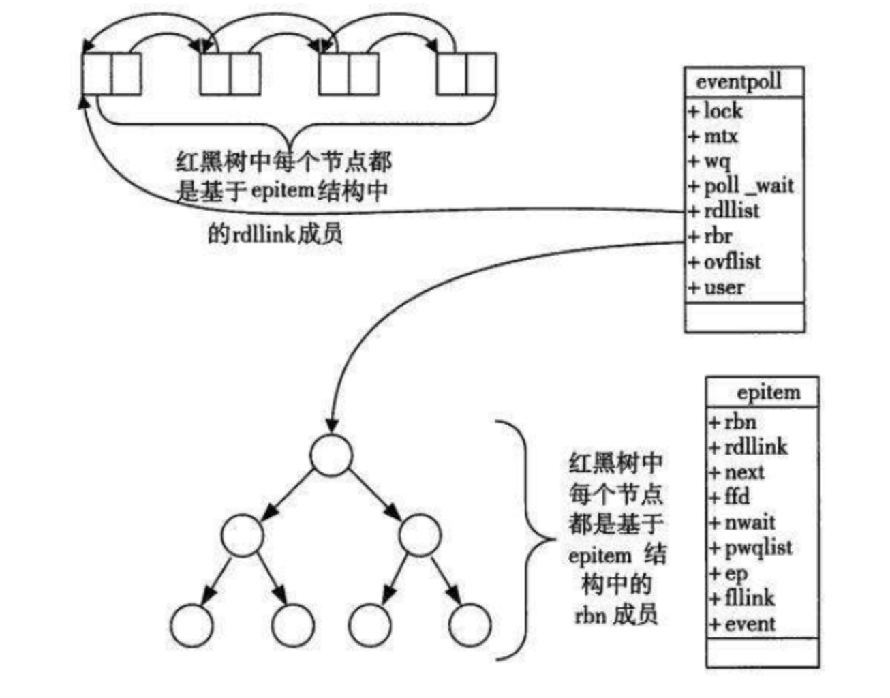

> 使用Linux epoll模型的LT水平触发模式，当socket可写时，会不停的触发socket可写的事件，如何处理？
>
> 网络流传的腾讯面试题

这道题目对LT和ET考察比较深入，验证了前文说的LT模式write问题。

​    **普通做法**： 

当需要向socket写数据时，将该socket加入到epoll等待可写事件。接收到socket可写事件后，调用write()或send()发送数据，当数据全部写完后， 将socket描述符移出epoll列表，这种做法需要反复添加和删除。

**改进做法**:

向socket写数据时直接调用send()发送，当send()返回错误码EAGAIN，才将socket加入到epoll，等待可写事件后再发送数据，全部数据发送完毕，再移出epoll模型，改进的做法相当于认为socket在大部分时候是可写的，不能写了再让epoll帮忙监控。

上面两种做法是对LT模式下write事件频繁通知的修复，本质上ET模式就可以直接搞定，并不需要用户层程序的补丁操作。


### 不适用的地方

如果做不到“处理过程相对于IO可以忽略不计”，IO多路复用的并不一定比线程池方案更好

如果压力不是很大，并且处理性能相对于IO可以忽略不计

- IO多路复用+单进（线）程比较省资源
- 适合处理大量的闲置的IO

## linux

### 是一切皆文件

在Linux的学习中，一切皆文件的理念无处不在，文档、目录、磁盘驱动器、CD-ROM、调制解调器、键盘、打印机、显示器、终端，甚至是一些进程间通信和网络通信。所有这些资源拥有一个通用的抽象，在Linux中将其称为“文件”，其实Unix就是这种思想，所以Linux也借鉴了这个思想，因为每个“文件”都通过相同的 API 暴露出来，所以你可以使用同一组基本命令来读取和写入磁盘、键盘、文档或网络设备， “一切皆文件”的思想提供了***一个强大而简单的抽象，那就是无论是硬件设备、还是网络连接、还是我们日常解除的文件，都是文件，这样使得API的设计可以化繁为简，用户可以使用通用的方式去访问任何资源，自有相应的中间件做好对底层的适配。*** 所以在Linux操作系统看来，一切都是文件，也就意味着，网卡设备也是文件，Socket连接也是文件，文件的统一抽象使得都有共同的属性，

### Linux常用命令

https://juejin.im/post/6844903940690034702

### linux指令

top命令

https://www.cnblogs.com/peida/archive/2012/12/24/2831353.html

显示当前系统正在执行的进程的相关信息，包括进程ID、内存占用率、CPU占用率等


ps -ef|grep xxx 

查某个进程

tail -100 desc.txt

查看文件尾内容

netstat -a

显示网络相关信息

kill -s 9 27810

杀死进程


 tcpdump

https://juejin.im/post/6844904084168769549#heading-34


## Netty Reactor模型

https://juejin.im/post/6844903712435994631#comment

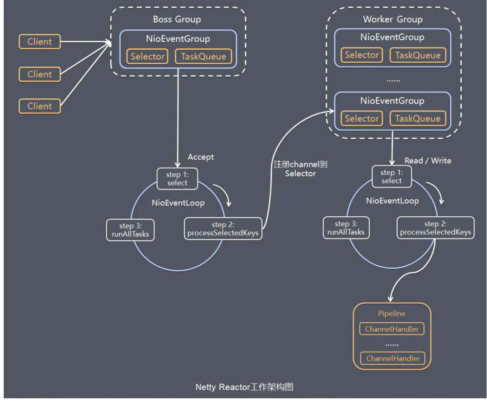

## mmap内存映射文件

https://www.cnblogs.com/huxiao-tee/p/4660352.html

使用mmap操作文件中，创建新的虚拟内存区域和建立文件磁盘地址和虚拟内存区域映射这两步，没有任何文件拷贝操作。而之后访问数据时发现内存中并无数据而发起的缺页异常过程，可以通过已经建立好的映射关系，只使用一次数据拷贝，就从磁盘中将数据传入内存的用户空间中，供进程使用。

**总而言之，常规文件操作需要从磁盘到页缓存再到用户主存的两次数据拷贝。而mmap操控文件，只需要从磁盘到用户主存的一次数据拷贝过程。**说白了，mmap的关键点是实现了用户空间和内核空间的数据直接交互而省去了空间不同数据不通的繁琐过程。因此mmap效率更高。

mmap的工作原理，当你发起这个调用的时候，它只是在你的虚拟空间中分配了一段空间，连真实的物理地址都不会分配的，当你访问这段空间，CPU陷入OS内核执行异常处理，然后异常处理会在这个时间分配物理内存，并用文件的内容填充这片内存，然后才返回你进程的上下文，这时你的程序才会感知到这片内存里有数据


作者：in nek
链接：https://www.zhihu.com/question/48161206/answer/110418693
来源：知乎
著作权归作者所有。商业转载请联系作者获得授权，非商业转载请注明出处。

## **互斥锁**

互斥锁是一种「独占锁」，比如当线程 A 加锁成功后，此时互斥锁已经被线程 A 独占了，只要线程 A 没有释放手中的锁，线程 B 加锁就会失败，于是就会释放 CPU 让给其他线程，**既然线程 B 释放掉了 CPU，自然线程 B 加锁的代码就会被阻塞**。

**对于互斥锁加锁失败而阻塞的现象，是由操作系统内核实现的**。当加锁失败时，内核会将线程置为「睡眠」状态，等到锁被释放后，内核会在合适的时机唤醒线程，当这个线程成功获取到锁后，于是就可以继续执行。如下图：


所以，互斥锁加锁失败时，会从用户态陷入到内核态，让内核帮我们切换线程，虽然简化了使用锁的难度，但是存在一定的性能开销成本。

那这个开销成本是什么呢？会有**两次线程上下文切换的成本**：

- 当线程加锁失败时，内核会把线程的状态从「运行」状态设置为「睡眠」状态，然后把 CPU 切换给其他线程运行；
- 接着，当锁被释放时，之前「睡眠」状态的线程会变为「就绪」状态，然后内核会在合适的时间，把 CPU 切换给该线程运行。

线程的上下文切换的是什么？当两个线程是属于同一个进程，**因为虚拟内存是共享的，所以在切换时，虚拟内存这些资源就保持不动，只需要切换线程的私有数据、寄存器等不共享的数据。**

上下切换的耗时有大佬统计过，大概在几十纳秒到几微秒之间，如果你锁住的代码执行时间比较短，那可能上下文切换的时间都比你锁住的代码执行时间还要长。

所以，**如果你能确定被锁住的代码执行时间很短，就不应该用互斥锁，而应该选用自旋锁，否则使用互斥锁。**

## Linux 内存管理

https://mp.weixin.qq.com/s?__biz=MzUxODAzNDg4NQ==&mid=2247485033&idx=1&sn=bf9ba7aca126ad186922c57a96928593&chksm=f98e42c3cef9cbd514df38d04deb5e7a9ea67dbd478da75fc4a7636ee90b1384d65f68eb23f5&mpshare=1&scene=1&srcid=0929Ur9auGCTC1n9UBY0FzQF&sharer_sharetime=1601367341613&sharer_shareid=7c323ad8a0150d2a639a51a5c8978bfb&key=aabb5ee173354e5dcf522bcd39e8aa1cf40b72fabe0875e6f0eaa4b27d7ecb23809ce43974e694228da027bf0182ce38b2f14f903528fd044b5d0fe4c3b29fa952c407813bcc4f58024904459155ed163cac13f36b22bf066338ad245f0cf79678bf1a264fc0faaa46d3579ad310288af206dda357c384837be537d14235096e&ascene=1&uin=MjkxNjk0ODI0Mw%3D%3D&devicetype=Windows+10+x64&version=62090529&lang=zh_CN&exportkey=A3ahGDVv4pFZB75vteEHUGs%3D&pass_ticket=xVQ5kNeUfHtkgbP7YNzD5HV1x%2B7EDpTgwlwmOdGo23FSSOePrDbmST9xrvb9AYFF&wx_header=0

**页式内存管理的作用是在由段式内存管理所映射而成的的地址上再加上一层地址映射。**

进程（执行的程序）占用的用户空间按照「 访问属性一致的地址空间存放在一起 」的原则，划分成 `5`个不同的内存区域。访问属性指的是“可读、可写、可执行等 。

- 代码段

  代码段是用来存放可执行文件的操作指令，可执行程序在内存中的镜像。代码段需要防止在运行时被非法修改，所以只准许读取操作，它是不可写的。

- 数据段

  数据段用来存放可执行文件中已初始化全局变量，换句话说就是存放程序静态分配的变量和全局变量。

- BSS段

  `BSS`段包含了程序中未初始化的全局变量，在内存中 `bss` 段全部置零。

- 堆 `heap`

  堆是用于存放进程运行中被动态分配的内存段，它的大小并不固定，可动态扩张或缩减。当进程调用malloc等函数分配内存时，新分配的内存就被动态添加到堆上（堆被扩张）；当利用free等函数释放内存时，被释放的内存从堆中被剔除（堆被缩减）

- 栈 `stack`

  栈是用户存放程序临时创建的局部变量，也就是函数中定义的变量（但不包括 `static` 声明的变量，static意味着在数据段中存放变量）。除此以外，在函数被调用时，其参数也会被压入发起调用的进程栈中，并且待到调用结束后，函数的返回值也会被存放回栈中。由于栈的先进先出特点，所以栈特别方便用来保存/恢复调用现场。从这个意义上讲，我们可以把堆栈看成一个寄存、交换临时数据的内存区。

上述几种内存区域中数据段、`BSS`

 段、堆通常是被连续存储在内存中，在位置上是连续的，而代码段和栈往往会被独立存放。堆和栈两个区域在 `i386` 体系结构中栈向下扩展、堆向上扩展，相对而生。


##  Linux进程标准的内存段布局


**栈**

   进程地址空间中最顶部的段是栈，大多数编程语言将之用于存储函数参数和局部变量。调用一个方法或函数会将一个新的栈帧（stack frame）压入到栈中，这个栈帧会在函数返回时被清理掉。由于栈中数据严格的遵守FIFO的顺序，这个简单的设计意味着不必使用复杂的数据结构来追踪栈中的内容，只需要一个简单的指针指向栈的顶端即可，因此压栈（pushing）和退栈（popping）过程非常迅速、准确。进程中的每一个线程都有属于自己的栈。

**内存映射段**   

   在栈的下方是内存映射段，内核将文件的内容直接映射到内存。任何应用程序都可以通过Linux的mmap()系统调用或者Windows的CreateFileMapping()/MapViewOfFile()请求这种映射。内存映射是一种方便高效的文件I/O方式，所以它被用来加载动态库。创建一个不对应于任何文件的匿名内存映射也是可能的，此方法用于存放程序的数据。在Linux中，如果你通过malloc()请求一大块内存，C运行库将会创建这样一个匿名映射而不是使用堆内存。“大块”意味着比MMAP_THRESHOLD还大，缺省128KB，可以通过mallocp()调整。

**堆**

   与栈一样，堆用于运行时内存分配；但不同的是，堆用于存储那些生存期与函数调用无关的数据。大部分语言都提供了堆管理功能。

**BBS和数据段**

   在C语言中，BSS和数据段保存的都是静态（全局）变量的内容。区别在于BSS保存的是未被初始化的静态变量内容，他们的值不是直接在程序的源码中设定的。BSS内存区域是匿名的，它不映射到任何文件。如果你写static intcntActiveUsers，则cntActiveUsers的内容就会保存到BSS中去。

   **数据段保存在源代码中已经初始化的静态变量的内容。数据段不是匿名的，它映射了一部分的程序二进制镜像，也就是源代码中指定了初始值的静态变量。**

## 堆和栈区别

申请后系统的响应  
 栈：只要栈的剩余空间大于所申请空间，系统将为程序提供内存，否则将报异常提示栈溢 
 出。  
 堆：首先应该知道操作系统有一个记录空闲内存地址的链表，当系统收到程序的申请时， 
 会遍历该链表，寻找第一个空间大于所申请空间的堆结点，然后将该结点从空闲结点链表 
 中删除，并将该结点的空间分配给程序，另外，对于大多数系统，会在这块内存空间中的 
 首地址处记录本次分配的大小，这样，代码中的delete语句才能正确的释放本内存空间。 
 另外，由于找到的堆结点的大小不一定正好等于申请的大小，系统会自动的将多余的那部 
 分重新放入空闲链表中。  

 2.3申请大小的限制  
 栈：在Windows下,栈是向低地址扩展的数据结构，是一块连续的内存的区域。这句话的意 
 思是栈顶的地址和栈的最大容量是系统预先规定好的，在WINDOWS下，栈的大小是2M（也有 
 的说是1M，总之是一个编译时就确定的常数），如果申请的空间超过栈的剩余空间时，将 
 提示overflow。因此，能从栈获得的空间较小。  
 堆：堆是向高地址扩展的数据结构，是不连续的内存区域。这是由于系统是用链表来存储 
 的空闲内存地址的，自然是不连续的，而链表的遍历方向是由低地址向高地址。堆的大小 
 受限于计算机系统中有效的虚拟内存。由此可见，堆获得的空间比较灵活，也比较大。  

 

 2.4申请效率的比较：  
 栈由系统自动分配，速度较快。但程序员是无法控制的。  
 堆是由new分配的内存，一般速度比较慢，而且容易产生内存碎片,不过用起来最方便.  
 另外，在WINDOWS下，最好的方式是用VirtualAlloc分配内存，他不是在堆，也不是在栈是 
 直接在进程的地址空间中保留一块内存，虽然用起来最不方便。但是速度快，也最灵活。 

 2.5堆和栈中的存储内容  
 栈：  在函数调用时，第一个进栈的是主函数中后的下一条指令（函数调用语句的下一条可 
 执行语句）的地址，然后是函数的各个参数，在大多数的C编译器中，参数是由右往左入栈 
 的，然后是函数中的局部变量。注意静态变量是不入栈的。  
 当本次函数调用结束后，局部变量先出栈，然后是参数，最后栈顶指针指向最开始存的地 
 址，也就是主函数中的下一条指令，程序由该点继续运行。  
 堆：一般是在堆的头部用一个字节存放堆的大小。堆中的具体内容由程序员安排。  

堆和栈访问效率

程序的局部性。。
栈一般是随时调用的，基本常驻cache的状态
堆一般是临时调用，具体内存地址还得看内存分配数量以及实现等多方面的原因，申请过多的时候，甚至会从虚拟内存进行切换

一个基本是cache的速度，一个可能会发生cache的切换，甚至是虚拟内存切换，这两者运行下来谁快还不一目了然


作者：陶百百
链接：https://www.zhihu.com/question/29005517/answer/43172614
来源：知乎
著作权归作者所有。商业转载请联系作者获得授权，非商业转载请注明出处。

## 内存对齐

https://zhuanlan.zhihu.com/p/30007037

尽管内存是以字节为单位，但是大部分处理器并不是按字节块来存取内存的.它一般会以双字节,四字节,8字节,16字节甚至32字节为单位来存取内存，我们将上述这些存取单位称为内存存取粒度.

现在考虑4字节存取粒度的处理器取int类型变量（32位系统），该处理器只能从地址为4的倍数的内存开始读取数据。

假如没有内存对齐机制，数据可以任意存放，现在一个int变量存放在从地址1开始的联系四个字节地址中，该处理器去取数据时，要先从0地址开始读取第一个4字节块,剔除不想要的字节（0地址）,然后从地址4开始读取下一个4字节块,同样剔除不要的数据（5，6，7地址）,最后留下的两块数据合并放入寄存器.这需要做很多工作.

## 文件描述符

https://juejin.im/post/6844903962043236365


进程间文件描述符的传递，只是通过内核将接收文件的一个新的file指针指向和发送进程的同一个file对象，并使这个file对象的引用计数增加。


## 无锁编程

CopyOnWrite

CAS

## Linux中本机和本机Socket通信会走网卡吗

**不走网卡，不走物理设备，但是走虚拟设备，loopback device环回.**

本机的报文的路径是这样的：
应用层-> socket接口 -> 传输层（tcp/udp报文） -> 网络层 -> back to 传输层 -> backto socket接口 -.> 传回应用程序

在网络层，会在路由表查询路由，路由表（软件路由，真正的转发需要依靠硬件路由，这里路由表包括快速转发表和FIB表）初始化时会保存主机路由(host route，or 环回路由)， 查询（先匹配mask，再匹配ip，localhost路由在路由表最顶端，最优先查到）后发现不用转发就不用走中断，不用发送给链接层了，不用发送给网络设备（网卡）。像网卡发送接收报文一样，走相同的接收流程，只不过net device是loopback device，最后发送回应用程序。这一套流程当然和转发和接收外网报文一样，都要经过内核协议栈的处理，不同的是本机地址不用挂net device.


作者：王小陆
链接：https://www.zhihu.com/question/43590414/answer/96246937
来源：知乎
著作权归作者所有。商业转载请联系作者获得授权，非商业转载请注明出处。

## linux在系统调用进入内核时，为什么要将参数从用户空间拷贝到内核空间

首先，内核不能信任任何用户空间的指针。必须对用户空间的指针指向的数据进行验证。如果只做验证不做拷贝的话，那么在随后的运行中要随时受到其它进／线程可能修改用户空间数据的威胁。所以必须做拷贝。（有人提到在 copy 过程中数据依然可以被修改。是的，但是这种修改不能称为「篡改」。因为这种修改是在「合法性检查」之前发生的，影响的是用户进程的正确性，而不是内核对数据的验证。copy 只保证最后被使用的数据是被验证的数据，至于有没有 race 去破坏被传入的数据本身的正确性不在内核责任之内。要注意，「合法性」不等于「正确性」。）


作者：冯东
链接：https://www.zhihu.com/question/19728793/answer/137716739
来源：知乎
著作权归作者所有。商业转载请联系作者获得授权，非商业转载请注明出处。

## 零拷贝

https://mp.weixin.qq.com/s/P0IP6c_qFhuebwdwD8HM7w

#### mmap + write


- 应用进程调用了 `mmap()` 后，DMA 会把磁盘的数据拷贝到内核的缓冲区里。接着，应用进程跟操作系统内核「共享」这个缓冲区；
- 应用进程再调用 `write()`，操作系统直接将内核缓冲区的数据拷贝到 socket 缓冲区中，这一切都发生在内核态，由 CPU 来搬运数据；
- 最后，把内核的 socket 缓冲区里的数据，拷贝到网卡的缓冲区里，这个过程是由 DMA 搬运的。

我们可以得知，通过使用 `mmap()` 来代替 `read()`， 可以减少一次数据拷贝的过程。

但这还不是最理想的零拷贝，因为仍然需要通过 CPU 把内核缓冲区的数据拷贝到 socket 缓冲区里，而且仍然需要 4 次上下文切换，因为系统调用还是 2 次。

#### sendfile


它可以替代前面的 `read()` 和 `write()` 这两个系统调用，这样就可以减少一次系统调用，也就减少了 2 次上下文切换的开销。

其次，该系统调用，可以直接把内核缓冲区里的数据拷贝到 socket 缓冲区里，不再拷贝到用户态，这样就只有 2 次上下文切换，和 3 次数据拷贝


SG-DMA


**只需要 2 次上下文切换和数据拷贝次数，就可以完成文件的传输，而且 2 次的数据拷贝过程，都不需要通过 CPU，2 次都是由 DMA 来搬运。**

### PageCache 有什么作用？

回顾前面说道文件传输过程，其中第一步都是先需要先把磁盘文件数据拷贝「内核缓冲区」里，这个「内核缓冲区」实际上是**磁盘高速缓存（\*PageCache\*）**。

PageCache 的优点主要是两个：

- 缓存最近被访问的数据；
- 预读功能；

**但是，在传输大文件（GB 级别的文件）的时候，PageCache 会不起作用，那就白白浪费 DMA 多做的一次数据拷贝，造成性能的降低，即使使用了 PageCache 的零拷贝也会损失性能**

因为如果你有很多 GB 级别文件需要传输，每当用户访问这些大文件的时候，内核就会把它们载入 PageCache 中，于是 PageCache 空间很快被这些大文件占满。

另外，由于文件太大，可能某些部分的文件数据被再次访问的概率比较低，这样就会带来 2 个问题：

- PageCache 由于长时间被大文件占据，其他「热点」的小文件可能就无法充分使用到 PageCache，于是这样磁盘读写的性能就会下降了；
- PageCache 中的大文件数据，由于没有享受到缓存带来的好处，但却耗费 DMA 多拷贝到 PageCache 一次；

**在高并发的场景下，针对大文件的传输的方式，应该使用「异步 I/O + 直接 I/O」来替代零拷贝技术**。**在高并发的场景下，针对大文件的传输的方式，应该使用「异步 I/O + 直接 I/O」来替代零拷贝技术**。


需要注意的是，零拷贝技术是不允许进程对文件内容作进一步的加工的，比如压缩数据再发送。


问将数据从硬盘加载到系统内存中，又从系统内从中拷贝到应用程序内存中。为啥要这么做？应用程序不能直接去取系统内存吗？如果这样做，我们的内存就有两份一摸一样的数据，这不就浪费内存嘛

应用程序当然没有权限直接操作设备，都是交给内核处理的，文中也有提到。你说的没错，这样就有多份一模一样的数据，所以为了减少内存的浪费，就出现了零拷贝技术呀

### 直接I/O**缓存 I/O** 和原理

https://cloud.tencent.com/developer/news/406991

缓存 I/O 优点：

缓存 I/O 使用了操作系统内核缓冲区，在一定程度上分离了应用程序空间和实际的物理设备。
缓存 I/O 可以减少读盘的次数，从而提高性能。

缓存 I/O 的缺点
在缓存I/O的机制中，以写操作为例，数据先从用户态拷贝到内核态中的页缓存中，然后又会从页缓存中写到磁盘中，这些拷贝操作带来的CPU以及内存的开销是非常大的。

直接I/O 优点
最大的优点就是减少操作系统缓冲区和用户地址空间的拷贝次数。降低了CPU的开销，和内存带宽。对于某些应用程序来说简直是福音，将会大大提高性能。

直接I/O 缺点
直接IO并不总能让人如意。直接IO的开销也很大，应用程序没有控制好读写，将会导致磁盘读写的效率低下。磁盘的读写是通过磁头的切换到不同的磁道上读取和写入数据，如果需要写入数据在磁盘位置相隔比较远，就会导致寻道的时间大大增加，写入读取的效率大大降低。


## [孤儿进程与僵尸进程](https://www.cnblogs.com/Anker/p/3271773.html)

https://www.cnblogs.com/Anker/p/3271773.html

**孤儿进程：一个父进程退出，而它的一个或多个子进程还在运行，那么那些子进程将成为孤儿进程。孤儿进程将被init进程(进程号为1)所收养，并由init进程对它们完成状态收集工作。**

　　**僵尸进程：一个进程使用fork创建子进程，如果子进程退出，而父进程并没有调用wait或waitpid获取子进程的状态信息，那么子进程的进程描述符仍然保存在系统中。这种进程称之为僵死进程。**

原因

unix提供了一种机制可以保证只要父进程想知道子进程结束时的状态信息， 就可以得到。这种机制就是: 在每个进程退出的时候,内核释放该进程所有的资源,包括打开的文件,占用的内存等。 但是仍然为其保留一定的信息(包括进程号the process ID,退出状态the termination status of the process,运行时间the amount of CPU time taken by the process等)。直到父进程通过wait / waitpid来取时才释放。

## 打开文件过程

https://www.cnblogs.com/huxiao-tee/p/4657851.html

**读文件**

1、进程调用库函数向内核发起读文件请求；

2、内核通过检查进程的文件描述符定位到虚拟文件系统的已打开文件列表表项；

3、调用该文件可用的系统调用函数read()

3、read()函数通过文件表项链接到目录项模块，根据传入的文件路径，在目录项模块中检索，找到该文件的inode；

4、在inode中，通过文件内容偏移量计算出要读取的页；

5、通过inode找到文件对应的address_space；

6、在address_space中访问该文件的页缓存树，查找对应的页缓存结点：

（1）如果页缓存命中，那么直接返回文件内容；

（2）如果页缓存缺失，那么产生一个页缺失异常，创建一个页缓存页，同时通过inode找到文件该页的磁盘地址，读取相应的页填充该缓存页；重新进行第6步查找页缓存；

7、文件内容读取成功。

**写文件**

前5步和读文件一致，在address_space中查询对应页的页缓存是否存在：

6、如果页缓存命中，直接把文件内容修改更新在页缓存的页中。写文件就结束了。这时候文件修改位于页缓存，并没有写回到磁盘文件中去。

7、如果页缓存缺失，那么产生一个页缺失异常，创建一个页缓存页，同时通过inode找到文件该页的磁盘地址，读取相应的页填充该缓存页。此时缓存页命中，进行第6步。

8、一个页缓存中的页如果被修改，那么会被标记成脏页。脏页需要写回到磁盘中的文件块。有两种方式可以把脏页写回磁盘：

（1）手动调用sync()或者fsync()系统调用把脏页写回

（2）pdflush进程会定时把脏页写回到磁盘

同时注意，脏页不能被置换出内存，如果脏页正在被写回，那么会被设置写回标记，这时候该页就被上锁，其他写请求被阻塞直到锁释放。

## 简单函数的调用原理

https://zhuanlan.zhihu.com/p/64915630

## 锁为什么是低效的

https://www.icode9.com/content-4-278303.html

锁一般是基于**原子操作**和**内存屏障来**实现的，往往还会导致**高速缓存未命中**。这是锁为什么低效的原因。简单来说，对于互斥锁而言，锁依靠原子操作来实现资源访问者对临界区拥有唯一的读写权；依靠内存屏障来禁止临界区内代码代码优化，包括编译器编译优化和CPU指令乱序优化。因为禁止优化，导致了锁保护的临界区内的数据缓存命中率低。

再加上挂起，和自旋

##  页与块之间的关系

https://cloud.tencent.com/developer/article/1027626

| 页             | 块             |
| :------------- | :------------- |
| 程序           | 内存           |
| 逻辑地址       | 物理地址       |
| 页号           | 块号           |
| 页内地址       | 块内地址       |
| 页长(页面大小) | 块长（块大小） |

## 几种常见的内存分配算法

https://www.dazhuanlan.com/2020/02/11/5e420adf150c5/?__cf_chl_jschl_tk__=21678d4d9dd93197d04792b5d9c390d40dd087d3-1602403643-0-AXG-QQGBq59SkJtqnVNuhX2Iac360EfKHqFc5MniVzpVzYWe7MmzNrurNWGfe3wmWFxzO6CsPqMzofvTHm3uflYqu1LLZLCMTkuJu8zMwQiINPKbr7NtICDi2fvPNiyJDx18lSu0y7-CFYFHW16iPg-qkXyMqsBlx1-Qsyz6crZXr9K75woDmhU7ySzmxeoemH8hZXxt0hDGtdR-ytnE6HQ_Mq1-mucaHCnBP9hk0JbrqHPPnIlfRVXFYy5oV2nTuMyLw-lqX5fAGnvozoE3idEys_Z6z_1yFPnLWmpN7cWJrbz3g_BysHQfCOnatD6A-A

## kill -9 PIDuan原理

http://zyearn.com/blog/2015/03/22/what-happens-when-you-kill-a-process/

执行`kill -9 <PID>`，进程是怎么知道自己被发送了一个信号的？首先要产生信号，执行kill程序需要一个pid，根据这个pid找到这个进程的task_struct（这个是Linux下表示进程/线程的结构），然后在这个结构体的特定的成员变量里记下这个信号。 这时候信号产生了但还没有被特定的进程处理，叫做Pending signal。 等到下一次CPU调度到这个进程的时候，内核会保证先执行`do\_signal`这个函数看看有没有需要被处理的信号，若有，则处理；若没有，那么就直接继续执行该进程。所以我们看到，在Linux下，信号并不像中断那样有异步行为，而是每次调度到这个进程都是检查一下有没有未处理的信号。

# 设计模式

## 单例模式

```
public class Singleton implement Serializable{
    private static volatile Singleton instance = null;
    private Singleton(){}
    public static Singleton getInstance() {
        if (instance == null) {
            synchronized (Singleton.class) {
                if (instance == null) {
                    instance = new Singleton();
                }
            }
        }
        return instance;
    }
    private Object readResolve(){
		retutn getInstance();
	}
}
```

1. 分配对象内存
2. 调用构造器方法，执行初始化
3. 将对象引用赋值给变量。


内部类

```
public class Singleton{
    private static class SingletonHolder{
        public static Singleton instance = new Singleton();
    }
    private Singleton(){}
    public static Singleton newInstance(){
        return SingletonHolder.instance;
    }
}
```

枚举

```
public enum Singleton{
    instance;
    public void whateverMethod(){}    
}
```

# 计算机组成原理

## 为什么要指令重排

https://www.jianshu.com/p/c6f190018db1

| 步骤                | 描述                             |
| :------------------ | :------------------------------- |
| 取指（fetch）       | 根据PC值，从存储器中读取指令字节 |
| 译码（decode）      | 从寄存器文件读入最多两个操作数   |
| 执行（execute）     | 执行指令指明的操作               |
| 访存（memory）      | 将数据写入存储器                 |
| 写回（write back）  | 最多可以写两个结果到寄存器文件   |
| 更新PC（PC update） | 将PC设置下一条指令的地址         |

指令集并行的重排序是对CPU的性能优化，从指令的执行角度来说一条指令可以分为多个步骤完成，如下:

- 取指 IF
- 译码和取寄存器操作数 ID
- 执行或者有效地址计算 EX
- 存储器访问 MEM
- 写回 WB

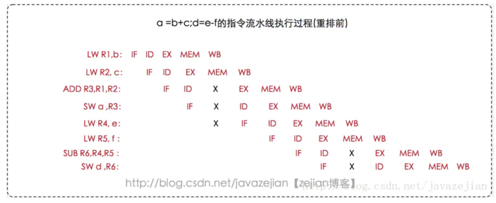

上述便是汇编指令的执行过程，在某些指令上存在X的标志，X代表中断的含义，也就是只要有X的地方就会导致指令流水线技术停顿，同时也会影响后续指令的执行，可能需要经过1个或几个指令周期才可能恢复正常，那为什么停顿呢？这是因为部分数据还没准备好，如执行ADD指令时，需要使用到前面指令的数据R1，R2，而此时R2的MEM操作没有完成，即未拷贝到存储器中，这样加法计算就无法进行，必须等到MEM操作完成后才能执行，也就因此而停顿了，其他指令也是类似的情况。前面阐述过，停顿会造成CPU性能下降，因此我们应该想办法消除这些停顿，这时就需要使用到指令重排了，如下图，既然ADD指令需要等待，那我们就利用等待的时间做些别的事情


作者：西部小笼包
链接：https://www.jianshu.com/p/c6f190018db1
来源：简书
著作权归作者所有。商业转载请联系作者获得授权，非商业转载请注明出处。


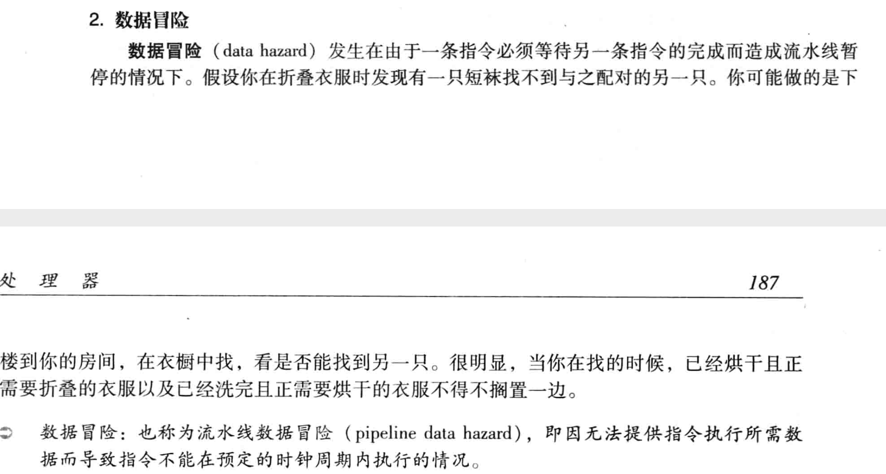

## 	寻址方式

 1   立即数寻址
   操作数就在指令中，作为指令的一部分，跟在操作码后存放在代码段。
  eg.   mov ah,01h
       mov ax,1204h 
      ;如果立即数是16位的，则高地址放在高位，低地址放在低位

 2   寄存器寻址
   操作数在寄存器中，指令中指定寄存器号。对于8位操作数，寄存器可以是AL,AH,BL,BH,
  CL,CH,DL,DH。 对于16位操作数，寄存器可以是AX,BX,CX,DX,BP,SP,SI,DI等
   eg.   mov ah,ch
       mov bx,ax

 3   直接寻址方式
   操作数在存储器中，指令直接包含操作数的有效地址EA。
  eg.   mov ax,[1122h]   ;将ds:1122的数据放在ax，默认段为DS
       mov es:[1234],al ;采用了段前缀

 4   寄存器间接寻址
   操作数在存储器中，操作数的有效地址在SI,DI,BX,BP这4个寄存器之一中。在不采用段前
  缀的情况下， 对于DI,SI,BX默认段为DS,而BP为SS。
   eg.   mov ah,[bx]
       mov ah,cs:[bx] ;使用了段前缀

 5   寄存器相对寻址
   操作数在存储器中，操作数的有效地址是一个基址寄存器(BX,BP)或变址寄存器(SI,DI)的
  内容加上8位或16位的位移之和。在指令中的8位和16位的常量采用补码表示，8位要被带
  符号扩展为16位。
  eg.   mov ah,[bx+6]
       ;段址默认情况与寄存器间接寻址相同

 6   基址加变址寻址
   操作数在存储器中，操作数的有效地址是一个基址寄存器(BX,BP)加上变址寄存器(SI,DI)的
  内容。如果有BP，则默认段址为SS,否则为DS.
  eg.   mov ah,[bx+si]

 7   相对基址加变址寻址
   操作数在存储器中，操作数的有效地址是一个基址寄存器(BX,BP)和变址寄存器(SI,DI)的
  内容加上8位或16位的位移之和。如果有BP，则默认段址为SS,否则为DS.
  eg.   mov ax,[bx+di-2]
       mov ax,1234h[bx][di]

## 进程调度算法

1、时间片轮转调度[算法](https://link.jianshu.com?t=http://lib.csdn.net/base/datastructure)（RR）：给每个进程固定的执行时间，根据进程到达的先后顺序让进程在单位时间片内执行，执行完成后便调度下一个进程执行，时间片轮转调度不考虑进程等待时间和执行时间，属于抢占式调度。优点是兼顾长短作业；缺点是平均等待时间较长，上下文切换较费时。适用于分时系统。
 2、先来先服务调度算法（FCFS）：根据进程到达的先后顺序执行进程，不考虑等待时间和执行时间，会产生饥饿现象。属于非抢占式调度，优点是公平，实现简单；缺点是不利于短作业。
 3、优先级调度算法（HPF）：在进程等待队列中选择优先级最高的来执行。
 4、多级反馈队列调度算法：将时间片轮转与优先级调度相结合，把进程按优先级分成不同的队列，先按优先级调度，优先级相同的，按时间片轮转。优点是兼顾长短作业，有较好的响应时间，可行性强，适用于各种作业环境。
 5、高响应比优先调度算法：根据“响应比=（进程执行时间+进程等待时间）/ 进程执行时间”这个公式得到的响应比来进行调度。高响应比优先算法在等待时间相同的情况下，作业执行的时间越短，响应比越高，满足段任务优先，同时响应比会随着等待时间增加而变大，优先级会提高，能够避免饥饿现象。优点是兼顾长短作业，缺点是计算响应比开销大，适用于批处理系统。


作者：韩故
链接：https://www.jianshu.com/p/ecfddbc0af2d
来源：简书
著作权归作者所有。商业转载请联系作者获得授权，非商业转载请注明出处。


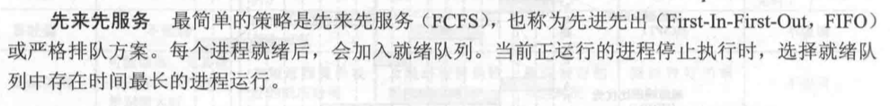


## 内核空间 用户空间 同步异步

https://developer.aliyun.com/article/726412

- 内核空间

操作系统单独拥有的内存空间为内核空间，这块内存空间独立于其他的应用内存空间，除了操作系统，其他应用程序不允许访问这块空间。但操作系统可以同时操作内核空间和用户空间。

- 用户空间

单独给用户应用进程分配的内存空间，操作系统和应用程序都可以访问这块内存空间。

- 同步

调用线程发出同步请求后，在没有得到结果前，该调用就不会返回。所有同步调用都必须是串行的，前面的同步调用处理完了后才能处理下一个同步调用。

- 异步

调用线程发出异步请求后，在没有得到结果前，该调用就返回了。真正的结果数据会在业务处理完成后通过发送信号或者回调的形式通知调用者。

- 阻塞

调用线程发出请求后，在没有得到结果前，该线程就会被挂起，此时CPU也不会给此线程分配时间，此线程处于非可执行状态。直到返回结果返回后，此线程才会被唤醒，继续运行。划重点：线程进入阻塞状态不占用CPU资源。

- 非阻塞

调用线程发出请求后，在没有得到结果前，该调用就返回了，整个过程调用线程不会被挂起。

## 32 位和 64 位 CPU 

最主要区别在于一次能计算多少字节数据：

- 32 位 CPU 一次可以计算 4 个字节；
- 64 位 CPU 一次可以计算 8 个字节；

这里的 32 位和 64 位，通常称为 CPU 的位宽。

之所以 CPU 要这样设计，是为了能计算更大的数值，如果是 8 位的 CPU，那么一次只能计算 1 个字节 `0~255` 范围内的数值，这样就无法一次完成计算 `10000 * 500` ，于是为了能一次计算大数的运算，CPU 需要支持多个 byte 一起计算，所以 CPU 位宽越大，可以计算的数值就越大，比如说 32 位 CPU 能计算的最大整数是`4294967295`。

## 为什么32位系统最大内存是4G

数据是如何通过地址总线传输的呢？其实是通过操作电压，低电压表示 0，高压电压则表示 1。

如果构造了高低高这样的信号，其实就是 101 二进制数据，十进制则表示 5，如果只有一条线路，就意味着每次只能传递 1 bit 的数据，即 0 或 1，那么传输 101 这个数据，就需要 3 次才能传输完成，这样的效率非常低。

这样一位一位传输的方式，称为串行，下一个 bit 必须等待上一个 bit 传输完成才能进行传输。当然，想一次多传一些数据，增加线路即可，这时数据就可以并行传输。

为了避免低效率的串行传输的方式，线路的位宽最好一次就能访问到所有的内存地址。CPU 要想操作的内存地址就需要地址总线，如果地址总线只有 1 条，那每次只能表示 「0 或 1」这两种情况，所以 CPU 一次只能操作 2 个内存地址；如果想要 CPU 操作 4G 的内存，那么就需要 32 条地址总线，因为 `2 ^ 32 = 4G`。

## 64位比32位的优势

对于 64 位 CPU 就可以一次性算出加和两个 64 位数字的结果，因为 64 位 CPU 可以一次读入 64 位的数字，并且 64 位 CPU 内部的逻辑运算单元也支持 64 位数字的计算。

但是并不代表 64 位 CPU 性能比 32 位 CPU 高很多，很少应用需要算超过 32 位的数字，所以**如果计算的数额不超过 32 位数字的情况下，32 位和 64 位 CPU 之间没什么区别的，只有当计算超过 32 位数字的情况下，64 位的优势才能体现出来**。

另外，32 位 CPU 最大只能操作 4GB 内存，就算你装了 8 GB 内存条，也没用。而 64 位 CPU 寻址范围则很大，理论最大的寻址空间为 `2^64`。

## CPU 执行程序的过程如下：

- 第一步，CPU 读取「程序计数器」的值，这个值是指令的内存地址，然后 CPU 的「控制单元」操作「地址总线」指定需要访问的内存地址，接着通知内存设备准备数据，数据准备好后通过「数据总线」将指令数据传给 CPU，CPU 收到内存传来的数据后，将这个指令数据存入到「指令寄存器」。
- 第二步，CPU 分析「指令寄存器」中的指令，确定指令的类型和参数，如果是计算类型的指令，就把指令交给「逻辑运算单元」运算；如果是存储类型的指令，则交由「控制单元」执行；
- 第三步，CPU 执行完指令后，「程序计数器」的值自增，表示指向下一条指令。这个自增的大小，由 CPU 的位宽决定，比如 32 位的 CPU，指令是 4 个字节，需要 4 个内存地址存放，因此「程序计数器」的值会自增 4；

简单总结一下就是，一个程序执行的时候，CPU 会根据程序计数器里的内存地址，从内存里面把需要执行的指令读取到指令寄存器里面执行，然后根据指令长度自增，开始顺序读取下一条指令。

CPU 从程序计数器读取指令、到执行、再到下一条指令，这个过程会不断循环，直到程序执行结束，这个不断循环的过程被称为 **CPU 的指令周期**。

# Java

## Java和C++

https://blog.csdn.net/SHENNONGZHAIZHU/article/details/51897060?utm_medium=distribute.pc_relevant_t0.none-task-blog-BlogCommendFromMachineLearnPai2-1.add_param_isCf&depth_1-utm_source=distribute.pc_relevant_t0.none-task-blog-BlogCommendFromMachineLearnPai2-1.add_param_isCf

1、Java为解释性语言，其运行过程为：程序源代码经过Java编译器编译成字节码，然后由JVM解释执行。而C/C++为编译型语言，源代码经过编译和链接后生成可执行的二进制代码，可直接执行。因此Java的执行速度比C/C++慢，但Java能够跨平台执行，C/C++不能。

2、Java是纯面向对象语言，所有代码（包括函数、变量）必须在类中实现，除基本数据类型（包括int、float等）外，所有类型都是类。此外，Java语言中不存在全局变量或者全局函数，而C++兼具面向过程和面向对象编程的特点，可以定义全局变量和全局函数。

3、与C/C++语言相比，Java语言中没有指针的概念，这有效防止了C/C++语言中操作指针可能引起的系统问题，从而使程序变得更加安全。

4、与C++语言相比，Java语言不支持多重继承，但是Java语言引入了接口的概念，可以同时实现多个接口。由于接口也有多态特性，因此Java语言中可以通过实现多个接口来实现与C++语言中多重继承类似的目的。

5、在C++语言中，需要开发人员去管理内存的分配（包括申请和释放），而Java语言提供了垃圾回收器来实现垃圾的自动回收，不需要程序显示地管理内存的分配。在C++语言中，通常会把释放资源的代码放到析构函数中，Java语言中虽然没有析构函数，但却引入了一个finalize()方法，当垃圾回收器要释放无用对象的内存时，会首先调用该对象的finalize()方法，因此，开发人员不需要关心也不需要知道对象所占的内存空间何时被释放。

游戏，偏底层的系统：操作系统，数据库，中间件，编译器等等  用C++

## JRE 和 JDK 的区别是什么？

JRE： Java Runtime Environment
JDK：Java Development Kit 
JRE顾名思义是java运行时环境，包含了java虚拟机，java基础类库。是使用java语言编写的程序运行所需要的软件环境，是提供给想运行java程序的用户使用的。
JDK顾名思义是java开发工具包，是程序员使用java语言编写java程序所需的开发工具包，是提供给程序员使用的。JDK包含了JRE，同时还包含了编译java源码的编译器javac，还包含了很多java程序调试和分析的工具：jconsole，jvisualvm等工具软件，还包含了java程序编写所需的文档和demo例子程序。


作者：王博
链接：https://www.zhihu.com/question/20317448/answer/14737358
来源：知乎
著作权归作者所有。商业转载请联系作者获得授权，非商业转载请注明出处。

## 为什么synchronized无法禁止指令重排，却能保证有序性？

为了进一步提升计算机各方面能力，在硬件层面做了很多优化，如处理器优化和指令重排等，但是这些技术的引入就会导致有序性问题。

我们也知道，最好的解决有序性问题的办法，就是禁止处理器优化和指令重排，就像volatile中使用内存屏障一样。

但是，虽然很多硬件都会为了优化做一些重排，但是在Java中，不管怎么排序，都不能影响单线程程序的执行结果。这就是as-if-serial语义，所有硬件优化的前提都是必须遵守as-if-serial语义。

synchronized通过排他锁的方式就保证了同一时间内，被synchronized修饰的代码是单线程执行的。所以呢，这就满足了as-if-serial语义的一个关键前提，那就是**单线程**，因为有as-if-serial语义保证，单线程的有序性就天然存在了。

## 创建线程的三种方式的对比

1、采用实现Runnable、Callable接口的方式创建多线程

```
  优势：

   线程类只是实现了Runnable接口或Callable接口，还可以继承其他类。

   在这种方式下，多个线程可以共享同一个target对象，所以非常适合多个相同线程来处理同一份资源的情况，从而可以将CPU、代码和数据分开，形成清晰的模型，较好地体现了面向对象的思想。

   劣势：

 编程稍微复杂，如果要访问当前线程，则必须使用Thread.currentThread()方法。
```

2、使用继承Thread类的方式创建多线程

```
  优势：

  编写简单，如果需要访问当前线程，则无需使用Thread.currentThread()方法，直接使用this即可获得当前线程。

  劣势：

  线程类已经继承了Thread类，所以不能再继承其他父类。
```


## 类加载过程

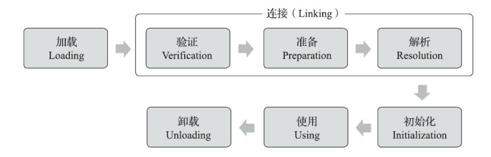

“加载”(Loading)阶段是整个“类加载”(Class Loading)过程中的一个阶段，

Java虚拟机需要完成以下三件事情:

1)通过一个类的全限定名来获取定义此类的二进制字节流。

2)将这个字节流所代表的静态存储结构转化为方法区的运行时数据结构。

3)在内存中生成一个代表这个类的java.lang.Class对象，作为方法区这个类的各种数据的访问入 口。


## Java 为什么是高效的?

因为 Java 使用 Just-In-Time (即时) 编译器.
把java字节码直接转换成可以直接发送给处理器的指令的程序

## NIO

Java NIO适合于处理大量链接的场景，因为他能够实现线程与链接解绑，从而减少了处理io中的线程数。

## String类不可变性的好处

1. 只有当字符串是不可变的，字符串池才有可能实现。字符串池的实现可以在运行时节约很多heap空间，因为不同的字符串变量都指向池中的同一个字符串。但如果字符串是可变的，那么String interning将不能实现([String interning](https://link.zhihu.com/?target=http%3A//en.wikipedia.org/wiki/String_interning)是指对不同的字符串仅仅只保存一个，即不会保存多个相同的字符串)，因为这样的话，如果变量改变了它的值，那么其它指向这个值的变量的值也会一起改变。
2. 如果字符串是可变的，那么会引起很严重的安全问题。譬如，数据库的用户名、密码都是以字符串的形式传入来获得数据库的连接，或者在socket编程中，主机名和端口都是以字符串的形式传入。因为字符串是不可变的，所以它的值是不可改变的，否则黑客们可以钻到空子，**改变字符串指向的对象的值，造成安全漏洞。**
3. 因为字符串是不可变的，所以是多线程安全的，同一个字符串实例可以被多个线程共享。这样便不用因为线程安全问题而使用同步。字符串自己便是线程安全的。
4. 类加载器要用到字符串，不可变性提供了安全性，以便正确的类被加载。譬如你想加载java.sql.Connection类，而这个值被改成了myhacked.Connection，那么会对你的数据库造成不可知的破坏。
5. 因为字符串是不可变的，所以在它创建的时候hashcode就被缓存了，不需要重新计算。这就使得字符串很适合作为Map中的键，字符串的处理速度要快过其它的键对象。这就是HashMap中的键往往都使用字符串。

## Object类方法

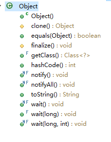

## 异常


## 集合方法使用

https://www.liaoxuefeng.com/wiki/1252599548343744/1265112034799552

## 集合


### hashmap

#### hashmap8和7的区别

https://blog.csdn.net/qq_36520235/article/details/82417949

1. `jdk7 数组+单链表 jdk8 数组+(单链表+红黑树) `
2. `jdk7 链表头插 jdk8 链表尾插 `
3. `jdk7 先扩容再put jdk8 先put再扩容  
4. `jdk7 计算hash运算多 jdk8 计算hash运算少
5. `jdk7 受rehash影响 jdk8 调整后是(原位置)or(原位置+旧容量)`


**1.8get**

https://crossoverjie.top/2018/07/23/java-senior/ConcurrentHashMap/

1. 判断当前桶是否为空，空的就需要初始化（resize 中会判断是否进行初始化）。
2. 根据当前 key 的 hashcode 定位到具体的桶中并判断是否为空，为空表明没有 Hash 冲突就直接在当前位置创建一个新桶即可。
3. 如果当前桶有值（ Hash 冲突），那么就要比较当前桶中的 `key、key 的 hashcode` 与写入的 key 是否相等，相等就赋值给 `e`,在第 8 步的时候会统一进行赋值及返回。
4. 如果当前桶为红黑树，那就要按照红黑树的方式写入数据。
5. 如果是个链表，就需要将当前的 key、value 封装成一个新节点写入到当前桶的后面（形成链表）。
6. 接着判断当前链表的大小是否大于预设的阈值，大于时就要转换为红黑树。
7. 如果在遍历过程中找到 key 相同时直接退出遍历。
8. 如果 `e != null` 就相当于存在相同的 key,那就需要将值覆盖。
9. 最后判断是否需要进行扩容。

**get**

- 首先将 key hash 之后取得所定位的桶。
- 如果桶为空则直接返回 null 。
- 否则判断桶的第一个位置(有可能是链表、红黑树)的 key 是否为查询的 key，是就直接返回 value。
- 如果第一个不匹配，则判断它的下一个是红黑树还是链表。
- 红黑树就按照树的查找方式返回值。
- 不然就按照链表的方式遍历匹配返回值。

死循环

https://blog.csdn.net/littlehaes/article/details/105241194

### ConcurrentHashMap

**put**

1. 根据 key 计算出 hashcode 。
2. 判断是否需要进行初始化。
3. `f` 即为当前 key 定位出的 Node，如果为空表示当前位置可以写入数据，利用 CAS 尝试写入，失败则自旋保证成功。
4. 如果当前位置的 `hashcode == MOVED == -1`,则需要进行扩容。
5. 如果都不满足，则利用 synchronized 锁写入数据。
6. 如果数量大于 `TREEIFY_THRESHOLD` 则要转换为红黑树。

**get**

- 根据计算出来的 hashcode 寻址，如果就在桶上那么直接返回值。
- 如果是红黑树那就按照树的方式获取值。
- 就不满足那就按照链表的方式遍历获取值。

ConcurrentHashMap源码分析（JDK8） 扩容实现机制

https://www.jianshu.com/p/487d00afe6ca

1线程执行put操作，发现容量已经达到扩容阈值，需要进行扩容操作，此时transferindex=tab.length=32

2扩容线程A 以cas的方式修改transferindex=31-16=16 ,然后按照降序迁移table[31]--table[16]这个区间的hash桶

3迁移hash桶时，会将桶内的链表或者红黑树，按照一定算法，拆分成2份，将其插入nextTable[i]和nextTable[i+n]（n是table数组的长度）。 迁移完毕的hash桶,会被设置成ForwardingNode节点，以此告知访问此桶的其他线程，此节点已经迁移完毕。

4此时线程2访问到了ForwardingNode节点，如果线程2执行的put或remove等写操作，那么就会先帮其扩容。如果线程2执行的是get等读方法，则会调用ForwardingNode的find方法，去nextTable里面查找相关元素。

###  CountDownLatch，CyclicBarrier，Semaphore 

https://mp.weixin.qq.com/s/TDw7GnzDw5FK3RWwkIzzZA

1. CountDownLatch 是一个线程等待其他线程， CyclicBarrier 是多个线程互相等待。
2. CountDownLatch 的计数是减 1 直到 0，CyclicBarrier 是加 1，直到指定值。
3. CountDownLatch 是一次性的， CyclicBarrier  可以循环利用。
4. CyclicBarrier 可以在最后一个线程达到屏障之前，选择先执行一个操作。
5. Semaphore ，需要拿到许可才能执行，并可以选择公平和非公平模式。

### 阻塞队列(BlockingQueue)的实现原理

https://blog.csdn.net/chenchaofuck1/article/details/51660119

- 支持阻塞的插入方法：当队列满时，队列会阻塞插入元素的线程，直到队列不满。
- 支持阻塞的移除方法：当队列为空时，获取元素的线程会等待队列变为非空。


## 线程转换关系

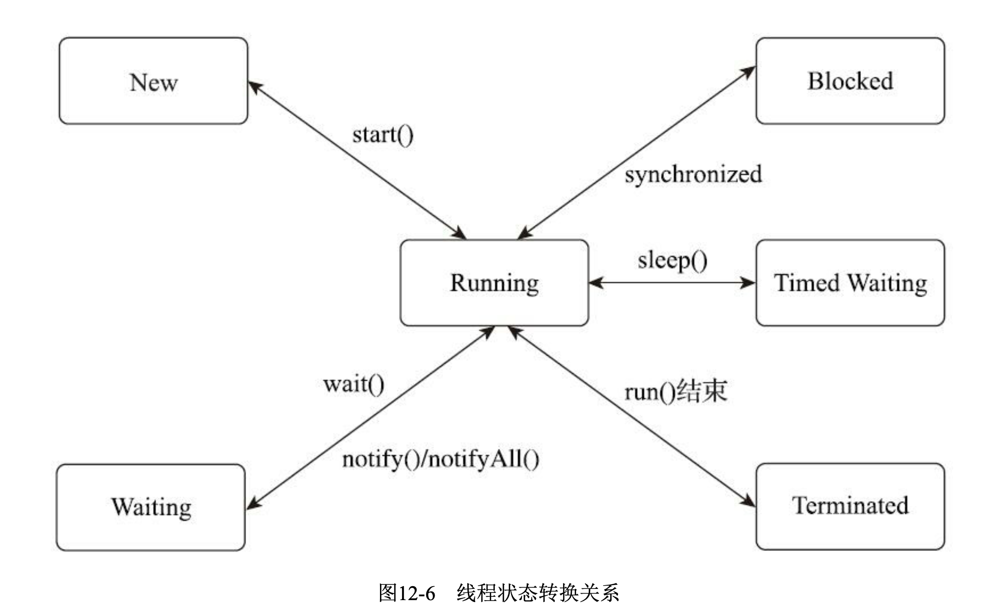

“阻塞状态”与“等待状态”的区别是“阻塞状态”在等待着获取到 一个排它锁，这个事件将在另外一个线程放弃这个锁的时候发生;而“等待状态”则是在等待一段时 间，或者唤醒动作的发生。在程序等待进入同步区域的时候，线程将进入这种状态。


## 线程池

### JAVA线程池参数详解

ThreadPoolExecutor(int corePoolSize,
                              int maximumPoolSize,
                              long keepAliveTime,
                              TimeUnit unit,
                              BlockingQueue<Runnable> workQueue,
                              ThreadFactory threadFactory,
                              RejectedExecutionHandler handler) 
复制代码
1、corePoolSize核心线程数量
       线程池内部核心线程数量，如果线程池收到任务，且线程池内部线程数量没有达到corePoolSize，线程池会直接给此任务创建一个新线程来处理此任务。具体是创建一个Work对象，此Work持有此任务Runnable、此线程Thread的引用。最后将此Work放入一个名叫workers的Set集合中。0 =< workers.size <=maximumPoolSize。

2、maximumPoolSize 最大允许线程数量
       线程池内部线程数量已经达到核心线程数量，即corePoolSize，并且任务队列已满，此时如果继续有任务被提交，将判断线程池内部线程总数是否达到maximumPoolSize，如果小于maximumPoolSize，将继续使用线程工厂创建新线程。如果线程池内线程数量等于maximumPoolSize，就不会继续创建线程，将触发拒绝策略RejectedExecutionHandler。新创建的同样是一个Work对象，并最终放入workers集合中。

3、keepAliveTime、unit 超出线程的存活时间
       当线程池内部的线程数量大于corePoolSize，则多出来的线程会在keepAliveTime时间之后销毁。

4、workQueue 任务队列
       线程池需要执行的任务的队列，通常有固定数量的ArrayBlockingQueue，无限制的LinkedBlockingQueue。

5、threadFactory 线程工厂，用于创建线程
       线程池内初初始没有线程，任务来了之后，会使用线程工厂创建线程。

6、handler 任务拒绝策略
       当任务队列已满，又有新的任务进来时，会回调此接口。有几种默认实现，通常建议根据具体业务来自行实现。

### 线程池数量

最佳线程数目 = （（线程等待时间+线程CPU时间）/线程CPU时间 ）* CPU数目

### 四种线程池拒绝策略

ThreadPoolExecutor.AbortPolicy:丢弃任务并抛出RejectedExecutionException异常。
ThreadPoolExecutor.DiscardPolicy：丢弃任务，但是不抛出异常。
ThreadPoolExecutor.DiscardOldestPolicy：丢弃队列最前面的任务，然后重新提交被拒绝的任务
ThreadPoolExecutor.CallerRunsPolicy：由调用线程（提交任务的线程）处理该任务


## ***\*FGC又是什么时候触发的\**？**

下面4种情况，对象会进入到老年代中：

- YGC时，To Survivor区不足以存放存活的对象，对象会直接进入到老年代。
- 经过多次YGC后，如果存活对象的年龄达到了设定阈值，则会晋升到老年代中。
- 动态年龄判定规则，To Survivor区中相同年龄的对象，如果其大小之和占到了 To Survivor区一半以上的空间，那么大于此年龄的对象会直接进入老年代，而不需要达到默认的分代年龄。
- 大对象：由-XX:PretenureSizeThreshold启动参数控制，若对象大小大于此值，就会绕过新生代, 直接在老年代中分配。

当晋升到老年代的对象大于了老年代的剩余空间时，就会触发FGC（Major GC），FGC处理的区域同时包括新生代和老年代。除此之外，还有以下4种情况也会触发FGC：

- 老年代的内存使用率达到了一定阈值（可通过参数调整），直接触发FGC。
- 空间分配担保：在YGC之前，会先检查老年代最大可用的连续空间是否大于新生代所有对象的总空间。如果小于，说明YGC是不安全的，则会查看参数 HandlePromotionFailure 是否被设置成了允许担保失败，如果不允许则直接触发Full GC；如果允许，那么会进一步检查老年代最大可用的连续空间是否大于历次晋升到老年代对象的平均大小，如果小于也会触发 Full GC。
- Metaspace（元空间）在空间不足时会进行扩容，当扩容到了-XX:MetaspaceSize 参数的指定值时，也会触发FGC。
- System.gc() 或者Runtime.gc() 被显式调用时，触发FGC。

## Minor GC的触发条件

当 Eden 区的空间耗尽，这个时候 Java虚拟机便会触发一次 **Minor GC**来收集新生代的垃圾，存活下来的对象，则会被送到 Survivor区。


## **volatile**

1、防止重排序

2、实现可见性


（1）LoadLoad 屏障
执行顺序：Load1—>Loadload—>Load2
确保Load2及后续Load指令加载数据之前能访问到Load1加载的数据。

（2）StoreStore  屏障
执行顺序：Store1—>StoreStore—>Store2
确保Store2以及后续Store指令执行前，Store1操作的数据对其它处理器可见。

（3）LoadStore 屏障
执行顺序： Load1—>LoadStore—>Store2
确保Store2和后续Store指令执行前，可以访问到Load1加载的数据。

（4）StoreLoad 屏障
执行顺序: Store1—> StoreLoad—>Load2
确保Load2和后续的Load指令读取之前，Store1的数据对其他处理器是可见的。

#### 原子操作的实现原理                                                                                                    

**（1）使用总线锁保证原子性**

第一个机制是通过总线锁保证原子性。如果多个处理器同时对共享变量进行读改写操作（i++就是经典的读改写操作），那么共享变量就会被多个处理器同时进行操作，这样读改写操作就不是原子的，操作完之后共享变量的值会和期望的不一致。那么，想要保证读改写共享变量的操作是原子的，就必须保证CPU1读改写共享变量的时候，CPU2不能操作缓存了该共享变量内存地址的缓存。处理器使用总线锁就是来解决这个问题的。**所谓总线锁就是使用处理器提供的一个LOCK＃信号，当一个处理器在总线上输出此信号时，其他处理器的请求将被阻塞住，那么该处理器可以独占共享内存。**

**（2）使用缓存锁保证原子性**

第二个机制是通过缓存锁定来保证原子性。在同一时刻，我们只需保证对某个内存地址的操作是原子性即可，但总线锁定把CPU和内存之间的通信锁住了，这使得锁定期间，其他处理器不能操作其他内存地址的数据，所以**总线锁定的开销比较大**，目前处理器在某些场合下使用缓存锁定代替总线锁定来进行优化。**所谓“缓存锁定”是指内存区域如果被缓存在处理器的缓存行中，并且在Lock操作期间被锁定，那么当它执行锁操作回写到内存时，处理器不在总线上声言LOCK＃信号，而是修改内部的内存地址，并允许它的缓存一致性机制来保证操作的原子性，因为缓存一致性机制会阻止同时修改由两个以上处理器缓存的内存区域数据，当其他处理器回写已被锁定的缓存行的数据时，会使缓存行无效。**

嗅探

来的处理器都提供了缓存锁定机制，也就说当某个处理器对缓存中的共享变量进行了操作，其他处理器会有个嗅探机制，将其他处理器的该共享变量的缓存失效，待其他线程读取时会重新从主内存中读取最新的数据，基于 MESI 缓存一致性协议来实现的。

嗅探过程

https://www.jianshu.com/p/537897436132

## sleep()和wait()


两者都可以让线程暂停一段时间,但是本质的区别是一个线程的运行状态控制,一个是线程之间的通讯的问题

## 轻量级锁

https://www.bbsmax.com/A/A2dmM7lbde/


## AQS

AQS，全称：AbstractQueuedSynchronizer，是JDK提供的一个同步框架，内部维护着FIFO双向队列，即CLH同步队列。

AQS依赖它来完成同步状态的管理（voliate修饰的state，用于标志是否持有锁）。如果获取同步状态state失败时，会将当前线程及等待信息等构建成一个Node，将Node放到FIFO队列里，同时阻塞当前线程，当线程将同步状态state释放时，会把FIFO队列中的首节的唤醒，使其获取同步状态state。
很多JUC包下的锁都是基于AQS实现的

在AQS中维护着一个FIFO的同步队列，当线程获取同步状态失败后，则会加入到这个CLH同步队列的对尾并一直保持着自旋。在CLH同步队列中的线程在自旋时会判断其前驱节点是否为首节点，如果为首节点则不断尝试获取同步状态，获取成功则退出CLH同步队列。当线程执行完逻辑后，会释放同步状态，释放后会唤醒其后继节点。 

共享式同步状态过程
共享式与独占式的最主要区别在于同一时刻独占式只能有一个线程获取同步状态，而共享式在同一时刻可以有多个线程获取同步状态。例如读操作可以有多个线程同时进行，而写操作同一时刻只能有一个线程进行写操作，其他操作都会被阻塞。 


## **类需要同时满足下面3个条件才能算是 “无用的类” ：**

1.该类所有的实例都已经被回收，也就是 Java 堆中不存在该类的任何实例。

2.加载该类的 ClassLoader 已经被回收。

3.该类对应的 java.lang.Class 对象没有在任何地方被引用，无法在任何地方通过反射访问该类的方法。

 

**如何判断一个常量是废弃常量：**

运行时常量池主要回收的是废弃的常量。那么，我们如何判断一个常量是废弃常量呢?

假如在常量池中存在字符串"abc" ,如果当前没有任何String对象引用该字符串常量的话，就说明常量"abc"就是废弃常量,如果这时发生内存回收的话而且有必要的话，" abc"就会被系统清理出常量池。

## 反射

实现

jdk是通过UNSAFE类对堆内存中对象的属性进行直接的读取和写入，要读取和写入首先需要确定属性所在的位置，也就是相对对象起始位置的偏移量

反射机制是在运行状态中，对于任意一个类，都能够知道这个类的所有属性和方法；对于任意一个对象，都能够调用它的任意一个方法和属性；这种动态获取的信息以及动态调用对象的方法的功能称为java语言的反射机制。

功能

①、在运行时判断任意一个对象所属的类
 ②、在运行时构造任意一个类的对象
 ③、在运行时判断任意一个类所具有的成员变量和方法（通过反射设置可以调用 private）
 ④、在运行时调用人一个对象的方法

 反射的缺点
　　1.性能第一:反射包括了一些动态类型，所以 JVM 无法对这些代码进行优化。因此，反射操作的 效率要比那些非反射操作低得多。我们应该避免在经常被 执行的代码或对性能要求很高的程 序中使用反射。
　　2.安全限制:使用反射技术要求程序必须在一个没有安全限制的环境中运行。如果一个程序必须在有安全限制的环境中运行，如 Applet，那么这就是个问题了
　　3.内部暴露:由于反射允许代码执行一些在正常情况下不被允许的操作（比如访问私有的属性和方法），所以使用反射可能会导致意料之外的副作用－－代码有功能上的错误，降低可移植性。 反射代码破坏了抽象性，因此当平台发生改变的时候，代码的行为就有可能也随着变化。


### 反射为什么慢

经过以上优化，其实反射的效率并不慢，在某些情况下可能达到和直接调用基本相同的效率，但是在首次执行或者没有缓存的情况下还是会有性能上的开销，主要在以下方面

1. Class.forName();会调用本地方法，我们用到的method和field都会在此时加载进来，虽然会进行缓存，但是本地方法免不了有JAVA到C+=在到JAVA得转换开销
2. class.getMethod()，会遍历该class所有的公用方法，如果没匹配到还会遍历父类的所有方法，并且getMethods()方法会返回结果的一份拷贝，所以该操作不仅消耗CPU还消耗堆内存，在热点代码中应该尽量避免，或者进行缓存
3. invoke参数是一个object数组，而object数组不支持java基础类型，而自动装箱也是很耗时的

## 双亲委派

过程

源ClassLoader先判断该Class是否已加载，如果已加载，则返回Class对象；如果没有则委托给父类加载器。
父类加载器判断是否加载过该Class，如果已加载，则返回Class对象；如果没有则委托给祖父类加载器。
依此类推，直到始祖类加载器（引用类加载器）。
始祖类加载器判断是否加载过该Class，如果已加载，则返回Class对象；如果没有则尝试从其对应的类路径下寻找class字节码文件并载入。如果载入成功，则返回Class对象；如果载入失败，则委托给始祖类加载器的子类加载器。
始祖类加载器的子类加载器尝试从其对应的类路径下寻找class字节码文件并载入。如果载入成功，则返回Class对象；如果载入失败，则委托给始祖类加载器的孙类加载器。
依此类推，直到源ClassLoader。
源ClassLoader尝试从其对应的类路径下寻找class字节码文件并载入。如果载入成功，则返回Class对象；如果载入失败，源ClassLoader不会再委托其子类加载器，而是抛出异常。

当一个类加载器去加载类时先尝试让父类加载器去加载，如果父类加载器加载不了再尝试自身加载。这也是我们在自定义ClassLoader时java官方建议遵守的约定。

**双亲委派模型能保证基础类仅加载一次，不会让jvm中存在重名的类。比如String.class，每次加载都委托给父加载器，最终都是BootstrapClassLoader，都保证java核心类都是BootstrapClassLoader加载的，保证了java的安全与稳定性。**

自己实现ClassLoader时只需要继承ClassLoader类，然后覆盖findClass（String name）方法即可完成一个带有双亲委派模型的类加载器。

破坏双亲委派模型

1代码热替换，在不重启服务器的情况下可以修改类的代码并使之生效。

热部署步骤：

1. 销毁自定义classloader(被该加载器加载的class也会自动卸载)；
2. 更新class
3. 使用新的ClassLoader去加载class

JVM中的Class只有满足以下三个条件，才能被GC回收，也就是该Class被卸载（unload）：

- 该类所有的实例都已经被GC，也就是JVM中不存在该Class的任何实例。
- 加载该类的ClassLoader已经被GC。
- 该类的java.lang.Class 对象没有在任何地方被引用，如不能在任何地方通过反射访问该类的方法

2JDBC

我们知道Java核心API（比如rt.jar包）是使用Bootstrap ClassLoader类加载器加载的，而用户提供的Jar包是由AppClassLoader加载的。如果一个类由类加载器加载，那么这个类依赖的类也是由相同的类加载器加载的。

- 第一，从META-INF/services/java.sql.Driver文件中获取具体的实现类名“com.mysql.jdbc.Driver”
- 第二，加载这个类，这里肯定只能用class.forName("com.mysql.jdbc.Driver")来加载

好了，问题来了，Class.forName()加载用的是调用者的Classloader，这个调用者DriverManager是在rt.jar中的，ClassLoader是启动类加载器，而com.mysql.jdbc.Driver肯定不在/lib下，所以肯定是无法加载mysql中的这个类的。这就是双亲委派模型的局限性了，父级加载器无法加载子级类加载器路径中的类。

那么，这个问题如何解决呢？按照目前情况来分析，这个mysql的drvier只有应用类加载器能加载，那么我们只要在启动类加载器中有方法获取应用程序类加载器，然后通过它去加载就可以了。这就是所谓的线程上下文加载器。

**线程上下文类加载器让父级类加载器能通过调用子级类加载器来加载类，这打破了双亲委派模型的原则**

简单的说就是破坏了可见性


3tomcat中的每个项目之间能加载不用的lib

## 全盘负责

“全盘负责”是指当一个ClassLoader装载一个类时，除非显示地使用另一个ClassLoader，则该类所依赖及引用的类也由这个CladdLoader载入。

例如，系统类加载器AppClassLoader加载入口类（含有main方法的类）时，会把main方法所依赖的类及引用的类也载入，依此类推。“全盘负责”机制也可称为当前类加载器负责机制。显然，入口类所依赖的类及引用的类的当前类加载器就是入口类的类加载器。
————————————————
版权声明：本文为CSDN博主「zhangzeyuaaa」的原创文章，遵循CC 4.0 BY-SA版权协议，转载请附上原文出处链接及本声明。
原文链接：https://blog.csdn.net/zhangzeyuaaa/article/details/42499839

## 有了基本类型为什么还要有包装类？

逻辑上来讲，java只有包装类就够了，为了运行速度，需要用到基本数据类型。

我们都知道在Java语言中，new一个对象存储在堆里，我们通过栈中的引用来使用这些对象。但是对于经常用到的一系列类型如int、boolean… 如果我们用new将其存储在堆里就不是很高效——特别是简单的小的变量。所以，同C++ 一样Java也采用了相似的做法，决定基本数据类型不是用new关键字来创建，而是直接将变量的值存储在栈中，方法执行时创建，结束时销毁，因此更加高效。
————————————————
版权声明：本文为CSDN博主「田潇文」的原创文章，遵循CC 4.0 BY-SA版权协议，转载请附上原文出处链接及本声明。
原文链接：https://blog.csdn.net/weixin_44259720/article/details/87009843

## Arrays.asList为什么不能增加或者修改

1.返回的是内部类，而内部类对元素的定义是final

```
private final E[] a;
```

2.Arrays继承了AbstractList<E>，而在AbstractList中U对add方法天然就会抛出异常“throw new UnsupportedOperationException();”，平时我们使用的都是ArrayList的add方法，它是进行了重写；

## Random在高并发下的缺陷以及JUC对其的优化

    protected int next(int bits) {
        long oldseed, nextseed;//定义旧种子，下一个种子
        AtomicLong seed = this.seed;
        do {
            oldseed = seed.get();//获得旧的种子值，赋值给oldseed 
            nextseed = (oldseed * multiplier + addend) & mask;//一个神秘的算法
        } while (!seed.compareAndSet(oldseed, nextseed));//CAS，如果seed的值还是为oldseed，就用nextseed替换掉，并且返回true，退出while循环，如果已经不为oldseed了，就返回false，继续循环
        return (int)(nextseed >>> (48 - bits));//一个神秘的算法
    }


定义了旧种子oldseed，下一个种子（新种子）nextseed。

获得旧的种子的值，赋值给oldseed 。

一个神秘的算法，计算出下一个种子（新种子）赋值给nextseed。

使用CAS操作，如果seed的值还是oldseed，就用nextseed替换掉，并且返回true，！true为false，退出while循环；如果seed的值已经不为oldseed了，就说明seed的值已经被替换过了，返回false，！false为true，继续下一次while循环。

一个神秘的算法，根据nextseed计算出随机数，并且返回。

作者：CoderBear
链接：https://juejin.im/post/5cbc1e3bf265da039d32819c
来源：掘金
著作权归作者所有。商业转载请联系作者获得授权，非商业转载请注明出处。

CAS会有竞争

优化：

ThreadLocalRandom中，把probe和seed设置到当前的线程，这样其他线程就拿不到了。


## 抽象类和接口的区别

比较
从定义上看

抽象类是包含抽象方法的类；
接口是抽象方法和全局变量的集合。

从组成上看

抽象类由构造方法、抽象方法、普通方法、常量和变量构成；
接口由常量、抽象方法构成，在 JDK 1.8 以后，接口里可以有静态方法和方法体。

从使用上看

子类继承抽象类（extends）;
子类实现接口（implements）。

从关系上看

抽象类可以实现多个接口；
接口不能继承抽象类，但是允许继承多个接口。

从局限上看

抽象类有单继承的局限；
接口没有单继承的限制。

区分
类是对对象的抽象，抽象类是对类的抽象；

接口是对行为的抽象。

若行为跨越不同类的对象，可使用接口；

对于一些相似的类对象，用继承抽象类。

抽象类是从子类中发现了公共的东西，泛化出父类，然后子类继承父类；

接口是根本不知子类的存在，方法如何实现还不确认，预先定义。


## 偏向锁

https://www.jianshu.com/p/e62fa839aa41

**在大多数情况下，锁不仅不存在多线程竞争，而且总是由同一线程多次获得**，为了让线程获得锁的代价更低，引进了偏向锁。

引入偏向锁主要目的是：**为了在没有多线程竞争的情况下尽量减少不必要的轻量级锁执行路径**。因为轻量级锁的加锁解锁操作是需要依赖多次CAS原子指令的，**而偏向锁只需要在置换ThreadID的时候依赖一次CAS原子指令**

流程

**检测Mark Word是否为可偏向状态**，即是否为偏向锁1，锁标识位为01；

**若为可偏向状态，则测试线程ID是否为当前线程ID**，如果是，则执行步骤（5），否则执行步骤（3）；

**如果测试线程ID不为当前线程ID**，则通过CAS操作竞争锁，竞争成功，则将Mark Word的线程ID替换为当前线程ID，否则执行线程（4）；

**通过CAS竞争锁失败，证明当前存在多线程竞争情况，当到达全局安全点，获得偏向锁的线程被挂起，偏向锁升级为轻量级锁**，然后被阻塞在安全点的线程继续往下执行同步代码块；

执行同步代码块；

## 轻量级锁

引入轻量级锁的主要目的是 **在没有多线程竞争的前提下，减少传统的重量级锁使用操作系统互斥量产生的性能消耗**。


**为什么升级为轻量锁时要把对象头里的Mark Word复制到线程栈的锁记录中呢**？

> 因为在申请对象锁时 **需要以该值作为CAS的比较条件**，同时在升级到重量级锁的时候，**能通过这个比较判定是否在持有锁的过程中此锁被其他线程申请过**，如果被其他线程申请了，则在释放锁的时候要唤醒被挂起的线程。

此处，如何理解“轻量级”？**“轻量级”是相对于使用操作系统互斥量来实现的传统锁而言的**。但是，首先需要强调一点的是，**轻量级锁并不是用来代替重量级锁的，它的本意是在没有多线程竞争的前提下，减少传统的重量级锁使用产生的性能消耗**。

> **轻量级锁所适应的场景是线程交替执行同步块的情况，如果存在同一时间访问同一锁的情况，必然就会导致轻量级锁膨胀为重量级锁**。

## 重量级锁

Synchronized是通过对象内部的一个叫做 **监视器锁（Monitor）来实现的**。**但是监视器锁本质又是依赖于底层的操作系统的Mutex Lock来实现的。而操作系统实现线程之间的切换这就需要从用户态转换到核心态，这个成本非常高，状态之间的转换需要相对比较长的时间**，这就是为什么Synchronized效率低的原因。因此，这种依赖于操作系统Mutex Lock所实现的锁我们称之为 **“重量级锁”**。

mutex互斥锁一句话：保护共享资源。


作者：猿码架构
链接：https://www.jianshu.com/p/e62fa839aa41
来源：简书
著作权归作者所有。商业转载请联系作者获得授权，非商业转载请注明出处。


## Cas坏处

Core1和Core2可能会同时把主存中某个位置的值Load到自己的L1 Cache中，**当Core1在自己的L1 Cache中修改这个位置的值时，会通过总线，使Core2中L1 Cache对应的值“失效”，而Core2一旦发现自己L1 Cache中的值失效（称为Cache命中缺失）则会通过总线从内存中加载该地址最新的值，大家通过总线的来回通信称为“Cache一致性流量”**，因为总线被设计为固定的“通信能力”，**如果Cache一致性流量过大，总线将成为瓶颈**。而当Core1和Core2中的值再次一致时，称为“Cache一致性”，**从这个层面来说，锁设计的终极目标便是减少Cache一致性流量**。

而CAS恰好会导致Cache一致性流量，如果有很多线程都共享同一个对象，当某个Core CAS成功时必然会引起总线风暴，**这就是所谓的本地延迟，本质上偏向锁就是为了消除CAS，降低Cache一致性流量**。

1简单的说就是会引起总线风暴

2空循环

**库存减减案例：**比如有个库存是AtomicInteger类型，当只有一个线程去对他做减减的时候最快（即使机器有多个核），**线程越多库存减到0需要的时间越长**，但是CPU的利用率基本一直在100%，这是典型的浪费，花了更多的CPU只做了同样的事情（乐观锁不乐观）

​     如果是synchronized 来对库存加锁减减， 并发减库存的线程数量多少对整个库存减到0所需要的时间没有影响，线程再多CPU一般也跑不满（大概50%），系统能看到cs明显比CAS的情况高很多

3ABA问题

## CGLIB和JDK

CGLib创建的动态代理对象性能比JDK创建的动态代理对象的性能高不少，但是CGLib在创建代理对象时所花费的时间却比JDK多得多，所以对于单例的对象，因为无需频繁创建对象，用CGLib合适，反之，使用JDK方式要更为合适一些。同时，由于CGLib由于是采用动态创建子类的方法，对于final方法，无法进行代理。

JDK动态代理在调用方法时，使用了反射技术来调用被拦截的方法，效率低下，CGLib底层采用ASM字节码生成框架，使用字节码技术生成代理类，比使用Java反射效率要高。并且CGLIB采用`fastclass`机制来进行调用，对一个类的方法建立索引，通过索引来直接调用相应的方法。唯一需要注意的是，CGLib不能对声明为final的方法进行代理。

## Java为什么可以跨平台

Java之所以能跨平台,本质原因在于jvm不是跨平台的

执行过程：Java编译器将Java源程序编译成与平台无关的字节码文件(class文件)，然后由Java虚拟机（JVM）对字节码文件解释执行。该字节码与系统平台无关，是介于源代码和机器指令之间的一种状态。在后续执行时，采取解释机制将Java字节码解释成与系统平台对应的机器指令。这样既减少了编译次数，又增强了程序的可移植性，因此被称为“一次编译，多处运行！”。

## GC的缺点

GC(垃圾回收/garbage collector)也不是完美的，缺点就是如果会在程序运行时产生暂停；一般来说垃圾回收算法越好，暂停时间越短暂。

## 虚引用

**虚引用**主要用来**跟踪对象**被垃圾回收器**回收**的活动。 **虚引用**与**软引用**和**弱引用**的一个区别在于：

> 虚引用必须和引用队列(ReferenceQueue)联合使用。当垃圾回收器准备回收一个对象时，如果发现它还有虚引用，就会在回收对象的内存之前，把这个虚引用加入到与之关联的引用队列中。

```
    String str = new String("abc");
    ReferenceQueue queue = new ReferenceQueue();
    // 创建虚引用，要求必须与一个引用队列关联
    PhantomReference pr = new PhantomReference(str, queue);
复制代码
```

程序可以通过判断引用**队列**中是否已经加入了**虚引用**，来了解被引用的对象是否将要进行**垃圾回收**。如果程序发现某个虚引用已经被加入到引用队列，那么就可以在所引用的对象的**内存被回收之前**采取必要的行动。

简单的说是，虚引用是用来判断对象是否被即将回收，然后程序再采取相应的措施

作者：零壹技术栈
链接：https://juejin.im/post/5b82c02df265da436152f5ad
来源：掘金
著作权归作者所有。商业转载请联系作者获得授权，非商业转载请注明出处。

### Java对象的内存分配过程是如何保证线程安全的？

> 每个线程在Java堆中预先分配一小块内存，然后再给对象分配内存的时候，直接在自己这块”私有”内存中分配，当这部分区域用完之后，再分配新的”私有”内存。

这种方案被称之为TLAB分配，即Thread Local Allocation Buffer。这部分Buffer是从堆中划分出来的，但是是本地线程独享的。

**“堆是线程共享的内存区域”这句话并不完全正确，因为TLAB是堆内存的一部分，他在读取上确实是线程共享的，但是在内存分分配上，是线程独享的。**


作者：HollisChuang
链接：https://juejin.im/post/5e66f59f6fb9a07cde64e6da
来源：掘金
著作权归作者所有。商业转载请联系作者获得授权，非商业转载请注明出处。

## 虚拟机栈和本地方法栈溢出

1.定义了大量的本地变量，增大此方法帧中本地变量表的长度。

2.递归

3.线程太多

## 多态

多态中方法多态的实现是靠动态分派

### 动态分派原理

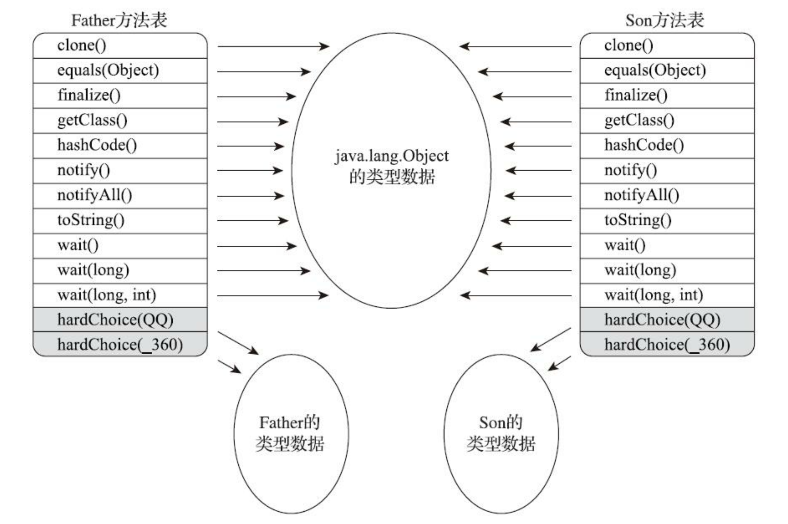

虚方法表中存放着各个方法的实际入口地址。如果某个方法在子类中没有被重写，那子类的虚方 法表中的地址入口和父类相同方法的地址入口是一致的，都指向父类的实现入口。如果子类中重写了 这个方法，子类虚方法表中的地址也会被替换为指向子类实现版本的入口地址。在图8-3中，Son重写 了 来 自 F a t h e r 的 全 部 方 法 ， 因 此 So n 的 方 法 表 没 有 指 向 F a t h e r 类 型 数 据 的 箭 头 。 但 是 So n 和 F a t h e r 都 没 有 重写来自Object的方法，所以它们的方法表中所有从Object继承来的方法都指向了Object的数据类型。


## 为什么用元空间

　1、字符串存在永久代中，容易出现性能问题和内存溢出。

　　2、类及方法的信息等比较难确定其大小，因此对于永久代的大小指定比较困难，太小容易出现永久代溢出，太大则容易导致老年代溢出。

　　3、永久代会为 GC 带来不必要的复杂度，并且回收效率偏低。


## ThreadLocal

场景

我们上线后发现部分用户的日期居然不对了，排查下来是SimpleDataFormat的锅，当时我们使用SimpleDataFormat的parse()方法，内部有一个Calendar对象，调用SimpleDataFormat的parse()方法会先调用Calendar.clear（），然后调用Calendar.add()，如果一个线程先调用了add()然后另一个线程又调用了clear()，这时候parse()方法解析的时间就不对了。

其实要解决这个问题很简单，让每个线程都new 一个自己的 SimpleDataFormat就好了，但是1000个线程难道new1000个SimpleDataFormat？

所以当时我们使用了线程池加上ThreadLocal包装SimpleDataFormat，再调用initialValue让每个线程有一个SimpleDataFormat的副本，从而解决了线程安全的问题，也提高了性能。

我在项目中存在一个线程经常遇到横跨若干方法调用，需要传递的对象，也就是上下文（Context），它是一种状态，经常就是是用户身份、任务信息等，就会存在过渡传参的问题。

使用到类似责任链模式，给每个方法增加一个context参数非常麻烦，而且有些时候，如果调用链有无法修改源码的第三方库，对象参数就传不进去了，所以我使用到了ThreadLocal去做了一下改造，这样只需要在调用前在ThreadLocal中设置参数，其他地方get一下就好了。

## web 容器的作用

https://www.jianshu.com/p/99f34a91aefe

## JDBC流程：

第一步：加载Driver类，注册数据库驱动；
第二步：通过DriverManager,使用url，用户名和密码建立连接(Connection)；
第三步：通过Connection，使用sql语句打开Statement对象；
第四步：执行语句，将结果返回resultSet；
第五步：对结果resultSet进行处理；
第六步：倒叙释放资源resultSet-》preparedStatement-》connection。

## Java线程池是如何实现线程复用的？

https://www.jianshu.com/p/5e952ab2c41b

1、当Thread的run方法执行完一个任务之后，会循环地从阻塞队列中取任务来执行，这样执行完一个任务之后就不会立即销毁了；

2、当工作线程数小于核心线程数，那些空闲的核心线程再去队列取任务的时候，如果队列中的Runnable数量为0，就会阻塞当前线程，这样线程就不会回收了

## 动态代理

https://www.zhihu.com/question/20794107	


## 泛型缺点

简单说就是擦除后，重载问题

​    List<String>list = new ArrayList<String>();

​    //List<Object>list2 = new ArrayList<String>();

局限性1：

集合等号两边所传递的值必须相同否则会报错，原因就是Java中的泛型有一个擦除的机制，就是所编译器期间编译器认识泛型，但是在运行期间Java虚拟机就不认识泛型了，有兴趣的可以通过反编译来看一下，那么运行期间就会变成Listlist = new ArrayList ();如果最终变成这个样子了，那么传入泛型还有什么意思，所以在程序编译期间就报错，这样泛型就得以应用了（这个实际上是引用c++中的模板没有用好才导致的，Java中用泛型的场景就是写一个通用的方法）。

局限性2：

  现在要写一个比较通用的方法。

​       publicvoid fun1(List<Object> list){

​       System.out.println("泛型方法");

​      }

​    但是在调用的时候传入的String类型变量就会报错

​    publicvoid test2(){

​       List<String>list = new ArrayList<String>();

​       //fun1(list);报错

​    }

原因无他，就是泛型擦除，理由同局限性1，那么怎么办呢？

重载吧！类型变量为String的一个，Integer的一个。     

public void fun1(List<String> list){

​      System.out.println("泛型方法1");

  }

  public void fun1(List<Integer>list){

​      System.out.println("泛型方法2");

   }

这个时候编译器又报错了，为啥呢？还是泛型擦除，当运行的时候会导致，参数都变成List  list，那么这两个方法都变成一个了。

# Mysql

## 储存格式


## SQL语句执行过程

​	客户端发送一条查询给服务器。

服务器先检查查询缓存，如果命中了缓存，则立刻返回存储在缓存中的结果。否则进入下一阶段。

服务器端进行SQL解析、预处理，再由优化器生成对应的执行计划。

MySQL根据优化器生成的执行计划，再调用存储引擎的API来执行查询。

将结果返回给客户端。


作者：程序员历小冰
链接：https://juejin.im/post/5b7036de6fb9a009c40997eb
来源：掘金
著作权归作者所有。商业转载请联系作者获得授权，非商业转载请注明出处。

## 索引为什么选择了B+树

http://www.gxlcms.com/mysql-366759.html

- **更少的IO次数：**B+树的非叶节点只包含键，而不包含真实数据，因此每个节点存储的记录个数比B数多很多（即阶m更大），因此B+树的高度更低，访问时所需要的IO次数更少。此外，由于每个节点存储的记录数更多，所以对访问局部性原理的利用更好，缓存命中率更高。
- **更适于范围查询：**在B树中进行范围查询时，首先找到要查找的下限，然后对B树进行中序遍历，直到找到查找的上限；而B+树的范围查询，只需要对链表进行遍历即可。
- **更稳定的查询效率：**B树的查询时间复杂度在1到树高之间(分别对应记录在根节点和叶节点)，而B+树的查询复杂度则稳定为树高，因为所有数据都在叶节点。

B+树也存在劣势：由于键会重复出现，因此会占用更多的空间。但是与带来的性能优势相比，空间劣势往往可以接受，因此B+树的在数据库中的使用比B树更加广泛。

## MySQL中myisam与innodb的区别

(1)、问5点不同；

1>.InnoDB支持事物，而MyISAM不支持事物

2>.InnoDB支持行级锁，而MyISAM支持表级锁

3>.InnoDB支持MVCC, 而MyISAM不支持

4>.InnoDB支持外键，而MyISAM不支持

innoDB聚集索引

(2)、innodb引擎的4大特性
插入缓冲（insert buffer),二次写(double write),自适应哈希索引(ahi),预读(read ahead)
(3)、2者selectcount(*)哪个更快，为什么
myisam更快，因为myisam内部维护了一个计数器，可以直接调取。

如何选择：

如果是只读，表小，可以容忍修复操作 选择myisam

## 二次写理解

简单的说就是以较快的速度快速顺序写入磁盘，这样可以防止断电后，页数据错误。


https://www.jianshu.com/p/7d87e2603cdd

## explain详解

https://www.jianshu.com/p/be1c86303c80

## 事务

事务：是数据库操作的最小工作单元，是作为单个逻辑工作单元执行的一系列操作；这些操作作为一个整体一起向系统提交，要么都执行、要么都不执行；事务是一组不可再分割的操作集合（工作逻辑单元）；

## 索引失效

NOT条件

LIKE通配符

条件上包括函数

数据类型的转换

当查询条件存在隐式转换时，索引会失效。比如在数据库里id存的number类型，但是在查询时，却用了下面的形式：

```
select * from sunyang where id='123';
```

如果mysql觉得全表扫描更快时（数据少）

索引统计的误差大

## mvcc实现原理

https://zhuanlan.zhihu.com/p/64576887

https://zhuanlan.zhihu.com/p/64576887

版本链
  对于使用InnoB引擎的表来说，它的聚簇索引记录中都包含两个必要的隐藏列：

    trx_id：每次一个事务对某条聚簇索引记录进行改动时，都会把该事务的事务id赋值给trx_id隐藏列；即记录事务ID。
    roll_pointer：每次对某条聚簇索引记录进行改动时，都会把旧的版本写入到undo日志中，然后这个隐藏列就相当于一个指针，可以通过它来找到该记录修改前的信息。

  每次对记录改动，都会记录一条undo日志，每条undo日志也都有一个roll_pointer属性（INSERT操作对应的undo日志没有该属性，因为该记录并没有更早的版本），将这条数据的undo日志组成一个链表；即为版本链。版本链的头节点就是当前记录的最新值。

## MVCC中的**ReadView**（可读视图）

说完了undo log我们再来看看ReadView。已提交读和可重复读的区别就在于它们生成ReadView的策略不同。

ReadView中主要就是有个列表来存储我们系统中当前活跃着的读写事务，也就是begin了还未提交的事务。通过这个列表来判断记录的某个版本是否对当前事务可见。其中最主要的与可见性相关的属性如下：

**up_limit_id**：当前已经提交的事务号 + 1，事务号 < up_limit_id ，对于当前Read View都是可见的。理解起来就是创建Read View视图的时候，之前已经提交的事务对于该事务肯定是可见的。

**low_limit_id**：当前最大的事务号 + 1，事务号 >= low_limit_id，对于当前Read View都是不可见的。理解起来就是在创建Read View视图之后创建的事务对于该事务肯定是不可见的。

**trx_ids**：为活跃事务id列表，即Read View初始化时当前未提交的事务列表。所以当进行RR读的时候，trx_ids中的事务对于本事务是不可见的（除了自身事务，自身事务对于表的修改对于自己当然是可见的）。理解起来就是创建RV时，将当前活跃事务ID记录下来，后续即使他们提交对于本事务也是不可见的。

用一张图更好的理解一下：


## 日志 redo undo binlog

https://mp.weixin.qq.com/s/Lx4TNPLQzYaknR7D3gmOmQ

`binlog`记载的是`update/delete/insert`这样的SQL语句，而`redo log`记载的是物理修改的内容（xxxx页修改了xxx）。

所以在搜索资料的时候会有这样的说法：`redo log` 记录的是数据的**物理变化**，`binlog` 记录的是数据的**逻辑变化**


`undo log`主要有两个作用：回滚和多版本控制(MVCC)

`undo log`主要存储的也是逻辑日志，比如我们要`insert`一条数据了，那`undo log`会记录的一条对应的`delete`日志。我们要`update`一条记录时，它会记录一条对应**相反**的update记录。

### binlog和redo log 写入的细节 

`redo log`**事务开始**的时候，就开始记录每次的变更信息，而`binlog`是在**事务提交**的时候才记录。

于是新有的问题又出现了：我写其中的某一个`log`，失败了，那会怎么办？现在我们的前提是先写`redo log`，再写`binlog`，我们来看看：

- 如果写`redo log`失败了，那我们就认为这次事务有问题，回滚，不再写`binlog`。
- 如果写`redo log`成功了，写`binlog`，写`binlog`写一半了，但失败了怎么办？我们还是会对这次的**事务回滚**，将无效的`binlog`给删除（因为`binlog`会影响从库的数据，所以需要做删除操作）
- 如果写`redo log`和`binlog`都成功了，那这次算是事务才会真正成功。

简单来说：MySQL需要保证`redo log`和`binlog`的**数据是一致**的，如果不一致，那就乱套了。

- 如果`redo log`写失败了，而`binlog`写成功了。那假设内存的数据还没来得及落磁盘，机器就挂掉了。那主从服务器的数据就不一致了。（从服务器通过`binlog`得到最新的数据，而主服务器由于`redo log`没有记载，没法恢复数据）
- 如果`redo log`写成功了，而`binlog`写失败了。那从服务器就拿不到最新的数据了。

MySQL通过**两阶段提交**来保证`redo log`和`binlog`的数据是一致的。

### **redo log，为啥还需要binlog呢？**

> 1、redo log的大小是固定的，日志上的记录修改落盘后，日志会被覆盖掉，无法用于数据回滚/数据恢复等操作。
>  2、redo log是innodb引擎层实现的，并不是所有引擎都有。

- **基于以上，binlog必不可少**

> 1、binlog是server层实现的，意味着所有引擎都可以使用binlog日志
>  2、binlog通过追加的方式写入的，可通过配置参数max_binlog_size设置每个binlog文件的大小，当文件大小大于给定值后，日志会发生滚动，之后的日志记录到新的文件上。
>  3、binlog有两种记录模式，statement格式的话是记sql语句， row格式会记录行的内容，记两条，更新前和更新后都有。


作者：Mr林_月生
链接：https://www.jianshu.com/p/4bcfffb27ed5
来源：简书
著作权归作者所有。商业转载请联系作者获得授权，非商业转载请注明出处。

## 两种复制方式

语句复制

简单的说就是复制sql语句

好处：

1.实现简单

2.占用宽带少

3.兼容表中列顺序不同的情况

坏处：

1.有些sql语句无法复制，如当前的时间戳，rand,uuid函数

行复制

好处：

1.几乎没有无法复制的场景

2.减少锁的使用，不要求串行

3.如果找不到对应的行，基于行复制会停止，而语句的复制则不会。

坏处

1.无法判断执行了什么sql语句

2.占用宽带多

举个例子，如update操作，语句只用发条语句，行的话可能要发送全部的行

## 复制的过程


过滤是为了过滤一些数据库权限的语句

## 备库升级主库

计划中

1停止向主库写

2让备库追上主库

3将一台备库升级为主库

4把写操作指向新的主库

计划外

1找到数据最新的备库

2让所有备库先重发好在之前主库的数据

3追赶新的主库

4把写操作指向新的主库

## Mvcc和next-key lock为什么不能完全解决幻读

https://blog.csdn.net/weixin_42907817/article/details/107121470

如果基于锁来控制的话，当对某个记录进行修改的时候，另一个事务将需要等待，不管他是要读取还是写入，MVCC 允许写入的时候还能够进行读操作，这对大部分都是查询操作的应用来说极大的提高了 tps 。

## 为什么不建议使用订单号作为主键?

如果主键是一个很长的字符串并且建了很多普通索引，将造成普通索引占有很大的物理空间，这也是为什么建议使用 自增ID 来替代订单号作为主键，另一个原因是 自增ID 在插入的时候可以保证相邻的两条记录可能在同一个数据块，而订单号的连续性在设计上可能没有自增ID好，导致连续插入可能在多个数据块，增加了磁盘读写次数。

不自增也会导致，B+树的分页等

## 排序

排序有好多种算法来实现，在 MySQL 中经常会带上一个 limit ,表示从排序后的结果集中取前 100 条，或者取第 n 条到第 m 条，要实现排序，我们需要先根据查询条件获取结果集，然后在内存中对这个结果集进行排序，如果结果集数量特别大，还需要将结果集写入到多个文件里，然后单独对每个文件里的数据进行排序，然后在文件之间进行归并，排序完成后在进行 limit 操作。没错，这个就是 MySQL 实现排序的方式，前提是排序的字段没有索引。

```undefined
CREATE TABLE `person` (
  `id` int(11) NOT NULL,
  `city` varchar(16) NOT NULL,
  `name` varchar(16) NOT NULL,
  `age` int(11) NOT NULL,
  `addr` varchar(128) DEFAULT NULL,
  PRIMARY KEY (`id`),
  KEY `city` (`city`)
) ENGINE=InnoDB;

select city,name,age from person where city='武汉' order by name limit 100  ;
```

使用 explain 发现该语句会使用 city 索引，并且会有 filesort . 我们分析下该语句的执行流程

- 1.初始化 sortbuffer ，用来存放结果集

- 2.找到 city 索引，定位到 city 等于武汉的第一条记录，获取主键索引ID

- 3.根据 ID 去主键索引上找到对应记录，取出 city,name,age 字段放入 sortbuffer

- 4.在 city 索引取下一个 city 等于武汉的记录的主键ID

- 5.重复上面的步骤，直到所有 city 等于武汉的记录都放入 sortbuffer

- 6.对 sortbuffer 里的数据根据 name 做快速排序

- 7.根据排序结果取前面 1000 条返回

  这里是查询 city,name,age 3个字段，比较少，如果查询的字段较多，则多个列如果都放入 sortbuffer 将占有大量内存空间，另一个方案是只区出待排序的字段和主键放入 sortbuffer 这里是 name 和 id ,排序完成后在根据 id 取出需要查询的字段返回，其实就是时间换取空间的做法，这里通过 max_length_for_sort_data 参数控制，是否采用后面的方案进行排序。

另外如果 sortbuffer 里的条数很多，同样会占有大量的内存空间，可以通过参数 sort_buffer_size 来控制是否需要借助文件进行排序，这里会把 sortbuffer 里的数据放入多个文件里，用归并排序的思路最终输出一个大的文件。

以上方案主要是 name 字段没有加上索引，如果 name 字段上有索引，由于索引在构建的时候已经是有序的了，所以就不需要进行额外的排序流程只需要在查询的时候查出指定的条数就可以了，这将大大提升查询速度。我们现在加一个 city 和 name 的联合索引。

```undefined
alter table person add index city_user(city, name);
```

这样查询过程如下：

- 1.根据 city,name 联合索引定位到 city 等于武汉的第一条记录，获取主键索引ID
- 2.根据 ID 去主键索引上找到对应记录，取出 city,name,age 字段作为结果集返回
- 3.继续重复以上步骤直到 city 不等于武汉，或者条数大于 1000

由于联合所以在构建索引的时候，在 city 等于武汉的索引节点中的数据已经是根据 name 进行排序了的，所以这里只需要直接查询就可，另外这里如果加上 city, name, age 的联合索引，则可以用到索引覆盖，不行到主键索引上进行回表。

总结一下，我们在有排序操作的时候，最好能够让排序字段上建有索引，另外由于查询第一百万条开始的一百条记录，需要过滤掉前面一百万条记录，即使用到索引也很慢，所以可以根据 ID 来进行区分，分页遍历的时候每次缓存上一次查询结果最后一条记录的 id ， 下一次查询加上 id > xxxx limit 0,1000 这样可以避免前期扫描到的结果被过滤掉的情况。

## 数据库死锁场景


我们分析一下：

- 从第③步中可以看出，`Session A`中的事务先对`hero`表聚簇索引的`id`值为1的记录加了一个`X型正经记录锁`。

- 从第④步中可以看出，`Session B`中的事务对`hero`表聚簇索引的`id`值为3的记录加了一个`X型正经记录锁`。

- 从第⑤步中可以看出，`Session A`中的事务接着想对`hero`表聚簇索引的`id`值为3的记录也加了一个`X型正经记录锁`，但是与第④步中`Session B`中的事务加的锁冲突，所以`Session A`进入阻塞状态，等待获取锁。

- 从第⑥步中可以看出，`Session B`中的事务想对`hero`表聚簇索引的`id`值为1的记录加了一个`X型正经记录锁`，但是与第③步中`Session A`中的事务加的锁冲突，而此时`Session A`和`Session B`中的事务循环等待对方持有的锁，死锁发生，被`MySQL`服务器的死锁检测机制检测到了，所以选择了一个事务进行回滚，并向客户端发送一条消息：

  ```
  ERROR 1213 (40001): Deadlock found when trying to get lock; try restarting transaction
  ```

作者：小孩子4919
链接：https://juejin.im/post/5d8082bc6fb9a06b032031a2
来源：掘金
著作权归作者所有。商业转载请联系作者获得授权，非商业转载请注明出处。

## 分布式数据库演化出现的问题

2、读写分离

随着业务的发展，数据量与数据访问量不断增长，很多时候应用的主要业务是读多写少的，比如说一些新闻网站，运营在后台上传了一堆新闻之后，所有的用户都会去读取这些新闻资讯，因此数据库面临的读压力远大于写压力，那么这时候在原来数据库 Master 的基础上增加一个备用数据库 Slave，备库和主库存储着相同的数据，但只提供读服务，不提供写服务。以后的写操作以及事务中的读操作就走主库，其它读操作就走备库，这就是所谓的读写分离。

读写分离会直接带来两个问题：

1）数据复制问题

因为最新写入的数据只会存储在主库中，之后想要在备库中读取到新数据就必须要从主库复制过来，这会带来一定的延迟，造成短期的数据不一致性。但这个问题应该也没有什么特别好的办法，主要依赖于数据库提供的数据复制机制，常用的是根据数据库日志 binary-log 实现数据复制。

2）数据源选择问题

读写分离之后我们都知道写要找主库，读要找备库，但是程序不知道，所以我们在程序中应该根据 SQL 来判断出是读操作还是写操作，进而正确选择要访问的数据库。

3、垂直分库

数据量与访问量继续上升时，主备库的压力都在变大，这时候可以根据业务特点考虑将数据库垂直拆分，即把数据库中不同的业务单元的数据划分到不同的数据库里面。比如说，还是新闻网站，注册用户的信息与新闻是没有多大关系的，数据库访问压力大时可以尝试把用户信息相关的表放在一个数据库，新闻相关的表放在一个数据库中，这样大大减小了数据库的访问压力。

垂直分库会带来以下问题：

- **事务的ACID将被打破**：数据被分到不同的数据库，原来的事务操作将会受很大影响。比如说注册用户时需要在一个事务中往用户表和用户信息表插入一条数据，单机数据库可以利用本地事务很好地完成这件事儿，但是多机就会变得比较麻烦。这个问题就涉及到分布式事务，分布式事务的解决方案有很多，比如使用强一致性的分布式事务框架[Seata](https://github.com/seata/seata)，或者使用[RocketMQ](http://rocketmq.apache.org/docs/transaction-example/)等消息队列实现最终一致性。
- **Join联表操作困难**：这个也毋庸置疑了，解决方案一般是将联表查询改成多个单次查询，在代码层进行关联。
- **外键约束受影响**：因为外键约束和唯一性约束一样本质还是依靠索引实现的，所以分库后外键约束也会收到影响。但外键约束本就不太推荐使用，一般都是在代码层进行约束，这个问题倒也不会有很大影响。

4、水平分表

- **自增主键会有影响**：分表中如果使用的是自增主键的话，那么就不能产生唯一的 ID 了，因为逻辑上来说多个分表其实都属于一张表，数据库的自增主键无法标识每一条数据。一般采用[分布式的id生成策略](https://zhuanlan.zhihu.com/p/107939861)解决这个问题。

  > 比如我上一家公司在分库之上有一个目录库，里面存了数据量不是很大的系统公共信息，其中包括一张类似于Oracle的sequence的`hibernate_sequence`表用于实现的id序列生成。

- **有些单表查询会变成多表**：比如说 count 操作，原来是一张表的问题，现在要从多张分表中共同查询才能得到结果。

- **排序和分页影响较大**：比如 `order by id limit 10`按照10个一页取出第一页，原来只需要一张表执行直接返回给用户，现在有5个分库要从5张分表分别拿出10条数据然后排序，返回50条数据中最前面的10条。当翻到第二页的时候，需要每张表拿出20条数据然后排序，返回100条数据中的第二个11～20条。很明显这个操作非常损耗性能。

## 什么是索引

索引其实是一种数据结构，能够帮助我们快速的检索数据库中的数据。

## B+ Tree索引和Hash索引区别 

哈希索引适合等值查询，但是不无法进行范围查询 哈希索引没办法利用索引完成排序 哈希索引不支持多列联合索引的最左匹配规则 如果有大量重复键值得情况下，哈希索引的效率会很低，因为存在哈希碰撞问题

## 非关系数据库

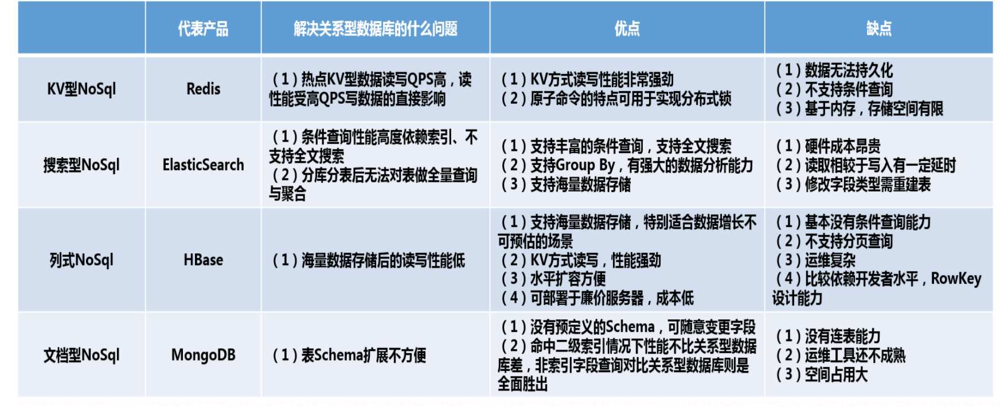

## 关系数据库优缺点

- **易理解**

　　因为行 + 列的二维表逻辑是非常贴近逻辑世界的一个概念，关系模型相对网状、层次等其他模型更加容易被理解

- **操作方便**

　　通用的SQL语言使得操作关系型数据库非常方便，支持join等复杂查询，Sql + 二维表是关系型数据库一个无可比拟的优点，易理解与易用的特点非常贴近开发者

- **数据一致性**

　　支持ACID特性，可以维护数据之间的一致性，这是使用数据库非常重要的一个理由之一，例如同银行转账，张三转给李四100元钱，张三扣100元，李四加100元，而且必须同时成功或者同时失败，否则就会造成用户的资损

- **数据稳定**

　　数据持久化到磁盘，没有丢失数据风险，支持海量数据存储

- **服务稳定**

　　最常用的关系型数据库产品MySql、Oracle服务器性能卓越，服务稳定，通常很少出现宕机异常


- **高并发下IO压力大**

　　数据按行存储，即使只针对其中某一列进行运算，也会将整行数据从存储设备中读入内存，导致IO较高

- **为维护索引付出的代价大**

　　为了提供丰富的查询能力，通常热点表都会有多个二级索引，一旦有了二级索引，数据的新增必然伴随着所有二级索引的新增，数据的更新也必然伴随着所有二级索引的更新，这不可避免地降低了关系型数据库的读写能力，且索引越多读写能力越差。有机会的话可以看一下自己公司的数据库，除了数据文件不可避免地占空间外，索引占的空间其实也并不少

- **为维护数据一致性付出的代价大**

　　数据一致性是关系型数据库的核心，但是同样为了维护数据一致性的代价也是非常大的。我们都知道SQL标准为事务定义了不同的隔离级别，从低到高依次是读未提交、读已提交、可重复度、串行化，事务隔离级别越低，可能出现的并发异常越多，但是通常而言能提供的并发能力越强。那么为了保证事务一致性，数据库就需要提供并发控制与故障恢复两种技术，前者用于减少并发异常，后者可以在系统异常的时候保证事务与数据库状态不会被破坏。对于并发控制，其核心思想就是加锁，无论是乐观锁还是悲观锁，只要提供的隔离级别越高，那么读写性能必然越差

- **水平扩展后带来的种种问题难处理**

　　前文提过，随着企业规模扩大，一种方式是对数据库做分库，做了分库之后，数据迁移（1个库的数据按照一定规则打到2个库中）、跨库join（订单数据里有用户数据，两条数据不在同一个库中）、分布式事务处理都是需要考虑的问题，尤其是分布式事务处理，业界当前都没有特别好的解决方案

- **表结构扩展不方便**

　　由于数据库存储的是结构化数据，因此表结构schema是固定的，扩展不方便，如果需要修改表结构，需要执行DDL（data definition language）语句修改，修改期间会导致锁表，部分服务不可用

- **全文搜索功能弱**

　　例如like "%中国真伟大%"，只能搜索到"2019年中国真伟大，爱祖国"，无法搜索到"中国真是太伟大了"这样的文本，即不具备分词能力，且like查询在"%中国真伟大"这样的搜索条件下，无法命中索引，将会导致查询效率大大降低

写了这么多，我的理解核心还是前三点，它反映出的一个问题是**关系型数据库在高并发下的能力是有瓶颈的**，尤其是写入/更新频繁的情况下，出现瓶颈的结果就是数据库CPU高、Sql执行慢、客户端报数据库连接池不够等错误，因此例如万人秒杀这种场景，我们绝对不可能通过数据库直接去扣减库存。

可能有朋友说，数据库在高并发下的能力有瓶颈，我公司有钱，加CPU、换固态硬盘、继续买服务器加数据库做分库不就好了，问题是这是一种性价比非常低的方式，花1000万达到的效果，换其他方式可能100万就达到了，不考虑人员、服务器投入产出比的Leader就是个不合格的Leader，且关系型数据库的方式，受限于它本身的特点，可能花了钱都未必能达到想要的效果。至于什么是花100万就能达到花1000万效果的方式呢？可以继续往下看，这就是我们要说的NoSql。

## MySQL中有一条SQL比较慢

回答Pass标准：

\1. 先看explain sql， 看看SQL的执行计划。

\2. 执行计划中重点关注，走到了哪个索引，如果没有索引，则建立索引

 原因，好的索引可以减少查找全表的数据遍历。

\3. 额外能够回答出：关注临时表创建，关注回表，关注索引覆盖，关注驱动表之中的最少一个。 


### 关系型数据库的常见设计范式

https://www.zhihu.com/question/24696366/answer/29189700

1NF的定义为：符合1NF的关系中的每个属性都不可再分

第二范式（2NF）2NF在1NF的基础之上，消除了非主属性对于码的部分函数依赖。

第三范式（3NF） 3NF在2NF的基础之上，消除了非主属性对于码的传递函数依赖。

### 图解MySQL 内连接、外连接、左连接、右连接、全连接

https://blog.csdn.net/plg17/article/details/78758593

## 一棵B+数可以存放多少行数据。

 这个就得因地制宜了。首先，InnoDB底层的数据页大小默认为16KB，一般来说，生产环境一行数据为1KB左右，那么一个数据页可以存放16条数据。剩下的只要计算有多少个数据页就行了。
 InnoDB的一个页可以为索引页，也可以为数据页。数据页上文已分析。对于索引页，里面数据是怎么存放的呢？索引页存放的是主键和指针（6 Byte），若建表时没有指定主键，mysql会自动创建一个6Byte的主键。一般数据库中我们使用bigint的自增id作为主键（8Byte），那么一个<主键，指针>对大小为14Byte。一个16KB的索引页可以存放16*1024/14=1170个单元。
 一般树高为3层，那么对应的数据页有1170*1170个，数据行数为1170*1170*16=2000W行。


作者：赖床实习生
链接：https://www.jianshu.com/p/b6f8261da854
来源：简书
著作权归作者所有。商业转载请联系作者获得授权，非商业转载请注明出处。


## 数据库死锁怎么处理

1.每个事务都有一个时间阀值，如果该事务超时，那么就回滚该事务。

这样实现简单，但是，如果事务操作很多行，占用了较多的undolog，而另外一个事务占用较少，这样不合适，而且超时不是一种主动检查死锁的方式。

2.使用等待图

比如，row1事务2上写锁，事务1上读锁，那么事务1就要等事务2，就是说事务1指向事务2，可以用深度遍历，如果存在环，那么挑一个undo log量最小的来进行回滚。

## 数据恢复策略

https://www.cnblogs.com/gxcstyle/p/6881477.html

系统故障
系统故障的恢复是由系统在重新启动时候自动完成的，不需要用户干预。
系统的恢复步骤是：
（1）正向扫描日志文件（即从头扫描日志文件），找出在故障发生前已经提交的事务（这些事务既有BEGIN TRANSACTION记录，也有COMMIT记录），将其事务标识记入重做（REDO）队列。同时找出故障发生时尚未完成的事务（这些事务只有BEGIN TRANSACTION记录，无相应的COMMIT记录）,将其事务标识记入撤销队列。
（2）对撤销队列中的各个事务进行撤销（UNDO）处理。
进行UNDO处理的方法是，反向扫描日志文件，对每一个UNDO事务的更新操作执行逆操作，将将日志记录中"更新前的值"写入数据库（该方法和事务故障的解决方法一致）。
（3）对重做队列中的各个事务进行重做（REDO）处理。
进行REDO处理的方法是：正向扫描日志文件，对每一个REDO事务从新执行日志文件登记的操作。即将日志记录中"更新后的值"写入数据库。

## MySqlr如何建立连接

https://my.oschina.net/alchemystar/blog/833598


Step1:客户端向DB发起TCP握手。
Step2:三次握手成功。与通常流程不同的是，由DB发送HandShake信息。这个Packet里面包含了MySql的能力、加密seed等信息。
Step3:客户端根据HandShake包里面的加密seed对MySql登录密码进行摘要后，构造Auth认证包发送给DB。
Step4:DB接收到客户端发过来的Auth包后会对密码摘要进行比对，从而确认是否能够登录。如果能，则发送Okay包返回。
Step5:客户端与DB的连接至此完毕。

## 分布式数据库数据一致性原理说明与实现

https://cloud.tencent.com/developer/article/1013767

**Raft算法**保障的

## Join算法原理

https://zhuanlan.zhihu.com/p/54275505

**

## 分库表关联问题**

在单库单表的情况下，联合查询是非常容易的。但是，随着分库与分表的演变，联合查询就遇到跨库关联的问题。粗略的解决方法：ER分片：子表的记录与所关联的父表记录存放在同一个数据分片上。全局表：基础数据，所有库都拷贝一份。字段冗余：这样有些字段就不用join去查询了。ShareJoin：是一个简单的跨分片join，目前支持2个表的join,原理就是解析SQL语句，拆分成单表的SQL语句执行，然后把各个节点的数据汇集。

## Mysql优缺点

**优点：**

- 体积小、速度快、总体拥有成本低，开源；
- 支持多种操作系统；
- 是开源数据库，提供的接口支持多种语言连接操作
- mysql的核心程序采用完全的多线程编程。线程是轻量级的进程，它可以灵活地为用户提供服务，而不过多的系统资源。用多线程和C语言实现的MySql能很容易充分利用CPU；
- MySql有一个非常灵活而且安全的权限和口令系统。当客户与MySql服务器连接时，他们之间所有的口令传送被加密，而且MySql支持主机认证；
- 支持ODBC for Windows， 支持所有的ODBC 2.5函数和其他许多函数， 可以用Access连接MySql服务器， 使得应用被扩展；
- 支持大型的数据库， 可以方便地支持上千万条记录的数据库。作为一个开放源代码的数据库，可以针对不同的应用进行相应的修改。
- 拥有一个非常快速而且稳定的基于线程的内存分配系统，可以持续使用面不必担心其稳定性；
- MySQL同时提供高度多样性，能够提供很多不同的使用者介面，包括命令行客户端操作，网页浏览器，以及各式各样的程序语言介面，例如C+，Perl，Java，PHP，以及Python。你可以使用事先包装好的客户端，或者干脆自己写一个合适的应用程序。MySQL可用于Unix，Windows，以及OS/2等平台，因此它可以用在个人电脑或者是服务器上；

**缺点：**[返回搜狐，查看更多](https://www.sohu.com/?strategyid=00001&spm=smpc.content.content.2.1601865635126ZpwiCVt)

- 不支持热备份；
- MySQL最大的缺点是其安全系统，主要是复杂而非标准，另外只有到调用mysqladmin来重读用户权限时才发生改变；
- 没有一种存储过程(Stored Procedure)语言，这是对习惯于企业级数据库的程序员的最大限制；
- MySQL的价格随平台和安装方式变化。Linux的MySQL如果由用户自己或系统管理员而不是第三方安装则是免费的，第三方案则必须付许可费。Unix或linux 自行安装 免费 、Unix或Linux 第三方安装 收费；

## 索引不生效 前缀索引

https://mp.weixin.qq.com/s/-gmAPfiKMNJgHhIZqR2C4A

## 索引设计准则：三星索引

 法则：将选择性最高的列放在索引的最前列，这种建立在某些场景可能有用，但通常不如避免随机 IO 和 排序那么重要，这里引入索引设计中非常著名的一个准则：三星索引。

如果一个查询满足三星索引中三颗星的所有索引条件，**理论上**可以认为我们设计的索引是最好的索引。什么是三星索引

1. 第一颗星：WHERE 后面参与查询的列可以组成了单列索引或联合索引
2. 第二颗星：避免排序，即如果 SQL 语句中出现 order by colulmn，那么取出的结果集就已经是按照 column 排序好的，不需要再生成临时表
3. 第三颗星：SELECT 对应的列应该尽量是索引列，即尽量避免回表查询。

## [SQL truncate 、delete与drop区别](https://www.cnblogs.com/8765h/archive/2011/11/25/2374167.html)

https://www.cnblogs.com/8765h/archive/2011/11/25/2374167.html

1. truncate 和 delete 只删除数据不删除表的结构(定义)
drop 语句将删除表的结构被依赖的约束(constrain)、触发器(trigger)、索引(index)；依赖于该表的存储过程/函数将保留,但是变为 invalid 状态。

 

2. delete 语句是数据库操作语言(dml)，这个操作会放到 rollback segement 中，事务提交之后才生效；如果有相应的 trigger，执行的时候将被触发。
truncate、drop 是数据库定义语言(ddl)，操作立即生效，原数据不放到 rollback segment 中，不能回滚，操作不触发 trigger。

## 预编译语句

https://www.cnblogs.com/micrari/p/7112781.html

通常我们的一条sql在db接收到最终执行完毕返回可以分为下面三个过程：

1. 词法和语义解析
2. 优化sql语句，制定执行计划
3. 执行并返回结果

我们把这种普通语句称作**Immediate Statements**。

但是很多情况，我们的一条sql语句可能会反复执行，或者每次执行的时候只有个别的值不同（比如query的where子句值不同，update的set子句值不同,insert的values值不同）。
如果每次都需要经过上面的词法语义解析、语句优化、制定执行计划等，则效率就明显不行了。

所谓预编译语句就是将这类语句中的值用占位符替代，可以视为将sql语句模板化或者说参数化，一般称这类语句叫**Prepared Statements**或者**Parameterized Statements**
预编译语句的优势在于归纳为：**一次编译、多次运行，省去了解析优化等过程；此外预编译语句能防止sql注入。**
当然就优化来说，很多时候最优的执行计划不是光靠知道sql语句的模板就能决定了，往往就是需要通过具体值来预估出成本代价。

# Spring

## 控制反转

控制反转就是把创建和管理 bean 的过程转移给了第三方。而这个第三方，就是 Spring IoC Container，对于 IoC 来说，最重要的就是**容器**。

容器负责创建、配置和管理 bean，也就是它管理着 bean 的生命，控制着 bean 的依赖注入。

通俗点讲，因为项目中每次创建对象是很麻烦的，所以我们使用 Spring IoC 容器来管理这些对象，需要的时候你就直接用，不用管它是怎么来的、什么时候要销毁，只管用就好了。

何为控制，控制的是什么？

答：是 bean 的创建、管理的权利，控制 bean 的整个生命周期。

何为反转，反转了什么？

答：把这个权利交给了 Spring 容器，而不是自己去控制，就是反转。由之前的自己主动创建对象，变成现在被动接收别人给我们的对象的过程，这就是反转。

## 依赖注入

何为依赖，依赖什么？

程序运行需要依赖外部的资源，提供程序内对象的所需要的数据、资源。

何为注入，注入什么？

配置文件把资源从外部注入到内部，容器加载了外部的文件、对象、数据，然后把这些资源注入给程序内的对象，维护了程序内外对象之间的依赖关系。

## 初始化

IOC容器的初始化分为三个过程实现：
第一个过程是Resource资源定位。这个Resouce指的是BeanDefinition的资源定位。这个过程就是容器找数据的过程，就像水桶装水需要先找到水一样。
第二个过程是BeanDefinition的载入过程。这个载入过程是把用户定义好的Bean表示成Ioc容器内部的数据结构，而这个容器内部的数据结构就是BeanDefition。
第三个过程是向IOC容器注册这些BeanDefinition的过程，这个过程就是将前面的BeanDefition保存到HashMap中的过程。
 BeanDefinition:
SpringIOC 容器管理了我们定义的各种 Bean 对象及其相互的关系，Bean 对象在 Spring 实现中是以 BeanDefinition 来描述的。
BeanDefinition定义了Bean的数据结构，用来存储Bean。
Bean 的解析过程非常复杂，Bean 的解析主要就是对 Spring 配置文件的解析,使用BeanDefinitionReader对资源文件进行解析。

一：Resource定位
想要构建BeanDefinition，需要先找到配置文件，也就是通常所说的applicationContetx.xml等配置文件
二：BeanDefinition载入
找到资源文件之后，后面的就是解析这个文件并将其转化为容器支持的BeanDifination结构，可以分为一下三步：
1.构造一个BeanFactory,也就是IOC容器
2.调用XML解析器得到document对象   XmlBeanDefinitionReader
3.按照Spring的规则解析document对象为容器支持的BeanDefition类型
三：向IOC容器注册BeanDefition
在IOC容器中有一个map，用于存放所有的BeanDefinition，方便容器对Bean进行管理


先找到资源配置文件，然后使用BeanDefinationReader对配置文件进行解析得到容器支持的BeanDefination结构，最后把解析完成的所有的BeanDefination放入容器的一个map容器中便于容器对bean进行统一的管理

Spring ioc容器实例化Bean有几种方式：singleton   prototype  request  session  globalSession
主要用到的是：singleton：单例，IOC容器之中有且仅有一个Bean实例  prototype：每次从bean容器中调用bean时，都返回一个新的实例，IOC容器默认为singleton


## 传播机制


## bean初始化

Spring初始化过程：

- 1、首先初始化上下文，生成`ClassPathXmlApplicationContext`对象，在获取`resourcePatternResolver`对象将`xml`解析成`Resource`对象。
- 2、利用1生成的context、resource初始化工厂，并将resource解析成beandefinition,再将beandefinition注册到beanfactory中。


https://www.jianshu.com/p/9ea61d204559


## springMVC

https://www.jianshu.com/p/8a20c547e245


## Spring和Springboot区别

Spring Boot可以建立独立的Spring应用程序；
内嵌了如Tomcat，Jetty和Undertow这样的容器，也就是说可以直接跑起来，用不着再做部署工作了；
无需再像Spring那样搞一堆繁琐的xml文件的配置；
可以自动配置Spring。SpringBoot将原有的XML配置改为Java配置，将bean注入改为使用注解注入的方式(@Autowire)，并将多个xml、properties配置浓缩在一个appliaction.yml配置文件中。
提供了一些现有的功能，如量度工具，表单数据验证以及一些外部配置这样的一些第三方功能；
整合常用依赖（开发库，例如spring-webmvc、jackson-json、validation-api和tomcat等），提供的POM可以简化Maven的配置。当我们引入核心依赖时，SpringBoot会自引入其他依赖。
————————————————
版权声明：本文为CSDN博主「zj_daydayup」的原创文章，遵循CC 4.0 BY-SA版权协议，转载请附上原文出处链接及本声明。
原文链接：https://blog.csdn.net/u012556994/article/details/81353002

## AOP 原理

[http://www.tianxiaobo.com/2018/01/18/%E8%87%AA%E5%B7%B1%E5%8A%A8%E6%89%8B%E5%AE%9E%E7%8E%B0%E7%9A%84-Spring-IOC-%E5%92%8C-AOP-%E4%B8%8B%E7%AF%87/#comments](http://www.tianxiaobo.com/2018/01/18/自己动手实现的-Spring-IOC-和-AOP-下篇/#comments)

1. AOP 逻辑介入 BeanFactory 实例化 bean 的过程
2. 根据 Pointcut 定义的匹配规则，判断当前正在实例化的 bean 是否符合规则
3. 如果符合，代理生成器将切面逻辑 Advice 织入 bean 相关方法中，并为目标 bean 生成代理对象
4. 将生成的 bean 的代理对象返回给 BeanFactory 容器，到此，AOP 逻辑执行结束


## BeanDefinition 及其他一些类的介绍


上图中的 ref 对应的 BeanReference 对象。BeanReference 对象保存的是 bean 配置中 ref 属性对应的值，在后续 BeanFactory 实例化 bean 时，会根据 BeanReference 保存的值去实例化 bean 所依赖的其他 bean。

接下来说说 PropertyValues 和 PropertyValue 这两个长的比较像的类，首先是PropertyValue。PropertyValue 中有两个字段 name 和 value，用于记录 bean 配置中的标签的属性值。然后是PropertyValues，PropertyValues 从字面意思上来看，是 PropertyValue 复数形式，在功能上等同于 List。那么为什么 Spring 不直接使用 List，而自己定义一个新类呢？答案是要获得一定的控制权，看下面的代码：

```
public class PropertyValues {

    private final List<PropertyValue> propertyValueList = new ArrayList<PropertyValue>();

    public void addPropertyValue(PropertyValue pv) {
        // 在这里可以对参数值 pv 做一些处理，如果直接使用 List，则就不行了
        this.propertyValueList.add(pv);
    }

    public List<PropertyValue> getPropertyValues() {
        return this.propertyValueList;
    }

}
```

## xml 的解析

1. 将 xml 配置文件加载到内存中
2. 获取根标签下所有的标签
3. 遍历获取到的标签列表，并从标签中读取 id，class 属性
4. 创建 BeanDefinition 对象，并将刚刚读取到的 id，class 属性值保存到对象中
5. 遍历标签下的标签，从中读取属性值，并保持在 BeanDefinition 对象中
6. 将 <id, BeanDefinition> 键值对缓存在 Map 中，留作后用
7. 重复3、4、5、6步，直至解析结束

## Spring Boot自动配置原理

https://blog.csdn.net/u014745069/article/details/83820511?utm_medium=distribute.pc_relevant.none-task-blog-BlogCommendFromMachineLearnPai2-1.channel_param&depth_1-utm_source=distribute.pc_relevant.none-task-blog-BlogCommendFromMachineLearnPai2-1.channel_param

Spring Boot启动的时候会通过@EnableAutoConfiguration注解找到META-INF/spring.factories配置文件中的所有自动配置类，并对其进行加载，而这些自动配置类都是以AutoConfiguration结尾来命名的，它实际上就是一个JavaConfig形式的Spring容器配置类，它能通过以Properties结尾命名的类中取得在全局配置文件中配置的属性如：server.port，而XxxxProperties类是通过@ConfigurationProperties注解与全局配置文件中对应的属性进行绑定的。


# 算法

### 两个线程交替打印数字

http://javatiku.cn/2019/03/14/odd-thread.html

public class Main {

```java
static  final Object lock = new Object();

static volatile int  count=0;

public static void main(String[] args) {
    Thread t1=new Thread(new Rurn());
    Thread t2=new Thread(new Rurn());
    t1.start();
    t2.start();

}

static class Rurn implements Runnable{
    @Override
    public void run() {
        while(count<100){
            synchronized(lock){
                System.out.println(Thread.currentThread().getName()+":"+count++);
                lock.notify();
                if(count<100){
                    try {
                        lock.wait();
                    } catch (InterruptedException e) {
                        e.printStackTrace();
                    }
                }
            }

        }
    }
}
```

}

### LRU

```
// 继承LinkedHashMap
    public class LRUCache<K, V> extends LinkedHashMap<K, V> {
        private final int MAX_CACHE_SIZE;

        public LRUCache(int cacheSize) {
            // 使用构造方法 public LinkedHashMap(int initialCapacity, float loadFactor, boolean accessOrder)
            // initialCapacity、loadFactor都不重要
            // accessOrder要设置为true，按访问排序
            super((int) Math.ceil(cacheSize / 0.75) + 1, 0.75f, true);
            MAX_CACHE_SIZE = cacheSize;
        }

        @Override
        protected boolean removeEldestEntry(Map.Entry eldest) {
            // 超过阈值时返回true，进行LRU淘汰
            return size() > MAX_CACHE_SIZE;
        }

    }
```

```
class LRUCache {
    private int capacity = 0;
    private HashMap<Integer, Integer> hm = null;
    private LinkedList<Integer> linkedList;

    public LRUCache(int capacity) {
        this.capacity = capacity;
        hm = new HashMap<>();
        linkedList = new LinkedList<Integer>();
    }

    public int get(int key) {
        if (!hm.containsKey(key)) {
            return -1;
        }

		//remove(int index)：移除此列表中指定位置处的元素。
//remove(Objec o)：从此列表中移除首次出现的指定元素（如果存在）。
//所以这里是remove(Objec o)
        linkedList.remove((Integer) key);
        linkedList.addFirst(key);
        return hm.get(key);
    }

    public void put(int key, int value) {
        if (hm.containsKey(key)) {
            hm.remove(key);
            linkedList.remove((Integer) key);
        } else {
            if (linkedList.size() == this.capacity) {
                hm.remove(linkedList.getLast());
                linkedList.removeLast();
            }
        }

        linkedList.addFirst(key);
        hm.put(key, value);
    }
}

作者：da-wei-wang-2
链接：https://leetcode-cn.com/problems/lru-cache/solution/146-lruhuan-cun-hashmaplinkedlist-shi-xian-by-da-w/
来源：力扣（LeetCode）
著作权归作者所有。商业转载请联系作者获得授权，非商业转载请注明出处。
```


```
public class LRUCache {
    class DLinkedNode {
        int key;
        int value;
        DLinkedNode prev;
        DLinkedNode next;
        public DLinkedNode() {}
        public DLinkedNode(int _key, int _value) {key = _key; value = _value;}
    }

    private Map<Integer, DLinkedNode> cache = new HashMap<Integer, DLinkedNode>();
    private int size;
    private int capacity;
    private DLinkedNode head, tail;

    public LRUCache(int capacity) {
        this.size = 0;
        this.capacity = capacity;
        // 使用伪头部和伪尾部节点
        head = new DLinkedNode();
        tail = new DLinkedNode();
        head.next = tail;
        tail.prev = head;
    }

    public int get(int key) {
        DLinkedNode node = cache.get(key);
        if (node == null) {
            return -1;
        }
        // 如果 key 存在，先通过哈希表定位，再移到头部
        moveToHead(node);
        return node.value;
    }

    public void put(int key, int value) {
        DLinkedNode node = cache.get(key);
        if (node == null) {
            // 如果 key 不存在，创建一个新的节点
            DLinkedNode newNode = new DLinkedNode(key, value);
            // 添加进哈希表
            cache.put(key, newNode);
            // 添加至双向链表的头部
            addToHead(newNode);
            ++size;
            if (size > capacity) {
                // 如果超出容量，删除双向链表的尾部节点
                DLinkedNode tail = removeTail();
                // 删除哈希表中对应的项
                cache.remove(tail.key);
                --size;
            }
        }
        else {
            // 如果 key 存在，先通过哈希表定位，再修改 value，并移到头部
            node.value = value;
            moveToHead(node);
        }
    }

    private void addToHead(DLinkedNode node) {
        node.prev = head;
        node.next = head.next;
        head.next.prev = node;
        head.next = node;
    }

    private void removeNode(DLinkedNode node) {
        node.prev.next = node.next;
        node.next.prev = node.prev;
    }

    private void moveToHead(DLinkedNode node) {
        removeNode(node);
        addToHead(node);
    }

    private DLinkedNode removeTail() {
        DLinkedNode res = tail.prev;
        removeNode(res);
        return res;
    }
}

```

### 死锁

```
class main{

    static Object  lock1=new Object ();
    static Object  lock2=new Object ();
    static Object  lock3=new Object ();

    static class DeadLock1 implements Runnable{

        @Override
        public void run() {
            synchronized (lock1){
                try {
                    Thread.sleep(1000);
                } catch (InterruptedException e) {
                    e.printStackTrace();
                }
                synchronized (lock2){
                    System.out.println(1);
                }
            }
        }
    }

    static class DeadLock2 implements Runnable{
        @Override
        public void run() {
            synchronized (lock2){
                try {
                    Thread.sleep(1000);
                } catch (InterruptedException e) {
                    e.printStackTrace();
                }
                synchronized (lock1){
                    System.out.println(2);
                }
            }
        }
    }

    /**
     * 解决死锁
     * @param lock1
     * @param lock2
     */
    private static void lock(Object lock1,Object lock2){

        if(lock1.hashCode()<lock2.hashCode()) {
            synchronized (lock2) {
                try {
                    Thread.sleep(1000);
                } catch (InterruptedException e) {
                    e.printStackTrace();
                }
                synchronized (lock1) {
                    System.out.println(2);
                }
            }
        }else if(lock1.hashCode()>lock2.hashCode()){
            synchronized (lock1) {
                try {
                    Thread.sleep(1000);
                } catch (InterruptedException e) {
                    e.printStackTrace();
                }
                synchronized (lock2) {
                    System.out.println(2);
                }
            }
        }else {
            synchronized (lock3){
                synchronized (lock1) {
                    try {
                        Thread.sleep(1000);
                    } catch (InterruptedException e) {
                        e.printStackTrace();
                    }
                    synchronized (lock2) {
                        System.out.println(2);
                    }
                }
            }
        }
    }


    public static void main(String[] args) {
        Thread thread1=new Thread(new DeadLock1());
        Thread thread2=new Thread(new DeadLock2());
        thread1.start();
        thread2.start();
    }


}
```

### 堆溢出

```
class main{
    public static void main(String[] args) {
        int i = 1;
        List<byte[]> list = new ArrayList<byte[]>();

        while (true) {
            list.add(new byte[10 * 1024 * 1024]);
            System.out.println("第" + (i++) + "次分配");
        }
    }
}
```

### 栈溢出

```
class main{
    static int depth = 0;

    public void countMethod() {
        depth++;
        countMethod();
    }

    public static void main(String[] args) {
        main demo = new main();
        try{
            demo.countMethod();
        }finally {
            System.out.println("方法执行了"+depth+"次");
        }

    }

}

```

### 常量池溢出

```
class main{

    public static void main(String[] args) {
        List<String> list=new ArrayList<>();
        long i=0;
        while(true){
            list.add(String.valueOf(i).intern());
        }

    }

}

```

### 红包算法

　红包形成的队列不应该是从小到大或者从大到小，需要有大小的随机性。

红包这种金钱类的需要用Decimal保证精确度。

考虑红包分到每个人手上的最小的最大的情况。

下面是利用线段分割算法实现的分红包， 比如把100元红包，分给十个人，就相当于把（0-100）这个线段随机分成十段，也就是再去中找出9个随机点。

找随机点的时候要考虑碰撞问题，如果碰撞了就重新随机（当前我用的是这个方法）。这个方法也更方便抑制红包金额MAX情况，如果金额index-start>MAX,就直接把红包设为最大值MAX，

然后随机点重置为start+MAX，保证所有红包金额相加等于总金额。

```

    import java.math.BigDecimal;
    import java.util.*;
     
    public class RedPaclage{
        public static List<Integer>  divideRedPackage(int allMoney, int peopleCount,int MAX) {
            //人数比钱数多则直接返回错误
            if(peopleCount<1||allMoney<peopleCount){
                System.out.println("钱数人数设置错误！");
                return null;
            }
            List<Integer> indexList = new ArrayList<>();
            List<Integer> amountList = new ArrayList<>();
            Random random = new Random();
            for (int i = 0; i < peopleCount - 1; i++) {
                int index;
                do{
                    index = random.nextInt(allMoney - 2) + 1;
                }while (indexList.contains(index));//解决碰撞
                indexList.add(index);
            }
            Collections.sort(indexList);
            int start = 0;
            for (Integer index:indexList) {
                    //解决最大红包值
                if(index-start>MAX){
                    amountList.add(MAX);
                    start=start+MAX;
                }else{
                    amountList.add(index-start);
                    start = index;
                }
            }
            amountList.add(allMoney-start);
            return amountList;
        }
        public static void main(String args[]){
            Scanner in=new Scanner(System.in);
            int n=Integer.parseInt(in.nextLine());
            int pnum=Integer.parseInt(in.nextLine());
            int money=n*100;int max=n*90;
            List<Integer> amountList = divideRedPackage(money, pnum,max);
            if(amountList!=null){
                for (Integer amount : amountList) {
                    System.out.println("抢到金额：" + new BigDecimal(amount).divide(new BigDecimal(100)));
                }
            }
     
        }
    }


```

### kmp

https://www.zhihu.com/question/21923021

```
class Solution {
    public int strStr(String haystack, String needle) {
    if(needle.length()==0){
        return 0;
    }
    if(haystack.length()==0){
        return -1;
    }
    int M = needle.length();
    int N = haystack.length();
    // pat 的初始态为 0
    char[] txt=haystack.toCharArray();
    char[] pat=needle.toCharArray();
    int[] next=getNext(pat,M);
    int j = 0,i=0;
    while(i<N&&j<M){
        if(j==-1||txt[i]==pat[j]){
            i++;
            j++;
        }else{
            j=next[j];
        }
    }
    if(j==M){
        return i-j;
    }else{
        return -1;
    }
    }

    private int[] getNext(char[] p,int m){
        int[] next=new int[m];
        next[0]=-1;
        int k=-1,j=0;
        while(j<m-1){
            if (k == -1 || p[j] == p[k]) 
		{
			++k;
			++j;
			next[j] = k;
		}else 
		{
			k = next[k];
		}
        }
        return next;
    }
}
```

### 生产者消费者

https://blog.csdn.net/ldx19980108/article/details/81707751?depth_1-utm_source=distribute.pc_relevant.none-task&utm_source=distribute.pc_relevant.none-task

```
class Storage{
    private final int MAX_SIZE=10;

    private Deque<Integer> list=new LinkedList<>();

    private int rangeSize=99;

    private Random random=new Random();

    public void produce(){
        synchronized(list){
            while(list.size()>=MAX_SIZE){
                System.out.println("【生产者" + Thread.currentThread().getName()
                        + "】仓库已满");
                try {
                    list.wait();
                } catch (InterruptedException e) {
                    e.printStackTrace();
                }
            }
            list.add(random.nextInt(rangeSize));
            System.out.println("【生产者" + Thread.currentThread().getName()
                    + "】生产一个产品，现库存" + list.size());
            list.notifyAll();
        }
    }

    public void consume(){
        synchronized (list){
            while(list.size()==0){
                System.out.println("【消费者" + Thread.currentThread().getName()
                        + "】仓库为空");
                try {
                    list.wait();
                } catch (InterruptedException e) {
                    e.printStackTrace();
                }
            }
            list.remove();
            System.out.println("【消费者" + Thread.currentThread().getName()
                    + "】消费一个产品，现库存" + list.size());
            list.notifyAll();
        }
    }
}


class Producer implements Runnable{
    private Storage storage;

    public Producer(){}

    public Producer(Storage storage ){
        this.storage = storage;
    }

    @Override
    public void run(){
        while (true){
            try {
                Thread.sleep(1000);
                storage.produce();
            } catch (InterruptedException e) {
                e.printStackTrace();
            }
        }
    }
}

class Consumer implements Runnable{
    private Storage storage;

    public Consumer(){}

    public Consumer(Storage storage ){
        this.storage = storage;
    }

    @Override
    public void run(){
        while(true){
            try{
                Thread.sleep(3000);
                storage.consume();
            }catch (InterruptedException e){
                e.printStackTrace();
            }
        }
    }
}


class main{

    public static void main(String[] args) {
        Storage storage = new Storage();
        Thread p1 = new Thread(new Producer(storage));
        Thread p2 = new Thread(new Producer(storage));
        Thread p3 = new Thread(new Producer(storage));

        Thread c1 = new Thread(new Consumer(storage));
        Thread c2 = new Thread(new Consumer(storage));
        Thread c3 = new Thread(new Consumer(storage));

        p1.start();
        p2.start();
        p3.start();
        c1.start();
        c2.start();
        c3.start();
    }

}


```

### 树的非递归遍历

前序

```
class Solution {
    public List<Integer> preorderTraversal(TreeNode root) {
        LinkedList<Integer> result=new LinkedList<>();
        Stack<TreeNode> stack=new Stack<>();
        TreeNode cur=root;
        while(!stack.isEmpty()||cur!=null){
            if(cur!=null){
                result.addLast(cur.val);
                stack.push(cur);
                cur=cur.left; 
            }else{
                cur=stack.pop();
                cur=cur.right;
            }
        }
        return result;
    }
}
```

中序

```
public List<Integer> inorderTraversal(TreeNode root) {
        List<Integer> result=new ArrayList<>();
        Stack<TreeNode> stack=new Stack<>();
        TreeNode cur=root;
        while(cur!=null||!stack.isEmpty()){
          while(cur!=null){
              stack.push(cur);
              cur=cur.left;
          }
          cur=stack.pop();
          result.add(cur.val);
          cur=cur.right;
        }
        return result;
    }
```

后序

前序遍历顺序为：根 -> 左 -> 右

后序遍历顺序为：左 -> 右 -> 根

如果1： 我们将前序遍历中节点插入结果链表尾部的逻辑，修改为将节点插入结果链表的头部

那么结果链表就变为了：右 -> 左 -> 根

如果2： 我们将遍历的顺序由从左到右修改为从右到左，配合如果1

那么结果链表就变为了：左 -> 右 -> 根

这刚好是后序遍历的顺序

基于这两个思路，我们想一下如何处理：

    修改前序遍历代码中，节点写入结果链表的代码，将插入队尾修改为插入队首
    
    修改前序遍历代码中，每次先查看左节点再查看右节点的逻辑，变为先查看右节点再查看左节点

想清楚了逻辑，就可以开始编写代码了，详细代码和逻辑注释如下：

作者：18211010139
链接：https://leetcode-cn.com/problems/binary-tree-postorder-traversal/solution/die-dai-jie-fa-shi-jian-fu-za-du-onkong-jian-fu-za/
来源：力扣（LeetCode）
著作权归作者所有。商业转载请联系作者获得授权，非商业转载请注明出处。

```
class Solution {
    public List<Integer> postorderTraversal(TreeNode root) {
        LinkedList<Integer> result=new LinkedList<>();
        Stack<TreeNode> stack=new Stack<>();
        TreeNode cur=root;
        while(!stack.isEmpty()||cur!=null){
            if(cur!=null){
                result.addFirst(cur.val);
                stack.push(cur);
                cur=cur.right; 
            }else{
                cur=stack.pop();
                cur=cur.left;
            }
        }
        return result;
    }
}
```

## java.lang.Integer#parseInt() 源码分析

https://juejin.im/post/6844904104251097095


```
 public static int parseInt(String s, int radix)
                throws NumberFormatException
    {
        /*
         * WARNING: This method may be invoked early during VM initialization
         * before IntegerCache is initialized. Care must be taken to not use
         * the valueOf method.
         */

        if (s == null) {
            throw new NumberFormatException("null");
        }

        if (radix < Character.MIN_RADIX) {
            throw new NumberFormatException("radix " + radix +
                                            " less than Character.MIN_RADIX");
        }

        if (radix > Character.MAX_RADIX) {
            throw new NumberFormatException("radix " + radix +
                                            " greater than Character.MAX_RADIX");
        }

        int result = 0;
        boolean negative = false;
        int i = 0, len = s.length();
        int limit = -Integer.MAX_VALUE;
        int multmin;
        int digit;

        if (len > 0) {
            char firstChar = s.charAt(0);
            if (firstChar < '0') { // Possible leading "+" or "-"
                if (firstChar == '-') {
                    negative = true;
                    limit = Integer.MIN_VALUE;
                } else if (firstChar != '+')
                    throw NumberFormatException.forInputString(s);

                if (len == 1) // Cannot have lone "+" or "-"
                    throw NumberFormatException.forInputString(s);
                i++;
            }
            multmin = limit / radix;
            while (i < len) {
                // Accumulating negatively avoids surprises near MAX_VALUE
                digit = Character.digit(s.charAt(i++),radix);
                if (digit < 0) {
                    throw NumberFormatException.forInputString(s);
                }
                if (result < multmin) {
                    throw NumberFormatException.forInputString(s);
                }
                result *= radix;
                if (result < limit + digit) {
                    throw NumberFormatException.forInputString(s);
                }
                result -= digit;
            }
        } else {
            throw NumberFormatException.forInputString(s);
        }
        return negative ? result : -result;
    }
```

## 整数与IP地址间的转换

```
/**
 * 将 ip 字符串转换为 int 类型的数字
 * <p>
 * 思路就是将 ip 的每一段数字转为 8 位二进制数，并将它们放在结果的适当位置上
 *
 * @param ipString ip字符串，如 127.0.0.1
 * @return ip字符串对应的 int 值
 */
public static long ip2Int(String ipString) {
    // 取 ip 的各段
    String[] ipSlices = ipString.split("\\.");
    long rs = 0;
    for (int i = 0; i < ipSlices.length; i++) {
        // 将 ip 的每一段解析为 long，并根据位置左移 8 位
        long intSlice = Integer.parseInt(ipSlices[i]) << 8 * i;
        // 求与
        rs = rs | intSlice;
    }
    return rs;
}
```

```text
/**
 * 将 int 转换为 ip 字符串
 *
 * @param ipInt 用 int 表示的 ip 值
 * @return ip字符串，如 127.0.0.1
 */
public static String int2Ip(int ipInt) {
    String[] ipString = new String[4];
    for (int i = 0; i < 4; i++) {
        // 每 8 位为一段，这里取当前要处理的最高位的位置
        int pos = i * 8;
        // 取当前处理的 ip 段的值
        long and = ipInt & (255 << pos);
        // 将当前 ip 段转换为 0 ~ 255 的数字，注意这里必须使用无符号右移
        ipString[i] = String.valueOf(and >>> pos);
    }
    return String.join(".", ipString);
}
```

## 并查集

```
class UF {
    // 连通分量个数
    private int count;
    // 存储一棵树
    private int[] parent;
    // 记录树的“重量”
    private int[] size;

    public UF(int n) {
        this.count = n;
        parent = new int[n];
        size = new int[n];
        for (int i = 0; i < n; i++) {
            parent[i] = i;
            size[i] = 1;
        }
    }

    public void union(int p, int q) {
        int rootP = find(p);
        int rootQ = find(q);
        if (rootP == rootQ)
            return;

        // 小树接到大树下面，较平衡
        if (size[rootP] > size[rootQ]) {
            parent[rootQ] = rootP;
            size[rootP] += size[rootQ];
        } else {
            parent[rootP] = rootQ;
            size[rootQ] += size[rootP];
        }
        count--;
    }

    public boolean connected(int p, int q) {
        int rootP = find(p);
        int rootQ = find(q);
        return rootP == rootQ;
    }

    private int find(int x) {
        while (parent[x] != x) {
            // 进行路径压缩
            parent[x] = parent[parent[x]];
            x = parent[x];
        }
        return x;
    }

    public int count() {
        return count;
    }
}
```

## 字符串转整数

```
public class Solution {
    public int myAtoi(String str) {
        char[] chars = str.toCharArray();
        int n = chars.length;
        int idx = 0;
        while (idx < n && chars[idx] == ' ') {
            // 去掉前导空格
            idx++;
        }
        if (idx == n) {
            //去掉前导空格以后到了末尾了
            return 0;
        }
        boolean negative = false;
        if (chars[idx] == '-') {
            //遇到负号
            negative = true;
            idx++;
        } else if (chars[idx] == '+') {
            // 遇到正号
            idx++;
        } else if (!Character.isDigit(chars[idx])) {
            // 其他符号
            return 0;
        }
        int ans = 0;
        while (idx < n && Character.isDigit(chars[idx])) {
            int digit = chars[idx] - '0';
            if (ans > (Integer.MAX_VALUE - digit) / 10) {
                // 本来应该是 ans * 10 + digit > Integer.MAX_VALUE
                // 但是 *10 和 + digit 都有可能越界，所有都移动到右边去就可以了。
                return negative? Integer.MIN_VALUE : Integer.MAX_VALUE;
            }
            ans = ans * 10 + digit;
            idx++;
        }
        return negative? -ans : ans;
    }
}
```

## 求两个字符串的最长公共子串

https://blog.csdn.net/qq_25800311/article/details/81607168?utm_medium=distribute.pc_relevant_t0.none-task-blog-BlogCommendFromMachineLearnPai2-1.add_param_isCf&depth_1-utm_source=distribute.pc_relevant_t0.none-task-blog-BlogCommendFromMachineLearnPai2-1.add_param_isCf

## 高精度阶乘

由于乘法会超过int甚至long long，所以要用高精度。
高精度的思路是用数组来存数字的每一位，然后模拟人计算乘法的竖式乘法方法。
你可以考虑如何计算一个长度为n的数组a乘以一个数x，假设a是从低位到高位存储的（比如数字12345，数组就是a[1]=5,a[2]=4,a[3]=3,a[4]=2,a[5]=1）。
首先各位就是a[1]*x%10，但是十位是什么呢，应该是(a[2]*x+上一位的进位)%10
所以这里，c表示的就是上一位的进位，f[j]在循环到j之前表示的是(i-1)!的第j位，循环到j后是i!的第j位。

```
#include <iostream>
#include <string.h>
#include <stdio.h> 
using namespace std;
const int maxn = 3000;//3000意指结果最多含3000个数字
int f[maxn];//结果存储器.下标大的元素对应结果的高位.即f[0]对应结果的个位.
//每次运行,f[]的每个元素初始值都是0.
//这里为了便于理解修改成了maxn,且避免与<algorithm>以及<cmath>库中的同名函数重复.
int main()
{ 
    //初始化开始
    int i,j,n;
    scanf("%d",&n);
    f[0]=1;
    //memset(f,0,sizeof(f)); //f声明在main外头,初始值都为0,不需要memset
    //初始化结束

    //开始计算阶乘
    for(i=2;i<=n;i++)//从2乘到n.
    {
        int c=0;//进位存储器.
        for(j=0;j<maxn;j++)//每一位都乘个i.
        {
            int s=f[j]*i+c;//f[j]是当前被乘i的那一位上的数字,"+c"是进位;s的值最大是9*9=81,最小是0,不会超过两位数
            f[j]=s%10;//模10,意在取计算结果个位上的数字,赋值给f[j]
            c=s/10;//除10,意在取十位上数字.
            //若无十位上的数字,则c为0;因为c++中,整型除法向0取整(理解起来等价于舍去小数部分),如9/10=0;
        }
    }
    //计算结束

    //输出开始
    for(j=maxn-1;j>=0;j--)              
        if(f[j]) break;
    for(i=j;i>=0;i--)
        cout<<f[i];
        /*这两句的意思很简单，假设f[]是这样的：(这边是f[2999]->)0000000...(省略若干个0)...00123123123(<-f[0]在这边)
         *先从高位开始往低位找，找到第一个不为零的数字，记下标为j,
         *然后再从j到0依次输出f[]中每一位的值
         */

    //输出结束
    return 0;
}


```

## [BitMap](https://www.cnblogs.com/wuhuangdi/p/4126752.html)

https://www.cnblogs.com/wuhuangdi/p/4126752.html#3074215

```
package com.chs.alg.bitmap;

public class BitMap {
    //保存数据的
    private byte[] bits;
    
    //能够存储多少数据
    private int capacity;
    
    
    public BitMap(int capacity){
        this.capacity = capacity;
        
        //1bit能存储8个数据，那么capacity数据需要多少个bit呢，capacity/8+1,右移3位相当于除以8
        bits = new byte[(capacity >>3 )+1];
    }
    
    public void add(int num){
        // num/8得到byte[]的index
        int arrayIndex = num >> 3; 
        
        // num%8得到在byte[index]的位置
        int position = num & 0x07; 
        
        //将1左移position后，那个位置自然就是1，然后和以前的数据做|，这样，那个位置就替换成1了。
        bits[arrayIndex] |= 1 << position; 
    }
    
    public boolean contain(int num){
        // num/8得到byte[]的index
        int arrayIndex = num >> 3; 
        
        // num%8得到在byte[index]的位置
        int position = num & 0x07; 
        
        //将1左移position后，那个位置自然就是1，然后和以前的数据做&，判断是否为0即可
        return (bits[arrayIndex] & (1 << position)) !=0; 
    }
    
    public void clear(int num){
        // num/8得到byte[]的index
        int arrayIndex = num >> 3; 
        
        // num%8得到在byte[index]的位置
        int position = num & 0x07; 
        
        //将1左移position后，那个位置自然就是1，然后对取反，再与当前值做&，即可清除当前的位置了.
        bits[arrayIndex] &= ~(1 << position); 

    }
    
    public static void main(String[] args) {
        BitMap bitmap = new BitMap(100);
        bitmap.add(7);
        System.out.println("插入7成功");
        
        boolean isexsit = bitmap.contain(7);
        System.out.println("7是否存在:"+isexsit);
        
        bitmap.clear(7);
        isexsit = bitmap.contain(7);
        System.out.println("7是否存在:"+isexsit);
    }
}
```


# 分布式

## 分布式事务

https://juejin.im/post/6844903647197806605#comment

分布式事务：Saga模式

https://www.jianshu.com/p/e4b662407c66

2PC 是一种**尽量保证强一致性**的分布式事务，因此它是**同步阻塞**的，而同步阻塞就导致长久的资源锁定问题，**总体而言效率低**，并且存在**单点故障**问题，在极端条件下存在**数据不一致**的风险。

3PC 相对于 2PC 做了一定的改进：引入了参与者超时机制，并且增加了预提交阶段使得故障恢复之后协调者的决策复杂度降低，但整体的交互过程更长了，性能有所下降，并且还是会存在数据不一致问题。

所以 2PC 和 3PC 都不能保证数据100%一致，因此一般都需要有定时扫描补偿机制。

## Raft

角色

首先明确一个角色的概念，分布式系统中的每个节点，都定义了三种角色，每个角色只能拥有这三种角色中的一种。

    Leader
    Follower
    Candidate（可以翻译为候选人）

从字面的意思上就能看的出来，如果没有Leader的时候，某些节点就会从Follower角色转变成Candidate，如果选举成功的情况下，将变成Leader。
选举

首先先说明两个基本概念

    raft协议一个timeout用来实现选举，大约为150ms～300ms。
    raft协议为每个节点定义了一个term，它是一个数字，代表当前Leader的任期号。相当于奥巴马是第44任美国总统这个意思。

稳定状态

    一个Leader需要在固定的时间给所有的Follower发送心跳。这个固定的时间自然应当小于上面提到的timeout
    如果一个Follower，在自己的timeout时间内收到了来自Leader的心跳，那么它将刷新自己的timeout计数器，重新计数。

选举流程

    一个Follower，它等待了timeout的时间后，仍然没有收到来自于Leader的心跳，那么它变为Candidate。并且它将现有Leader的term加一作为自己的term
    变为Candidate后的第一步，它会自己给自己投票。然后给其他的节点发起请求，请求其他节点投票给自己。发出请求后它将进入timeout计时。
    收到投票请求的节点，看到在这个term内，自己还没有投票，那么它将投票给这个Candidate
    Candidate在timeout的时间内接收到了大多数节点的投票，它将变成新的Leader
    成为新的Leader后，马上发送心跳给其他节点。其他节点收到了心跳，也就是知道了你是新的Leader

详细说明

    从整个选举的流程可以看到，想要成为Leader，必须要有大多数节点的投票。也就是说，比如有 N 个，它必须收到来自 N/2 + 1 个节点的投票，才能成为Leader
    由于每个节点，在同一个term下，只能投一次票，所以不可能在同一个term下产生两个Leader

选举失败

如果同时出现两个Candidate同时发起投票，这两个必然处于同一个term下，这时候很巧的是每个Candidate各自收到的票数相同。由于每个term每个节点只能投票一次，所以必然这两个Candidate拿到的票数不可能满足大多数。

那么这两个Candidate和其他节点将各自等待timeout的时间后重新发起选举，再重复一遍选举流程，到这里可以定义为在此次term任期的选举失败了。下个选举新的term会在这次失败的选举term基础上再加一。

仔细想想就知道，这种情况出现的几率并不高，所以不会无限循环下去。因为网络延迟等原因，每个节点的timeout计数器不可能完全一致。
日志同步
同步流程

    Leader收到了来自于客户端的写请求
    Leader将这条写操作写入它本地的日志中去。这次写日志仅仅是记录而已，并没有commit
    Leader将这条日志，加入到它下一个心跳中同步（replicates）到其他的Follower中去。
    Leader等待，直到大多数的Follower也和它一样把这条日志记录到它们自己本地的日志中去。
    Leader收到大多数的Follower的成功回复，它把自己本地的日志执行commit
    Leader向Follower广播，告诉Follower们，这条日志已经被commit了
    Follower们把自己本地的这条写操作执行commit

脑裂问题（split-brain）

这个名字有点儿恐怖，其实就是之前写过的CAP理论中的网络分区。

假设有 A、B、C、D、E，5个节点，它们之间正常的状态下都是可以相互链接的。但是由于网络分区，变成了两个集群。A、B、C 之间可以相互连接，D、E 之间可以相互连接，但是 A、B、C 和 D、E 之间无法连接。

1

​	

A B C | D E

更直白的说，前三个节点在北京，后两个节点在深圳，但是北京通向深圳的电缆断了。下面看看会发生什么？

    假如说之前在深圳的节点 D 是Leader，虽然它发出的心跳 A、B、C 收不到，但是它还依然是Leader
    在北京的三个节点没有收到来自于深圳的Leader D 节点发出的心跳，所以北京的 A、B、C 三个节点自己发起了选举。由于在北京的是三个节点，符合大多数，它们三个选举成功了。
    北京三兄弟选举成功后，有了自己的Leader并且有了一个新的term

好了，现在出现问题了，北京有一个Leader深圳还有一个Leader，产生了两个Leader！但是不用担心，接着往下看，如果这个时候两个客户端分别在两个Leader执行写入操作会发生什么？

    在北京的新Leader接收到新的请求，它执行默认的日志复制，由于接收到大多数节点的同意，它写入成功了。
    在深圳的老Leader接收到新的请求，它执行的时候由于只能同步到 5 个节点中的两个，它的日志处于uncommit状态，所以它并没有返回给客户端成功。

可以看到，就算是两个Leader，也只有一个Leader可以成功的执行写入操作，所以不用担心数据出现问题。那么如果北京到深圳的电缆修好了呢？

    在北京的新Leader正常发送心跳，这时它收到了老Leader的心跳，但是一看发现老Leader的term没有自己当前的term高，所以根本不用在意
    在深圳的老Leader收到了来自北京的新Leader的心跳，发现人家的term比我自己的高，所以不得不承认人家才是真正的Leader
    北京的新Leader将之前没有同步的少数日志同步到了深圳这两个节点中。
    整个系统又恢复正常了。

总结

    符合BASE中的Eventual Consistency最终一致性。

写操作只要同步到大多数节点，就可以返回给客户端成功。同时，它对客户端的承诺是一定有效的，那些少数的没有同步的节点，终有一天会进行同步的。

    符合BASE中的Base Availability基本可用。

如果Leader挂了，会发起选举，那么在这个过程中，写操作由于没有Leader带领执行，会暂时不可用。但是选举过程很快就可以完成，写操作就可以恢复正常了。发生网络分区，会牺牲掉一部分节点的可用性，但是待网络畅通后可以自我修复。


## 哈希槽和一致性哈希对比

https://juejin.im/post/5ae1476ef265da0b8d419ef2

https://segmentfault.com/a/1190000022718948

当新增或删除节点的时候，需要找到受影响的所有key再进行数据转移，哈希槽由于储存了每个节点所对应的数据，能更快

哈希槽找到key更快，一致性哈希需要顺时针寻找

哈希槽需要的空间多，相当于用空间换了时间


## CAP

- **一致性** ─ 每次访问都能获得最新数据但可能会收到错误响应
- **可用性** ─ 每次访问都能收到非错响应，但不保证获取到最新数据
- **分区容错性** ─ 在任意分区网络故障的情况下系统仍能继续运行

当你一个数据项只在一个节点中保存，那么分区出现后，和这个节点不连通的部分就访问不到这个数据了。这时分区就是无法容忍的。

提高分区容忍性的办法就是一个数据项复制到多个节点上，那么出现分区之后，这一数据项就可能分布到各个区里。容忍性就提高了。

然而，要把数据复制到多个节点，就会带来一致性的问题，就是多个节点上面的数据可能是不一致的。要保证一致，每次写操作就都要等待全部节点写成功，而这等待又会带来可用性的问题。

总的来说就是，数据存在的节点越多，分区容忍性越高，但要复制更新的数据就越多，一致性就越难保证。为了保证一致性，更新所有节点数据所需要的时间就越长，可用性就会降低。

## **BASE理论**

BASE是Basically Available（基本可用）、Soft state（软状态）和Eventually consistent（最终一致性）三个短语的缩写。BASE理论是对CAP中一致性和可用性权衡的结果，其来源于对大规模互联网系统分布式实践的总结，是基于CAP定理逐步演化而来的。BASE理论的核心思想是：**即使无法做到强一致性，但每个应用都可以根据自身业务特点，采用适当的方式来使系统达到最终一致性**。接下来看一下BASE中的三要素：

**1、基本可用**

基本可用是指分布式系统在出现不可预知故障的时候，允许损失部分可用性----注意，这绝不等价于系统不可用。比如：

（1）响应时间上的损失。正常情况下，一个在线搜索引擎需要在0.5秒之内返回给用户相应的查询结果，但由于出现故障，查询结果的响应时间增加了1~2秒

（2）系统功能上的损失：正常情况下，在一个电子商务网站上进行购物的时候，消费者几乎能够顺利完成每一笔订单，但是在一些节日大促购物高峰的时候，由于消费者的购物行为激增，为了保护购物系统的稳定性，部分消费者可能会被引导到一个降级页面

**2、软状态**

软状态指允许系统中的数据存在中间状态，并认为该中间状态的存在不会影响系统的整体可用性，即允许系统在不同节点的数据副本之间进行数据同步的过程存在延时

**3、最终一致性**

最终一致性强调的是所有的数据副本，在经过一段时间的同步之后，最终都能够达到一个一致的状态。因此，最终一致性的本质是需要系统保证最终数据能够达到一致，而不需要实时保证系统数据的强一致性。

总的来说，BASE理论面向的是大型高可用可扩展的分布式系统，和传统的事物ACID特性是相反的，**它完全不同于ACID的强一致性模型，而是通过牺牲强一致性来获得可用性，并允许数据在一段时间内是不一致的，但最终达到一致状态**。但同时，在实际的分布式场景中，不同业务单元和组件对数据一致性的要求是不同的，因此在具体的分布式系统架构设计过程中，ACID特性和BASE理论往往又会结合在一起。

 

## 分布式系统：向量时钟

https://juejin.im/post/5d1c8988f265da1bb2774d0b

### 逻辑时钟(logical clocks)

之前讲的是物理时钟，接下来介绍逻辑时钟。
逻辑时钟不再关心分布式系统的时间是否是同步的，而是把问题转换为，关注 分布式系统的事件被执行的顺序。
因此逻辑时钟 本质上解决的问题 是：让 分布式系统的 操作顺序 在每一个副本上保持一致。

Lamport的逻辑时钟理念，定义了 一种 叫 happens-before的关系，
表达式 a → b 表达了“事件a happens before 事件b“ ，具体说就是 所有的系统中节点都一致认可 事件a先发生，然后才是 事件b。
该关系是可传递的，a → b , b → c 可以推论出 a → c
事件x、事件y分别在两个独立的节点上发生，且相互之间没有消息交换。那就不存在 x → y 或 y → x ， x和y的关系被认为是 并发 的 ，没有因果关系。

如下图所示的情况：
图a的系统内有三个节点，每个节点各自维护了一个本地逻辑时钟，且频率都不太一样。
P1发送m1消息给P2，发送的逻辑时间是 P1上的 6，而P2接收到m2的逻辑时间是P2上的16，这看上去是合理的。
但P3发送m3给P2时，发送时间是60，但接收时间却是56，在全局视角来看，逻辑时钟没有做到单调递增。这里就存在问题，不利于维护整体操作的一致性顺序。
[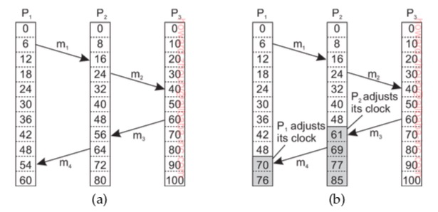](https://intranetproxy.alipay.com/skylark/lark/0/2019/png/20873/1561119795977-1c333b9b-04fc-4997-b441-888e2c7bea93.png#align=left&display=inline&height=298&name=image.png&originHeight=298&originWidth=615&size=127158&status=done&width=615)

图b是逻辑时钟的解决方案，
P2接收到m3消息时，P2会调整local的逻辑时钟，至少不少于发送方P2的逻辑时钟。在图示里，P2调整了接收m3的时间到61。
P1对接收m4的处理方式也是同理。
具体实现方式可以是 每个节点 发送 消息时，都带上发送瞬间的本地逻辑时钟的值，用ts(m) 代表，
接收方逻辑时间用C 来表示。
接收方在接收到发送方的消息数据以后，调整本地逻辑时钟的策略就可以表达为 C ← max{C, ts(m)} ，即取两者相对大的值作为本地时钟的新值。

特殊情况，如果有同时两个发送方在相同逻辑时间发起请求，那如何排序呢？
这种情况下的一种解决方案就是 消息的附带数据里，除了逻辑时间再加上当前节点编号。
比如节点i上的时间戳为40的事件 可以表示为 ⟨40,i⟩，另一个冲突的事件是⟨40,j⟩ 如果 i < j, 那可以判定 ⟨40,i⟩ < ⟨40,j⟩ , 通过这种方式来解决冲突。


事件a happens before 事件b，可以推论出 a的逻辑时间戳 早于 b的逻辑时间戳。
反过来 如果 a的逻辑时间戳 早于 b的逻辑时间戳 ，却不能推论出 事件a happens before 事件b。还需要额外的信息。
因为逻辑时钟 没法 表示 因果关系。引入 向量时钟 可以 解决这个问题。


### 向量时钟(vector clocks)

向量时钟引入了因果历史模型，因果历史可以用来表达某一个节点上所有发生过的事件历史。
比如：节点P1 上的因果历史 包含了三个事件 {p1,p2,p3} ， 但在解决全局顺序的场景中，因果历史往往只保留最新发生的事件即可。
使用VC来代表节点i上的向量时钟，通过向量时钟，可以掌握其他节点的逻辑时钟知识。

1. VC[i] 记录了节点i上最新发生的事件，使用事件对应的逻辑时钟表示。
2. If VC[j] = k 记录了节点j上最新发生的事件k，使用事件对应的逻辑时钟表示，这样节点i 就知道在 节点j上的最新逻辑时钟。


如下图(a)所示，由于系统中有三个节点，VC表现为3维的逻辑时钟集合 (0,0,0) ，分别代表3个节点的历史事件发生数量。
**P2发送消息m1给P1**：P2发送事件发生前，P2的VC就从 (0,0,0) 更新成 (0,1,0)， 并将完整的VC附加在m1消息上发送给P1。
**P1接收消息m1**：P1接收消息m1之前，P1的VC是(0,0,0), 接收到m1的同时也获取到了VC即(0,1,0)，合并到P1的VC1，同时更新本地逻辑时钟，变成VC(1,1,0)
之后的向量时钟都按照这种规则递进。

而图(b)的情况有些特殊。P3接收到的m2 和 m4附带的VC分别是 (4,1,0) 和 (2,3,0) ，
VC的比较是所有对应位置的元素都比对方大，才能认为前者大于后者。
因此m2和m4两者的向量时钟没法比较，没法判断哪个大于哪个。因此不存在因果关系，对于P3来说，两个消息就可能存在冲突。具体有没有冲突还得看两个消息的具体内容。
[](https://intranetproxy.alipay.com/skylark/lark/0/2019/png/20873/1561119809688-a44a80be-cda5-45d6-aa95-33f16d9aebef.png#align=left&display=inline&height=706&name=image.png&originHeight=916&originWidth=712&size=216146&status=done&width=549) 

## 内容分发网络（CDN）


1. 当用户点击网站页面上的内容URL，经过本地DNS系统解析，DNS 系统会最终将域名的解析权交给 [CNAME](https://link.zhihu.com/?target=https%3A//en.wikipedia.org/wiki/CNAME_record) 指向的 CDN 专用 DNS 服务器。
2. CDN 的 DNS 服务器将 CDN 的全局负载均衡设备 IP 地址返回用户。
3. 用户向 CDN 的全局负载均衡设备发起内容 URL 访问请求。
4. CDN 全局负载均衡设备根据用户 IP 地址，以及用户请求的内容URL，选择一台用户所属区域的区域负载均衡设备，告诉用户向这台设备发起请求。
5. 基于以下这些条件的综合分析之后，区域负载均衡设备会向全局负载均衡设备返回一台缓存服务器的IP地址：
6. 根据用户 IP 地址，判断哪一台服务器距用户最近；
7. 根据用户所请求的 URL 中携带的内容名称，判断哪一台服务器上有用户所需内容；
8. 查询各个服务器当前的负载情况，判断哪一台服务器尚有服务能力。
9. 全局负载均衡设备把服务器的 IP 地址返回给用户。
10. 用户向缓存服务器发起请求，缓存服务器响应用户请求，将用户所需内容传送到用户终端。如果这台缓存服务器上并没有用户想要的内容，而区域均衡设备依然将它分配给了用户，那么这台服务器就要向它的上一级缓存服务器请求内容，直至追溯到网站的源服务器将内容拉到本地。

DNS 服务器根据用户 IP 地址，将域名解析成相应节点的缓存服务器IP地址，实现用户就近访问。使用 CDN 服务的网站，只需将其域名解析权交给 CDN 的全局负载均衡（GSLB）设备，将需要分发的内容注入 CDN，就可以实现内容加速了。

## 反向代理（web 服务器）

反向代理是一种可以集中地调用内部服务，并提供统一接口给公共客户的 web 服务器。来自客户端的请求先被反向代理服务器转发到可响应请求的服务器，然后代理再把服务器的响应结果返回给客户端。

带来的好处包括：

增加安全性 - 隐藏后端服务器的信息，屏蔽黑名单中的 IP，限制每个客户端的连接数。
提高可扩展性和灵活性 - 客户端只能看到反向代理服务器的 IP，这使你可以增减服务器或者修改它们的配置。
本地终结 SSL 会话 - 解密传入请求，加密服务器响应，这样后端服务器就不必完成这些潜在的高成本的操作。
免除了在每个服务器上安装 X.509 证书的需要
压缩 - 压缩服务器响应
缓存 - 直接返回命中的缓存结果
静态内容 - 直接提供静态内容
HTML/CSS/JS
图片
视频
等等
负载均衡器与反向代理
当你有多个服务器时，部署负载均衡器非常有用。通常，负载均衡器将流量路由给一组功能相同的服务器上。
即使只有一台 web 服务器或者应用服务器时，反向代理也有用，可以参考上一节介绍的好处。
NGINX 和 HAProxy 等解决方案可以同时支持第七层反向代理和负载均衡。
不利之处：反向代理
引入反向代理会增加系统的复杂度。
单独一个反向代理服务器仍可能发生单点故障，配置多台反向代理服务器（如故障转移）会进一步增加复杂度。

## 服务发现的基本原理

https://zhuanlan.zhihu.com/p/34332329

## 如何设计一个高可用系统？要考虑哪些地方？

https://blog.csdn.net/qq_34337272/article/details/104047453

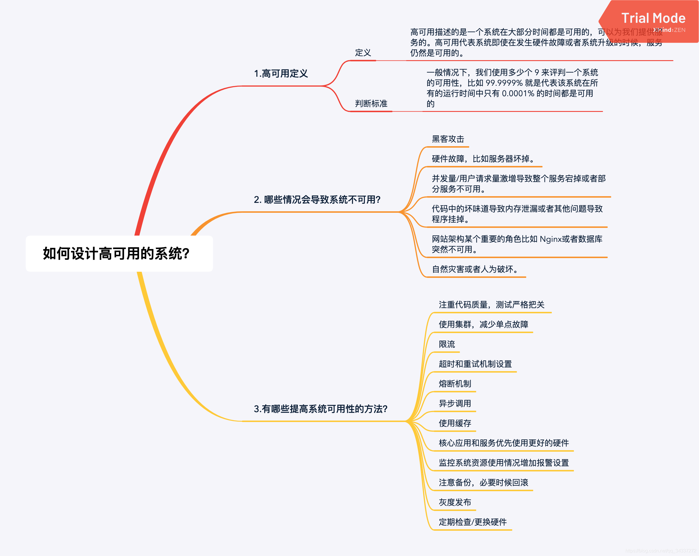


### 微服务

spring cloud 常见面试题 来理解微服务（通俗易懂）

https://blog.csdn.net/qq_35906921/article/details/84032874

微服务架构是—种架构模式或者说是一种架构风格,它提倡将单一应用程序划分成-一组小的服务,每个服务运行在其独立的自己的进程中,服务之间互相协调、互相配合,为用户提供最终价值。服务之间采用轻量级的通信机制互相沟通(通常是基于HTTP的REST ful API)。毎个服务都围绕着貝体业务进行构建,并且能够被独立地部罟到生产环境、类生产环境等另外,应尽量避免统一的、集中式的服务管理机制,对具体的_个服务而言,应根据业务上下文,选择合适的语言、工具对其进行构建,可以有一个非常轻量级的集中式管理来协调这些服务,可以使用不同的语言来编写服务,也可以使用不同的数据存储。 

## 雪花算法时间回拨问题

时钟回拨是与硬件时钟和ntp服务相关的。硬件时钟可能会因为各种原因发生不准的情况，网络中提供了ntp服务来做时间校准，做校准的时候就会发生时钟的跳跃或者回拨的问题。

- 如果时间回拨时间较短，比如配置5ms以内，那么可以直接等待一定的时间，让机器的时间追上来。
- 如果时间的回拨时间较长，我们不能接受这么长的阻塞等待，那么又有两个策略:

1. 直接拒绝，抛出异常，打日志，通知RD时钟回滚。
2. 利用扩展位，上面我们讨论过不同业务场景位数可能用不到那么多，那么我们可以把扩展位数利用起来了，比如当这个时间回拨比较长的时候，我们可以不需要等待，直接在扩展位加1。2位的扩展位允许我们有3次大的时钟回拨，一般来说就够了，如果其超过三次我们还是选择抛出异常，打日志。-----------------------------简单的说就是换个机器Id

作者：咖啡拿铁
链接：https://juejin.im/post/6844903686271926279
来源：掘金
著作权归作者所有。商业转载请联系作者获得授权，非商业转载请注明出处。

## [接口限流算法：漏桶算法&令牌桶算法](https://segmentfault.com/a/1190000015967922)

https://segmentfault.com/a/1190000015967922

#### 漏桶算法

把请求比作是水，水来了都先放进桶里，并以限定的速度出水，当水来得过猛而出水不够快时就会导致水直接溢出，即拒绝服务。


漏斗有一个进水口 和 一个出水口，出水口以一定速率出水，并且有一个最大出水速率：

在漏斗中没有水的时候，

- 如果进水速率小于等于最大出水速率，那么，出水速率等于进水速率，此时，不会积水
- 如果进水速率大于最大出水速率，那么，漏斗以最大速率出水，此时，多余的水会积在漏斗中

在漏斗中有水的时候

- 出水口以最大速率出水
- 如果漏斗未满，且有进水的话，那么这些水会积在漏斗中
- 如果漏斗已满，且有进水的话，那么这些水会溢出到漏斗之外

#### 令牌桶算法

对于很多应用场景来说，除了要求能够限制数据的平均传输速率外，还要求允许某种程度的突发传输。这时候漏桶算法可能就不合适了，令牌桶算法更为适合。

令牌桶算法的原理是系统以恒定的速率产生令牌，然后把令牌放到令牌桶中，令牌桶有一个容量，当令牌桶满了的时候，再向其中放令牌，那么多余的令牌会被丢弃；当想要处理一个请求的时候，需要从令牌桶中取出一个令牌，如果此时令牌桶中没有令牌，那么则拒绝该请求。


# 项目

## 协同过滤

https://mp.weixin.qq.com/s/B5ekmsBVN1oS77hWOV6Iww

https://www.bilibili.com/video/BV12E411i7ga

基于内容


基于用户


解决冷启动


## 异地多活

如果“注册”“登录”、“用户信息”全部都要支持异地多活的话，实际上是挺难的，有的问题甚至是无解的。那这种情况下我们应该如何考虑“异地多活”的方案设计呢？答案其实很简单：**优先实现核心业务的异地多活方案**！

异地多活本质上是通过异地的数据冗余，来保证在极端异常的情况下业务也能够正常提供给用户，因此数据同步是异地多活设计方案的核心

解决

1. 尽量减少异地多活机房的距离，搭建高速网络；

2. 尽量减少数据同步；

3. 保证最终一致性，不保证实时一致性；

   【减少距离：同城多中心】\****

   为了减少两个业务中心的距离，选择在同一个城市不同的区搭建机房，机房间通过高速网络连通，例如在北京的海定区和通州区各搭建一个机房，两个机房间采用高速光纤网络连通，能够达到近似在一个机房的性能。

   这个方案的优势在于对业务几乎没有影响，业务可以无缝的切换到同城多中心方案；缺点就是无法应对例如新奥尔良全城被水淹，或者2003美加大停电这种极端情况。所以即使采用这种方案，也还必须有一个其它城市的业务中心作为备份，最终的方案同样还是要考虑远距离的数据传输问题。 

   ***\*【减少数据同步】\****

   另外一种方式就是减少需要同步的数据。简单来说就是不重要的数据不要同步，同步后没用的数据不同步。

   以前面的“用户子系统”为例，用户登录所产生的token或者session信息，数据量很大，但其实并不需要同步到其它业务中心，因为这些数据丢失后重新登录就可以了。

   有的朋友会问：这些数据丢失后要求用户重新登录，影响用户体验的呀！
   确实如此，毕竟需要用户重新输入账户和密码信息，或者至少要弹出登录界面让用户点击一次，但相比为了同步所有数据带来的代价，这个影响完全可以接受，其实这个问题也涉及了一个异地多活设计的典型思维误区，后面我们会详细讲到。 

   ***\*【保证最终一致性】\****

   第三种方式就是业务不依赖数据同步的实时性，只要数据最终能一致即可。例如：A机房注册了一个用户，业务上不要求能够在50ms内就同步到所有机房，正常情况下要求5分钟同步到所有机房即可，异常情况下甚至可以允许1小时或者1天后能够一致。

   ​	

   不只使用存储系统的同步功能

    以MySQL为例，MySQL5.1版本的复制是单线程的复制，在网络抖动或者大量数据同步的时候，经常发生延迟较长的问题，短则延迟十几秒，长则可能达到十几分钟。而且即使我们通过监控的手段知道了MySQL同步时延较长，也难以采取什么措施，只能干等。

    Redis又是另外一个问题，Redis 3.0之前没有Cluster功能，只有主从复制功能，而为了设计上的简单，Redis主从复制有一个比较大的隐患：从机宕机或者和主机断开连接都需要重新连接主机，重新连接主机都会触发全量的主从复制，这时候主机会生成内存快照，主机依然可以对外提供服务，但是作为读的从机，就无法提供对外服务了，如果数据量大，恢复的时间会相当的长。

   我们可以采用如下几种方式同步数据：

   1. ***\*消息队列方式\****：对于账号数据，由于账号只会创建，不会修改和删除（假设我们不提供删除功能），我们可以将账号数据通过消息队列同步到其它业务中心。
   2. ***\*二次读取方式\****：某些情况下可能出现消息队列同步也延迟了，用户在A中心注册，然后访问B中心的业务，此时B中心本地拿不到用户的账号数据。为了解决这个问题，B中心在读取本地数据失败的时候，可以根据路由规则，再去A中心访问一次（这就是所谓的二次读取，第一次读取本地，本地失败后第二次读取对端），这样就能够解决异常情况下同步延迟的问题。
   3. ***\*存储系统同步方式\****：对于密码数据，由于用户改密码频率较低，而且用户不可能在1s内连续改多次密码，所以通过数据库的同步机制将数据复制到其它业务中心即可，用户信息数据和密码类似。
   4. ***\*回源读取方式\****：对于登录的session数据，由于数据量很大，我们可以不同步数据；但当用户在A中心登录后，然后又在B中心登录，B中心拿到用户上传的session id后，根据路由判断session属于A中心，直接去A中心请求session数据即可，反之亦然，A中心也可以到B中心去拿取session数据。
   5. ***\*重新生成数据方式\****：对于第4中场景，如果异常情况下，A中心宕机了，B中心请求session数据失败，此时就只能登录失败，让用户重新在B中心登录，生成新的session数据。

## TCP性能优化

客户通过专线访问云上的数据库，专线100M，时延20ms，一个SQL查询了22M数据，结果花了大概25秒，这慢得不太正常，如果通过云上client访问云上数据库那么1-2秒就返回了。如果通过http或者scp传输这22M的数据大概两秒钟也传送完毕了，所以这里问题的原因基本上是DRDS在这种网络条件下有性能问题，需要找出为什么。


	


通过抓包工具查看发现，每发送16k的数据就会等待20ms左右。那这个瓶颈究竟出现在哪。

有3个地方

1.把数据放到缓存socketSendBuffer 准备发送

2.拥塞窗口

3.发送窗口

通过抓包工具发现，对方的接收窗口没有满

设置**初始CWND的值****sthresh门限** 仍然没解决，因此可能是缓存的问题


查看缓存的大小只有16k，正好和上面每发送16kb就停止。那么怎么调

带宽时延积，从理论计算BDP（带宽时延积） 0.02秒*(100MB/8)=250Kb 所以SO_SNDBUF为256Kb的时候基本能跑满带宽了，再大实际意义也不大了。

问题解决从25秒到4秒


## 一致性解决方案

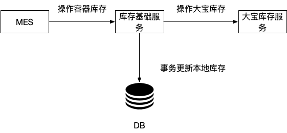

问题，我要更新本地的数据库存和远程的数据库存，并实现两边的数据一致。一般来说用分布式事务就能够解决了，但是远程的库存服务只提供了一个接口，该接口

支持幂等

▪未提供回滚接口

▪未提供回查接口，无法确认操作是否成功

▪仅能重试直至成功

▪仅能利用**冲正**达到回滚目的

方案一，冲正

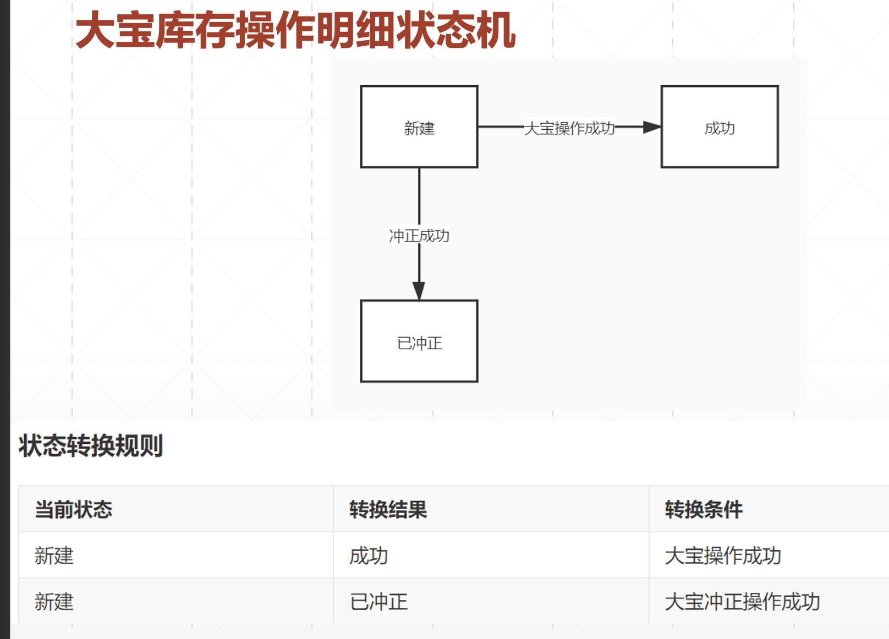


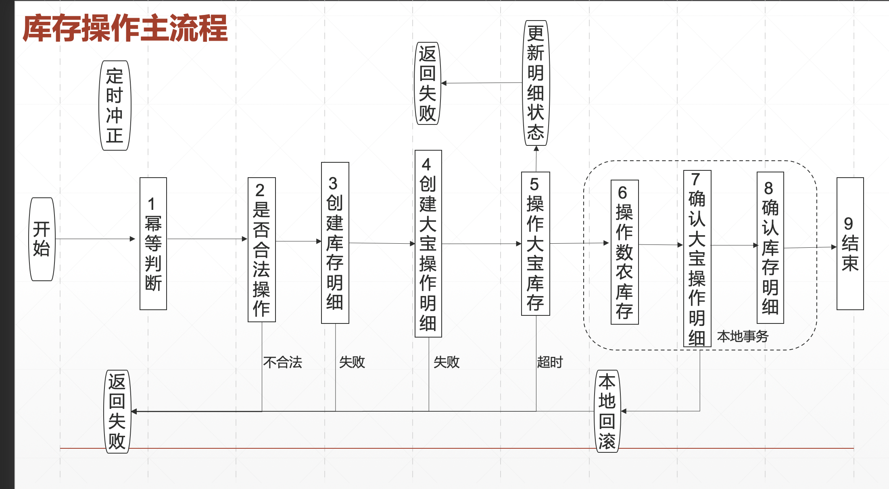


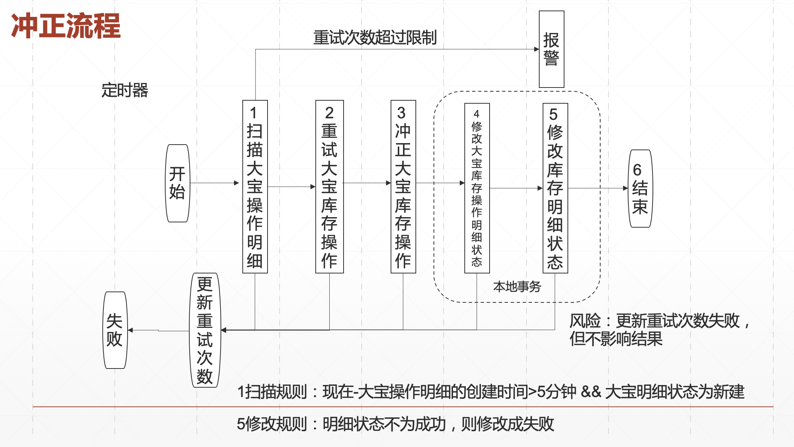

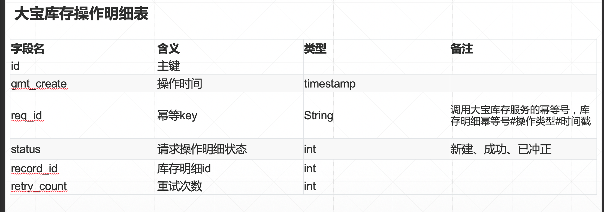

我一张表来记录操作明细，有状态，重试次数等

主流程是更新本地库存，更新远程库存，增加操作明细

失败流程：有个定时器去扫描操作明细表，状态为不成功的进行冲正直到成功，状态更新为冲正成功

冲正的问题

**可能出现竞争态，即冲正和用户重试调用同时进行，造成不一致**

▪引入版本号（时间戳），对内区别每一次调用，解决竞争态问题

▪**冲正操作始终无法成功**

▪引入重试次数限制，当冲正次数超过限制，发起报警，要求人工解决问题。明细记录将为人工操作提供参考

定时器扫描的记录会慢慢变多


方案二

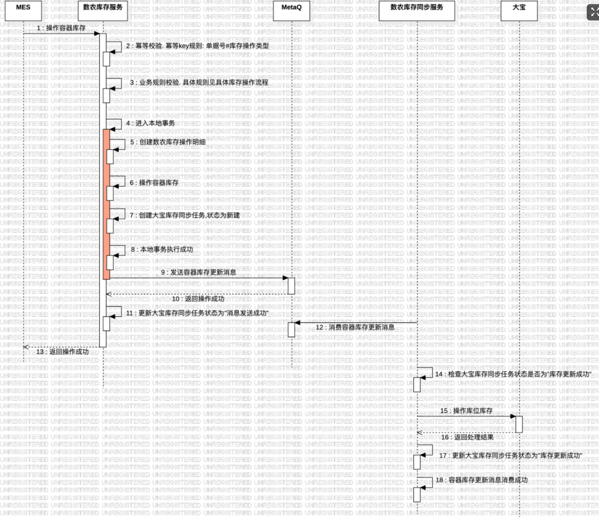

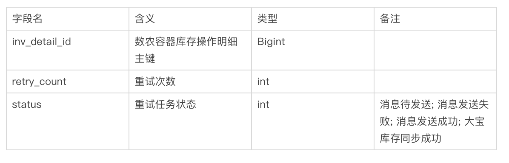

本地消息表

方案二我用到了mq，同步服务和明细表。同步服务是用来更新远程库存的

明细表主要有三个字段，主键，重试次数，重试任务状态

先进入本地事务，1更新本地库存 2.插入操作明细状态为新建。本地事务成功，后发送消息给mq，操作明细状态更新为消息发送成功

同步服务去拉取消息，并更新远程库存，操作明细更新状态为同步成功，并且！定期清理已成功的库存同步任务, 可以迁移到历史表里.。这是正常的流程


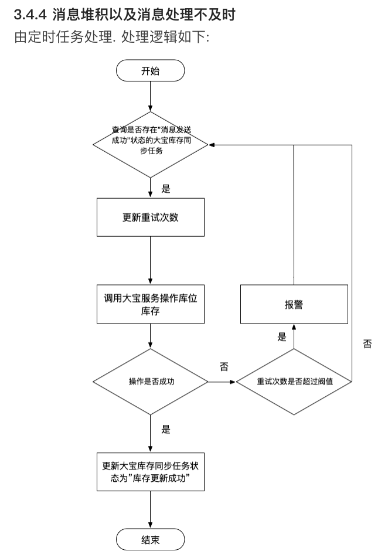


通过本地事务保证本地库存更新和操作表的原子性.

远程库存操作失败时, 通过MQ, 重试, 保障数据最终一致性.

缺点 只能实现最终一致性

与具体的业务场景绑定，耦合性强，不可公用。消息数据与业务数据同库，占用业务系统资源。业务系统在使用[关系型数据库](https://cloud.tencent.com/product/cdb-overview?from=10680)的情况下，消息服务性能会受到关系型数据库并发性能的局限。

## 解决慢查询例子

https://juejin.im/post/6844903696275341319#heading-11

# 智力题

https://cloud.tencent.com/developer/article/1151534

面试常问智力题40道（逻辑题）+ 参考答案

https://www.nowcoder.com/discuss/526897?type=2&order=3&pos=3&page=2&channel=1009&source_id=discuss_tag

## 详解十二小球问题：天平称三次最多可以对付几个球？


https://www.bilibili.com/video/BV19t4y1X7D3?from=search&seid=14600978108298952056

作者：大锤0123
链接：https://www.nowcoder.com/discuss/437267?type=2&order=3&pos=15&page=1&channel=666&source_id=discuss_tag
来源：牛客网

有A，B两个人，双方轮着数数。每次说出的数字，只能在对方的基础上加一或者加二，当最后谁先数到30及以上谁输。如果A先从0开始数，那你有什么方法使得A必赢？能否用具体算法实现。

答案：倒推就行了，只要谁拿到了n+1是3的倍数，就必赢。必赢序列 29， 26， 23， 20， 17 ，14 ，11， 8， 5， 2。只要任意一个人命中这个序列，按照这个顺序走就行了。按照题意，A先出0，B足够聪明的话，A必输。

## 双蛋问题

https://www.bilibili.com/video/BV1KE41137PK?from=search&seid=5506978171692492747

上面的视频真的好

## 赛马问题

https://zhuanlan.zhihu.com/p/103572219

## 1000个苹果分十箱

https://blog.csdn.net/Gnd15732625435/article/details/76407974

## 50个红球和50个篮球，放入两个箱子，怎么样放置才能使拿到红球的概率最大？

https://blog.csdn.net/qq_39635239/article/details/96314771

## 100个球两个人每次最多取五个最少取一个求必胜方法.

https://blog.csdn.net/less_cold/article/details/78298660

智力题收集

https://www.nowcoder.com/discuss/219008?type=6

https://www.nowcoder.com/discuss/262595?type=post&order=time&pos=&page=2&channel=1009&source_id=search_post

## 时针，分针在一昼夜的时间内重合次数是多少？

22次。因为时针转了两圈，分针转了24圈，超过了22次

## 分油问题

有容量为10斤、7斤、3斤的桶，10斤的桶中有10斤油，用这3个容器将油均分为5斤


#

## 100盏灯泡的开关问题

https://blog.csdn.net/realxie/article/details/8066927

## 生成随机数(根据rand5()生成rand7())

https://blog.csdn.net/leadai/article/details/79824224

```
def rand7():    

res = 25    

while res > 21:       

 res = 5 * (rand5() - 1) + rand5()    

return res % 7 + 1
```


# 情景题

系统设计面试题精选

https://soulmachine.gitbooks.io/system-design/content/cn/

**分析出 QPS 能够帮助我们确定在设计系统时的规模：**

- QPS < 100：使用单机低配服务器就可以了；
- QPS < 1K：稍好一些的中高配服务器（需要考虑单点故障、雪崩问题等）；
- QPS 达到 1M：百台以上 Web 服务器集群（需要考虑容错与恢复问题，某一台机器挂了怎么办，如何恢复）

**QPS 和 Web Server 或者 数据库之间也是存在关联性的：**

- 一台 Web Server 的承受量约为 1K QPS；
- 一台 SQL Database 的承受量约为 1K QPS（如果数据库访问中涵盖大量的 JOIN 和索引相关查询，这一数值会更小）；
- 一台 NoSQL Database（如 Cassandra）承受量约为 10K QPS；
- 一台 NoSQL 缓存 Database（如 Memcached 内存 KV 数据库）承受量约为 1M QPS

## 如何设计一个新鲜事系统

http://blog.luoyuanhang.com/2020/05/24/system-design-0/

## 二维码扫描登录原理

https://juejin.im/post/5e83e716e51d4546c27bb559#comment

## 设计一个第三方账号登陆

https://juejin.im/post/5dbd9c5af265da4d3a52e4a2#comment

## 单点登录

1. 用户访问app系统，app系统是需要登录的，但用户现在没有登录。
2. 跳转到CAS server，即SSO登录系统，**以后图中的CAS Server我们统一叫做SSO系统。** SSO系统也没有登录，弹出用户登录页。
3. 用户填写用户名、密码，SSO系统进行认证后，将登录状态写入SSO的session，浏览器（Browser）中写入SSO域下的Cookie。
4. SSO系统登录完成后会生成一个ST（Service Ticket），然后跳转到app系统，同时将ST作为参数传递给app系统。
5. app系统拿到ST后，从后台向SSO发送请求，验证ST是否有效。
6. 验证通过后，app系统将登录状态写入session并设置app域下的Cookie。

至此，跨域单点登录就完成了。以后我们再访问app系统时，app就是登录的。接下来，我们再看看访问app2系统时的流程。

1. 用户访问app2系统，app2系统没有登录，跳转到SSO。
2. 由于SSO已经登录了，不需要重新登录认证。
3. SSO生成ST，浏览器跳转到app2系统，并将ST作为参数传递给app2。
4. app2拿到ST，后台访问SSO，验证ST是否有效。
5. 验证成功后，app2将登录状态写入session，并在app2域下写入Cookie。

这样，app2系统不需要走登录流程，就已经是登录了。SSO，app和app2在不同的域，它们之间的session不共享也是没问题的。


作者：牛初九
链接：https://www.jianshu.com/p/75edcc05acfd
来源：简书
著作权归作者所有。商业转载请联系作者获得授权，非商业转载请注明出处。

## 实现一个适合高并发场景的LRU缓存

基础答案，基于LinkedHashMap + synchronized，实现无误
进阶答案，解决synchronized带来的性能损耗，例如基于ConcurrentHashMap，value是基于缓存值+时间戳的装饰类，利用timer线程异步维护缓存大小

## 微博的设计

https://www.honeypps.com/architect/bytedance-interview-general-business-solutions/

### 正文

业务背景：某浪微博平台有很多用户时常的会发布微博，当某个用户发布一条微博的时候，TA的所有关注着都可以接收到这条信息。那么怎么样设计一个合理的解决方案来让用户快速将他所发布的微博信息推送给所有的关注者呢？

小伙伴们可以先思考一下，回味一下这道题，然后再继续往下看。

> 当然，类似的业务场景有很多，举微博的例子因为它比较典型而且熟知度也高。注意：以下的分析仅代表个人立场，皮皮没有在某浪微博工作过，至于他们到底怎么做的只能说不了解。

第一种方案，每个用户所发送的微博都存储起来（时间上有序）。当用户要刷新微博的时候就可以直接拉取TA所关注的人在这个时间内的微博，然后按照时间排序之后再推送过来。（当然，这里的什么延迟拉取之类的细节优化就不做详述了。）

机智的小伙伴可能也发现了这种方案的问题，对于某浪微博这种级别的平台，他所支撑的用户都是数以亿计的，这样的方案对于读的压力将会是巨大的。

那么怎么办呢？当我们试图开始要优化一个系统的时候，有个相对无脑而又实用的方案就是——上缓存。

方案二具体操作说起来也比较简单，对每个用户都维护一块缓存。当用户发布微博的时候，相应的后台程序可以先查询一下他的关注着，然后将这条微博插入到所有关注着的缓存中。（当然这个缓存会按时间线排序，也会有一定的容量大小限制等，这些细节也不多做赘述。）这样当用户上线逛微博的时候，那么TA就可以直接从缓存中读取，读取的性能有了质的飞升。

如此就OK了吗？显然不是，这种方案的问题在于么有考虑到大V的存在，大V具有很庞大的流量扇出。比如微博女王谢娜的粉丝将近1.25亿，那么她发一条微博（假设为1KB）所要占用的缓存大小为1KB * 1.25 * 10^8 = 125GB。对于这个量我们思考一下几个点：

1. 对于1.25亿人中有多少人会在这个合适的时间在线，有多少人会刷到这条微博，很多像皮皮这种的半僵尸用户也不会太少，这块里面的很多容量都是浪费。
2. 1.25亿次的缓存写入，虽然不需要瞬时写入，但好歹也要在几秒内完成的吧。这个流量的剧增带来的影响也不容忽视。
3. 微博上虽然上亿粉丝的大V不多，但是上千万、上百万的大V也是一个不小的群体。某个大V发1条微博就占用了这么大的缓存，这个机器成本也太庞大了，得不偿失。

那么又应该怎么处理呢？这里也可以先停顿思考一下。

> 这种案例比较典型，比如某直播平台，当PDD上线直播时（直播热度一般在几百万甚至上千万级别）所用的后台支撑策略与某些小主播（直播热度几千之内的）的后台支撑的策略肯定是不一样的。

从微观角度而言，计算机应用是0和1的世界，而从宏观角度来看，计算机应用的艺术确是在0-1之间。通用型业务设计的难点在于要考虑很多种方面的因数，然后权衡利弊，再对症下药。业务架构本没有什么银弹，有的是对系统的不断认知和优化改进。

对于本文这个问题的解决方法是将方案一和二合并，以粉丝数来做区分。也就是说，对于大V发布的微博我们用方案一处理，而对于普通用户而言我们就用方案二来处理。当某个用户逛微博的时候，后台程序可以拉取部分缓存中的信息，与此同时可以如方案一中的方式读取大V的微博信息，最后将此二者做一个时间排序合并后再推送给用户。

## 染色日志

染色功能的主要作用是可以在某服务某接口中对特定用户号码的消息进行染色，方便地实时察看该用户引起后续所有相关调用消息流的日志。

https://tarscloud.github.io/TarsDocs/dev/tarscpp/tars-guide.html

## [在数据库中存储一棵树，实现无限级分类](https://segmentfault.com/a/1190000014284076)

## 微博计数器的设计

https://blog.cydu.net/weidesign/2012/09/09/weibo-counter-service-design-2/#

## 搜索引擎背后的经典数据结构和算法

https://labuladong.gitbook.io/algo/labuladong-he-ta-de-peng-you-men/sou-suo-yin-qing-bei-hou-de-jing-dian-shu-ju-jie-gou-he-suan-fa

## 如何保证缓存(redis)与数据库(MySQL)的一致性

https://developer.aliyun.com/article/712285

## 数据库连接池的原理怎么实现数据库连接池

https://blog.csdn.net/shuaihj/article/details/14223015

## [【面试被虐】如何只用2GB内存从20亿，40亿，80亿个整数中找到出现次数最多的数？](https://www.cnblogs.com/kubidemanong/p/10983251.html)

## 时间轮

https://www.cnblogs.com/boanxin/p/13059004.html

## 游戏实现实时性

https://juejin.im/entry/6844903486635655176

## 微信朋友圈的技术思路

https://cloud.tencent.com/developer/article/1082731

https://www.toutiao.com/i6227927850301784577/ 

## 百亿级微信红包的高并发资金交易系统设计方案

https://www.infoq.cn/article/2017hongbao-weixin

 通过分流+队列+流控解决高并发场景下库存锁竞争的情况；
\- 通过事务操作串行化保证资金安全，避免出现红包超发、漏发、重复发的情况；
\- 通过红包ID+循环天双维度分库表规则提升系统性能；

## 如何实现抢红包算法

https://cloud.tencent.com/developer/article/1587563

**二倍均值法**

剩余红包金额为M，剩余人数为N，那么有如下公式：

每次抢到的金额 = 随机区间 **（0， M / N X 2）**

这个公式，保证了**每次随机金额的平均值是相等的**，不会因为抢红包的先后顺序而造成不公平。

举个栗子：

假设有10个人，红包总额100元。

100/10X2 = 20, 所以第一个人的随机范围是**（0，20 )**，平均可以抢到**10元**。

假设第一个人随机到10元，那么剩余金额是100-10 = 90 元。

90/9X2 = 20, 所以第二个人的随机范围同样是**（0，20 )**，平均可以抢到**10元**。

假设第二个人随机到10元，那么剩余金额是90-10 = 80 元。

80/8X2 = 20, 所以第三个人的随机范围同样是**（0，20 )**，平均可以抢到**10元**。

**线段切割法**

何谓线段切割法？我们可以把红包总金额想象成一条很长的线段，而每个人抢到的金额，则是这条主线段所拆分出的若干子线段。


## 多级缓存的分层架构

https://juejin.im/post/6844903950051721230#comment

## CDN原理简析

https://juejin.im/post/6844903873518239752#comment


## 附近的人功能实现及原理

https://www.jianshu.com/p/ec6a3cd8817f

## 携带Cookie跨域

https://blog.csdn.net/duola8789/article/details/91447479

## 海量数据中寻找中位数

https://zhuanlan.zhihu.com/p/75397875

## CPU打到100%p排查

https://mp.weixin.qq.com/s/roEMz-5tzBZvGxbjq8NhOQ

先进服务器，用**top -c** 命令找出当前进程的运行列表

按一下 **P** 可以按照CPU使用率进行排序

显示Java进程 PID 为 2609 的java进程消耗最高


然后我们需要根据PID 查出CPU里面消耗最高的进程

使用命令 **top -Hp 2609** 找出这个进程下面的线程，继续按P排序

可以看到 2854 CPU消耗最高

image-20200331222532604

2854是十进制的，我们需要转换为十六进制，转换结果：b26

接下来就需要导出我们的进程快照了，看看这个线程做了啥

```
jstack -l 2609 > ./2609.stack
```

再用grep查看一下线程在文件里做了啥

```
cat 2609.stack |grep 'b26' -C 8
```

我这里就随便定位一个，基本上这样查都可以定位到你死循环的那个类，那一行，这里你还可以在jstack出来的文件中看到很多熟悉的名词，至于是啥，你们留言告诉我好了，就当是个课后作业了。


## 内存溢出排除

https://mp.weixin.qq.com/s/7XGD-Z3wrThv5HyoK3B8AQ

JDK自带的工具jvisualvm


堆空间就一直上去，直到OOM（out of memory）


这个时候我们就dump下来堆信息看看

会dump出一个这样的hprof快照文件，可以用jvisualvm本身的系统去分析，我这里推荐MAT吧，因为我习惯这个了。


mat已经分析了我们的文件


他发现了是ArrayList的问题了，我们再往下看看


看到了嘛，具体代码的位置都帮我们定位好了，那排查也就是手到擒来的事情了。


内存溢出的解决方案：

第一步，修改JVM启动参数，直接增加内存。(-Xms，-Xmx参数一定不要忘记加。)

第二步，检查错误日志，查看“OutOfMemory”错误前是否有其它异常或错误。

第三步，对代码进行走查和分析，找出可能发生内存溢出的位置。

重点排查以下几点：

1.检查对数据库查询中，是否有一次获得全部数据的查询。一般来说，如果一次取十万条记录到内存，就可能引起内存溢出。这个问题比较隐蔽，在上线前，数据库中数据较少，不容易出问题，上线后，数据库中数据多了，一次查询就有可能引起内存溢出。因此对于数据库查询尽量采用分页的方式查询。

2.检查代码中是否有死循环或递归调用。

3.检查是否有大循环重复产生新对象实体。

4.检查List、MAP等集合对象是否有使用完后，未清除的问题。List、MAP等集合对象会始终存有对对象的引用，使得这些对象不能被GC回收。

第四步，使用内存查看工具动态查看内存使用情况

## 键盘敲入 A 字母时，操作系统期间发生了什么

https://mp.weixin.qq.com/s/fKHOf_CzG8HYXHlg54V_rg

那当用户输入了键盘字符，**键盘控制器**就会产生扫描码数据，并将其缓冲在键盘控制器的寄存器中，紧接着键盘控制器通过总线给 CPU 发送**中断请求**。

CPU 收到中断请求后，操作系统会**保存被中断进程的 CPU 上下文**，然后调用键盘的**中断处理程序**。

键盘的中断处理程序是在**键盘驱动程序**初始化时注册的，那键盘**中断处理函数**的功能就是从键盘控制器的寄存器的缓冲区读取扫描码，再根据扫描码找到用户在键盘输入的字符，如果输入的字符是显示字符，那就会把扫描码翻译成对应显示字符的  ASCII 码，比如用户在键盘输入的是字母 A，是显示字符，于是就会把扫描码翻译成 A 字符的 ASCII 码。

得到了显示字符的 ASCII 码后，就会把 ASCII 码放到「读缓冲区队列」，接下来就是要把显示字符显示屏幕了，显示设备的驱动程序会定时从「读缓冲区队列」读取数据放到「写缓冲区队列」，最后把「写缓冲区队列」的数据一个一个写入到显示设备的控制器的寄存器中的数据缓冲区，最后将这些数据显示在屏幕里。

显示出结果后，**恢复被中断进程的上下文**。

## 统计在线用户人数

https://blog.huangz.me/diary/2016/redis-count-online-users.html

| 方案        | 特点                                                         |
| :---------- | :----------------------------------------------------------- |
| 有序集合    | 能够同时储存在线用户的名单以及用户的上线时间，能够执行非常多的聚合计算操作，但是耗费的内存也非常多。 |
| 集合        | 能够储存在线用户的名单，也能够执行聚合计算，消耗的内存比有序集合少，但是跟有序集合一样，这个方案消耗的内存也会随着用户数量的增多而增多。 |
| HyperLogLog | 无论需要统计的用户有多少，只需要耗费 12 KB 内存，但由于概率算法的特性，只能给出在线人数的估算值，并且也无法获取准确的在线用户名单。 |
| 位图        | 在尽可能节约内存的情况下，记录在线用户的名单，并且能够对这些名单执行聚合操作。 |

## 服务不可用排查思路

https://www.lagou.com/lgeduarticle/78019.html

- 日志很重要，无论是什么服务，一定要记得把日志排在首位
- 服务器一定要有监控，并且要有监控预警，超过多少，发短信，电话通知。
- 问题思路排查要有理有据，一步一步来，不能瞎子抓阄似的。
- 服务挂掉，首先要恢复服务，比如重启等操作


# ES

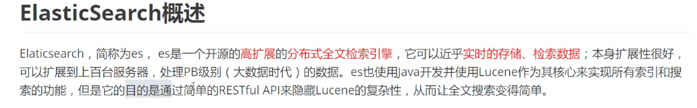

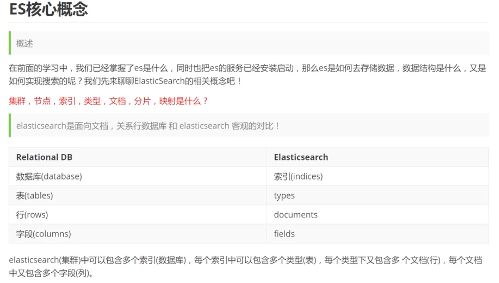


# 设计模式

https://www.cnblogs.com/throwable/p/9315318.html

### 设计模式八大原则

| 设计模式原则名称  |                     简单定义                     |
| :---------------: | :----------------------------------------------: |
|     开闭原则      |              对扩展开放，对修改关闭              |
|   单一职责原则    |       一个类只负责一个功能领域中的相应职责       |
|   里氏代换原则    |  所有引用基类的地方必须能透明地使用其子类的对象  |
|   依赖倒转原则    |          依赖于抽象，不能依赖于具体实现          |
|   接口隔离原则    |      类之间的依赖关系应该建立在最小的接口上      |
| 合成/聚合复用原则 | 尽量使用合成/聚合，而不是通过继承达到复用的目的  |
|    迪米特法则     | 一个软件实体应当尽可能少的与其他实体发生相互作用 |

## 抽象工厂模式和工厂方法模式区别

https://cloud.tencent.com/developer/article/1523363

| 工厂方法模式                               | 抽象工厂模式                               |
| ------------------------------------------ | ------------------------------------------ |
| 针对的是一个产品等级结构                   | 针对的是面向多个产品等级结构               |
| 一个抽象产品类                             | 多个抽象产品类                             |
| 可以派生出多个具体产品类                   | 每个抽象产品类可以派生出多个具体产品类     |
| 一个抽象工厂类，可以派生出多个具体工厂类   | 一个抽象工厂类，可以派生出多个具体工厂类   |
| 每个具体工厂类只能创建一个具体产品类的实例 | 每个具体工厂类可以创建多个具体产品类的实例 |


## 深入理解MVC

https://zhuanlan.zhihu.com/p/35680070

View层是界面，Model层是业务逻辑，Controller层用来调度View层和Model层，将用户界面和业务逻辑合理的组织在一起，起粘合剂的效果。所以Controller中的内容能少则少，这样才能提供最大的灵活性。

# mybatis

### MyBatis的Mapper原理

https://www.jianshu.com/p/db92d516134f


1.获取mapper对象的时候，会调用mapperRegistry对象中的方法创建一个代理对象。

2.当我们调用代理对象的方法时，会调用mapperMethod中的方法去找到对应的xml文件并找到相应的sql语句，最后执行


1.invoke方法什么时候执行的?
jdk动态代理创建代理对象的时候需要传入三个参数,分别为(1)类加载器,(2)为哪些接口做代理(拦截什么方法),(3)把这些方法拦截到哪里处理,从图中我们得知,他是要把执行的方法拦截到MapperProxy类中的invoke方法处理,换句话说,该动态代理对象执行接口中的方法,都会调到MapperProxy类的invoke方法处理,这也就是为什么调用get方法的时候会调用invoke
2.执行过程
mapper文件中要定位到sql,需要两个条件,一个是namespace,一个是sql id.要想用这种mapper接口的方式调用也必须遵循一个约定,那就是namespace等于接口的权限定名.接口的方法名等于xml文件中的sql id,这就是为什么图中封装MapperMethod的时候,需要把这两个传进去的原因.确定了sql,传入参数mapperMethod.execute(args),拼接成一条完成sql,执行之.

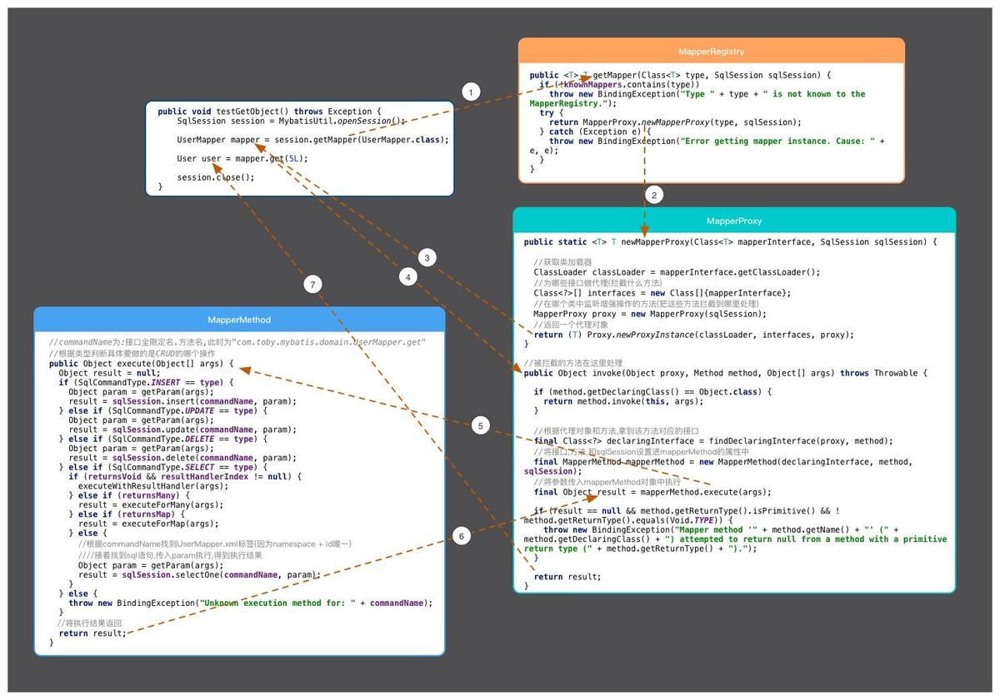

# 

# Kafka

## 生产者发送消息的过程

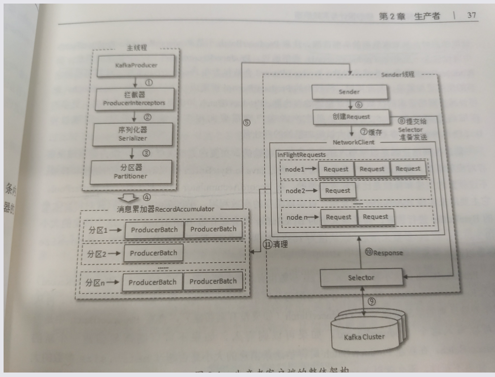

1.主线程通过拦截器，序列化器，再经过分区器把消息发送到消息累加器

为什么拦截器先，因为只有拦截器先才能不浪费后面的资源

2.消息累加器双端队列，是用来存放Batch的，他是几个消息的集合，这样能减少网络请求，消息累加器作为Sender线程读取数据的区域

3.sender线程拿到数据之后进行转化，成为能在网络传输的数据，request。再放到缓存中，

4.如何进行生产者的负载均衡，sender线程是判断当前哪个nodo发送消息后没回应的多，谁就负载比较重

## 生产者如何让消息顺序发送

很多人说只要让修改同一条数据的操作发送到一个分区就能保证消费者拿到消息的顺序的

可是如果生产者消息发送失败需要重试的话，能保证消息的顺序吗？

max.in.flight.requests.per.connection = 1 限制客户端在单个连接上能够发送的未响应请求的个数。设置此值是1表示kafka broker在响应请求之前client不能再向同一个broker发送请求。

此时可以修改参数限制连接

## 事务性消息

https://cloud.tencent.com/developer/news/172847

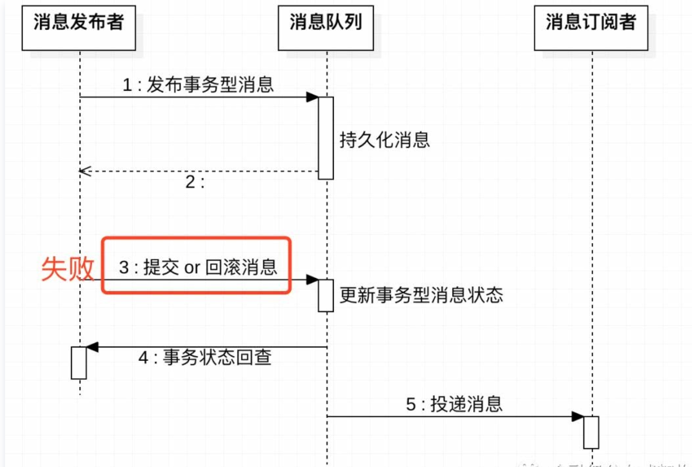

在分布式网络架构中是可能出现的，比如网络异常、消息队列服务短时间不可用等。这也是消息队列提供严谨的 “事务型消息” 特性必须要解决的问题，如果消息队列没有收到 “提交 or 回滚” 回滚消息，则无法决定是否投递消息到消息订阅者，因此，严谨的 “事务型消息” 设计方案需要有一个异常场景，命名为 “事务型消息状态回查”

## rocketmq 与 kafka 对比漫谈

https://www.jianshu.com/p/35fcd6e0bc93

## [Kafka分区分配策略分析——重点：StickyAssignor](https://www.cnblogs.com/hzmark/p/sticky_assignor.html)

## [Apache Kafka消息传递精确正好一次的含义 | TechMyTalk](https://techmytalk.com/2020/05/28/kafka-exactly-once-semantics/)

## kafka 实现高吞吐的原理

- 读写文件依赖OS文件系统的页缓存，而不是在JVM内部缓存数据，利用OS来缓存，内存利用率高
- sendfile技术（零拷贝），避免了传统网络IO四步流程
- 顺序IO以及常量时间get、put消息
- **批量发送**
- **数据压缩**
- 分区机制

https://mp.weixin.qq.com/s/wnULO6pJ4BkxhNNlWoLhrw

## [如何通过 offset 寻找数据]

如果consumer要找offset是1008的消息，那么，

1，按照二分法找到小于1008的segment，也就是00000000000000001000.log和00000000000000001000.index

2，用目标offset减去文件名中的offset得到消息在这个segment中的偏移量。也就是1008-1000=8，偏移量是8。

3，再次用二分法在index文件中找到对应的索引，也就是第三行6,45。

4，到log文件中，从偏移量45的位置开始（实际上这里的消息offset是1006），顺序查找，直到找到offset为1008的消息。查找期间kafka是按照log的存储格式来判断一条消息是否结束的。

## 讲一下zookeeper在kafka中的作用

[](https://github.com/CheckChe0803/BigData-Interview/blob/master/pictures/kafka在zk中的存储结构.png)

#### zk的作用主要有如下几点:

1. kafka的元数据都存放在zk上面,由zk来管理
2. 0.8之前版本的kafka, consumer的消费状态，group的管理以及 offset的值都是由zk管理的,现在offset会保存在本地topic文件里
3. 负责borker的lead选举和管理

## kafka 可以脱离 zookeeper 单独使用吗

kafka 不能脱离 zookeeper 单独使用，因为 kafka 使用 zookeeper 管理和协调 kafka 的节点服务器。

## kafka 分布式（不是单机）的情况下，如何保证消息的顺 序消费?

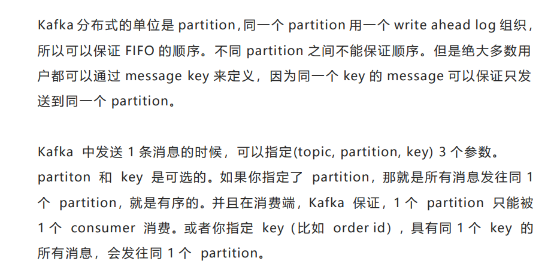

## 消息乱序问题

假设客户端代码依次执行下面的语句将两条消息发到相同的分区

```
producer.send(record1);
producer.send(record2);
```

如果此时由于某些原因(比如瞬时的网络抖动)导致record1没有成功发送，同时Kafka又配置了重试机制和max.in.flight.requests.per.connection大于1(默认值是5，本来就是大于1的)，那么重试record1成功后，record1在分区中就在record2之后，从而造成消息的乱序。很多某些要求强顺序保证的场景是不允许出现这种情况的。

既然异步发送有可能丢失数据， 我改成同步发送总可以吧？比如这样：

```
producer.send(record).get();
```

这样当然是可以的，但是性能会很差，不建议这样使用。因此特意总结了一份配置列表。个人认为该配置清单应该能够比较好地规避producer端数据丢失情况的发生：(特此说明一下，软件配置的很多决策都是trade-off，下面的配置也不例外：应用了这些配置，你可能会发现你的producer/consumer 吞吐量会下降，这是正常的，因为你换取了更高的数据安全性)

max.in.flight.requests.per.connection = 1 限制客户端在单个连接上能够发送的未响应请求的个数。设置此值是1表示kafka broker在响应请求之前client不能再向同一个broker发送请求。注意：设置此参数是为了避免消息乱序

## 一个副本被踢出 ISR集合的几种原因：

- 一个副本在一段时间内都没有跟得上 leader 节点，也就是跟leader节点的差距大于 replica.lag.max.messages， 通常情况是 IO性能跟不上，或者CPU 负载太高，导致 broker 在磁盘上追加消息的速度低于接收leader 消息的速度。
- 一个 broker 在很长时间内（大于 replica.lag.time.max.ms ）都没有向 leader 发送fetch 请求， 可能是因为 broker 发生了 full GC， 或者因为别的原因挂掉了。
- 一个新 的 broker 节点，比如同一个 broker id， 磁盘坏掉，新换了一台机器，或者一个分区 reassign 到一个新的broker 节点上，都会从分区leader 上现存的最老的消息开始同步。

## 不断的移入移出ISR集合

 follower 是正常的，所以下一次 fetch 请求就会又追上 leader， 这时候就会再次加入 ISR 集合，如果经常性的抖动，就会不断的移入移出ISR集合，会造成令人头疼的 告警轰炸。

对 replica.lag.time.max.ms **这个配置的含义做了增强，和之前一样，如果 follower 卡住超过这个时间不发送fetch请求， 会被踢出ISR集合，新的增强逻辑是，在 follower 落后 leader 超过** eplica.lag.max.messages **条消息的时候，不会立马踢出ISR 集合，而是持续落后超过** replica.lag.time.max.ms **时间，才会被踢出**，这样就能避免流量抖动造成的运维问题，因为follower 在下一次fetch的时候就会跟上leader， 这样就也不用对 topic 的写入速度做任何的估计喽。

# Dubbo

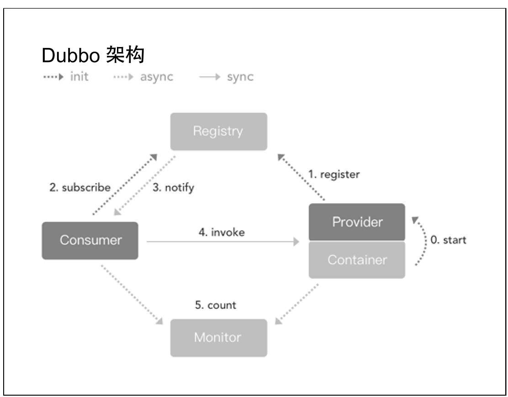

Provider为服务提供者集群，服务提供者负责暴露提供的服务，并将服务注册到服务注册中心。· Consumer为服务消费者集群，服务消费者通过RPC远程调用服务提供者提供的服务。· Registry负责服务注册与发现。· Monitor为监控中心，统计服务的调用次数和调用时间。


## SPI

SPI 全称为 Service Provider Interface，是一种服务发现机制。SPI 的本质是将接口实现类的全限定名配置在文件中，并由服务加载器读取配置文件，加载实现类。这样可以在运行时，动态为接口替换实现类。

spi，简单来说，就是 service provider interface，说白了是什么意思呢，比如你有个接口，现在这个接口有 3 个实现类，那么在系统运行的时候对这个接口到底选择哪个实现类呢？这就需要 spi 了，需要根据指定的配置或者是默认的配置，去找到对应的实现类加载进来，然后用这个实现类的实例对象。

## 工作流程

- 第一步：provider 向注册中心去注册
- 第二步：consumer 从注册中心订阅服务，注册中心会通知 consumer 注册好的服务
- 第三步：consumer 调用 provider
- 第四步：consumer 和 provider 都异步通知监控中心

## 序列化

https://blog.csdn.net/carson_ho/article/details/70568606

XML的反序列化过程如下：

1. 从文件中读取出字符串
2. 将字符串转换为 `XML` 文档对象结构模型
3. 从 `XML` 文档对象结构模型中读取指定节点的字符串
4. 将该字符串转换成指定类型的变量

上述过程非常复杂，其中，将 `XML` 文件转换为文档对象结构模型的过程通常需要完成词法文法分析等大量消耗 CPU 的复杂计算。

- `Protocol Buffer`的序列化 & 反序列化简单 & 速度快的原因是：
  a. 编码 / 解码 方式简单（只需要简单的数学运算 = 位移等等）
  b. 采用 **`Protocol Buffer` 自身的框架代码 和 编译器** 共同完成
- `Protocol Buffer`的数据压缩效果好（即序列化后的数据量体积小）的原因是：
  a. 采用了独特的编码方式，如`Varint`、`Zigzag`编码方式等等
  b. 采用`T - L - V` 的数据存储方式：减少了分隔符的使用 & 数据存储得紧凑

## 负载平衡

负载均衡算法 — 平滑加权轮询

https://www.fanhaobai.com/2018/12/load-balance-smooth-weighted-round-robin.html

## 如何实现rpc

- 上来你的服务就得去注册中心注册吧，你是不是得有个注册中心，保留各个服务的信息，可以用 zookeeper 来做，对吧。
- 然后你的消费者需要去注册中心拿对应的服务信息吧，对吧，而且每个服务可能会存在于多台机器上。
- 接着你就该发起一次请求了，咋发起？当然是基于动态代理了，你面向接口获取到一个动态代理，这个动态代理就是接口在本地的一个代理，然后这个代理会找到服务对应的机器地址。
- 然后找哪个机器发送请求？那肯定得有个负载均衡算法了，比如最简单的可以随机轮询是不是。
- 接着找到一台机器，就可以跟它发送请求了，第一个问题咋发送？你可以说用 netty 了，nio 方式；第二个问题发送啥格式数据？你可以说用 hessian 序列化协议了，或者是别的，对吧。然后请求过去了。
- 服务器那边一样的，需要针对你自己的服务生成一个动态代理，监听某个网络端口了，然后代理你本地的服务代码。接收到请求的时候，就调用对应的服务代码，对吧。

## 集群容错


## rpc和http

https://cloud.tencent.com/developer/article/1591740

基于Restful的远程过程调用有着明显的缺点，主要是效率低、封装调用复杂。当存在大量的服务间调用时，这些缺点变得更为突出。

服务A调用服务B的过程是应用间的内部过程，**牺牲可读性提升效率、易用性是可取的**。基于这种思路，RPC产生了。

简单来说成熟的rpc库相对http容器，更多的是封装了“服务发现”，"负载均衡"，“熔断降级”一类面向服务的高级特性。可以这么理解，rpc框架是面向服务的更高级的封装。

https://mp.weixin.qq.com/s/xkwwAUV9ziabPNUMEr5DPQ

##  说说Dubbo的分层？

从大的范围来说，dubbo分为三层，business业务逻辑层由我们自己来提供接口和实现还有一些配置信息，RPC层就是真正的RPC调用的核心层，封装整个RPC的调用过程、负载均衡、集群容错、代理，remoting则是对网络传输协议和数据转换的封装。

划分到更细的层面，就是图中的10层模式，整个分层依赖由上至下，除开business业务逻辑之外，其他的几层都是SPI机制。


## 能说下Dubbo的工作原理吗？

1. 服务启动的时候，provider和consumer根据配置信息，连接到注册中心register，分别向注册中心注册和订阅服务
2. register根据服务订阅关系，返回provider信息到consumer，同时consumer会把provider信息缓存到本地。如果信息有变更，consumer会收到来自register的推送
3. consumer生成代理对象，同时根据负载均衡策略，选择一台provider，同时定时向monitor记录接口的调用次数和时间信息
4. 拿到代理对象之后，consumer通过代理对象发起接口调用
5. provider收到请求后对数据进行反序列化，然后通过代理调用具体的接口实现


## 为什么要通过代理对象通信？

主要是为了实现接口的透明代理，封装调用细节，让用户可以像调用本地方法一样调用远程方法，同时还可以通过代理实现一些其他的策略，比如：

1、调用的负载均衡策略

2、调用失败、超时、降级和容错机制

3、做一些过滤操作，比如加入缓存、mock数据

4、接口调用数据统计

## 说说服务暴露的流程？

1. 在容器启动的时候，通过ServiceConfig解析标签，创建dubbo标签解析器来解析dubbo的标签，容器创建完成之后，触发ContextRefreshEvent事件回调开始暴露服务
2. 通过ProxyFactory获取到invoker，invoker包含了需要执行的方法的对象信息和具体的URL地址
3. 再通过DubboProtocol的实现把包装后的invoker转换成exporter，然后启动服务器server，监听端口
4. 最后RegistryProtocol保存URL地址和invoker的映射关系，同时注册到服务中心


## 说说服务引用的流程？

服务暴露之后，客户端就要引用服务，然后才是调用的过程。

1. 首先客户端根据配置文件信息从注册中心订阅服务

2. 之后DubboProtocol根据订阅的得到provider地址和接口信息连接到服务端server，开启客户端client，然后创建invoker

3. invoker创建完成之后，通过invoker为服务接口生成代理对象，这个代理对象用于远程调用provider，服务的引用就完成了

   

## 有哪些负载均衡策略？

1. 加权随机：假设我们有一组服务器 servers = [A, B, C]，他们对应的权重为 weights = [5, 3, 2]，权重总和为10。现在把这些权重值平铺在一维坐标值上，[0, 5) 区间属于服务器 A，[5, 8) 区间属于服务器 B，[8, 10) 区间属于服务器 C。接下来通过随机数生成器生成一个范围在 [0, 10) 之间的随机数，然后计算这个随机数会落到哪个区间上就可以了。
2. 最小活跃数：每个服务提供者对应一个活跃数 active，初始情况下，所有服务提供者活跃数均为0。每收到一个请求，活跃数加1，完成请求后则将活跃数减1。在服务运行一段时间后，性能好的服务提供者处理请求的速度更快，因此活跃数下降的也越快，此时这样的服务提供者能够优先获取到新的服务请求。
3. 一致性hash：通过hash算法，把provider的invoke和随机节点生成hash，并将这个 hash 投射到 [0, 2^32 - 1] 的圆环上，查询的时候根据key进行md5然后进行hash，得到第一个节点的值大于等于当前hash的invoker。

图片来自dubbo官方

1. 加权轮询：比如服务器 A、B、C 权重比为 5:2:1，那么在8次请求中，服务器 A 将收到其中的5次请求，服务器 B 会收到其中的2次请求，服务器 C 则收到其中的1次请求。

## 集群容错方式有哪些？

1. Failover Cluster失败自动切换：dubbo的默认容错方案，当调用失败时自动切换到其他可用的节点，具体的重试次数和间隔时间可用通过引用服务的时候配置，默认重试次数为1也就是只调用一次。
2. Failback Cluster快速失败：在调用失败，记录日志和调用信息，然后返回空结果给consumer，并且通过定时任务每隔5秒对失败的调用进行重试
3. Failfast Cluster失败自动恢复：只会调用一次，失败后立刻抛出异常
4. Failsafe Cluster失败安全：调用出现异常，记录日志不抛出，返回空结果
5. Forking Cluster并行调用多个服务提供者：通过线程池创建多个线程，并发调用多个provider，结果保存到阻塞队列，只要有一个provider成功返回了结果，就会立刻返回结果
6. Broadcast Cluster广播模式：逐个调用每个provider，如果其中一台报错，在循环调用结束后，抛出异常。

## 了解Dubbo SPI机制吗？

SPI 全称为 Service Provider Interface，是一种服务发现机制，本质是将接口实现类的全限定名配置在文件中，并由服务加载器读取配置文件，加载实现类，这样可以在运行时，动态为接口替换实现类。

Dubbo也正是通过SPI机制实现了众多的扩展功能，而且dubbo没有使用java原生的SPI机制，而是对齐进行了增强和改进。

SPI在dubbo应用很多，包括协议扩展、集群扩展、路由扩展、序列化扩展等等。

使用方式可以在META-INF/dubbo目录下配置：

```
key=com.xxx.value
```

然后通过dubbo的ExtensionLoader按照指定的key加载对应的实现类，这样做的好处就是可以按需加载，性能上得到优化。

## 如果让你实现一个RPC框架怎么设计？

1. 首先需要一个服务注册中心，这样consumer和provider才能去注册和订阅服务
2. 需要负载均衡的机制来决定consumer如何调用客户端，这其中还当然要包含容错和重试的机制
3. 需要通信协议和工具框架，比如通过http或者rmi的协议通信，然后再根据协议选择使用什么框架和工具来进行通信，当然，数据的传输序列化要考虑
4. 除了基本的要素之外，像一些监控、配置管理页面、日志是额外的优化考虑因素。

# ZooKeeper

## 解决的问题

分布式数据一致性


## 使用场景

1.数据的订阅和发布

配置中心

2.软负载均衡

3.命名服务

全局id

## 原子操作


每个节点都有版本号，所以原子操作是通过CAS,当然也可以加锁，如果是加锁version就是-1

## Watcher


## Zookeeper——一致性协议:Zab协议

https://www.jianshu.com/p/2bceacd60b8a

Zab 协议如何保证数据一致性

假设两种异常情况：
 1、一个事务在 Leader 上提交了，并且过半的 Folower 都响应 Ack 了，但是 Leader 在 Commit 消息发出之前挂了。
 2、假设一个事务在 Leader 提出之后，Leader 挂了。

要确保如果发生上述两种情况，数据还能保持一致性，那么 Zab 协议选举算法必须满足以下要求：

**Zab 协议崩溃恢复要求满足以下两个要求**：
 1）**确保已经被 Leader 提交的 Proposal 必须最终被所有的 Follower 服务器提交**。
 2）**确保丢弃已经被 Leader 提出的但是没有被提交的 Proposal**。

根据上述要求
 Zab协议需要保证选举出来的Leader需要满足以下条件：
 1）**新选举出来的 Leader 不能包含未提交的 Proposal** 。
 即新选举的 Leader 必须都是已经提交了 Proposal 的 Follower 服务器节点。
 2）**新选举的 Leader 节点中含有最大的 zxid** 。
 这样做的好处是可以避免 Leader 服务器检查 Proposal 的提交和丢弃工作。


作者：_Zy
链接：https://www.jianshu.com/p/2bceacd60b8a
来源：简书
著作权归作者所有。商业转载请联系作者获得授权，非商业转载请注明出处。


