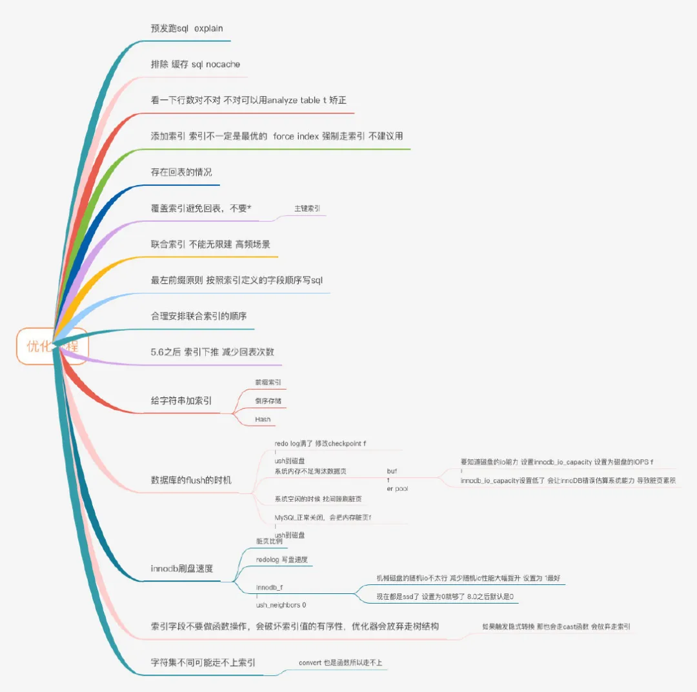

# mysql

## 调优

https://mp.weixin.qq.com/s/e0CqJG2-PCDgKLjQfh02tw

排除缓存干扰

数据库是存在缓存这样的情况的

Explain

analyze table tablename 就可以重新统计索

唯一索引普通索引选择难题

对于唯一索引来说，所有的更新操作都要先判断这个操作是否违反唯一性约束。

要判断表中是否存在这个数据，而这必须要将数据页读入内存才能判断，如果都已经读入到内存了，那直接更新内存会更快，就没必要使用change buffer了。001a