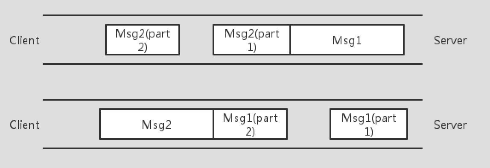

# 计算机网络

## TCP粘包

https://juejin.im/post/5b67902f6fb9a04fc67c1a24#comment

TCP 是一个面向字节流的协议，它是性质是流式的，所以它并没有分段。就像水流一样，你没法知道什么时候开始，什么时候结束。

解决：

- 在报文末尾增加换行符表明一条完整的消息，这样在接收端可以根据这个换行符来判断消息是否完整。
- 将消息分为消息头、消息体。可以在消息头中声明消息的长度，根据这个长度来获取报文（比如 808 协议）。
- 规定好报文长度，不足的空位补齐，取的时候按照长度截取即可。

## UDP实现可靠

https://zhuanlan.zhihu.com/p/30770889

**CP属于是通过增大延迟和传输成本来保证质量的通信方式，UDP是通过牺牲质量来保证时延和成本的通信方式，所以在一些特定场景下RUDP更容易找到这样的平衡点。**RUDP是怎么去找这个平衡点的

可靠的概念

在实时通信过程中，不同的需求场景对可靠的需求是不一样的，我们在这里总体归纳为三类定义：

l **尽力可靠**：通信的接收方要求发送方的数据**尽量完整**到达，但业务本身的数据是可以允许缺失的。例如：音视频数据、幂等性状态数据。

l **无序可靠**：通信的接收方要求发送方的数据**必须完整到达，但可以不管到达先后顺序**。例如：文件传输、白板书写、图形实时绘制数据、日志型追加数据等。

l **有序可靠**：通信接收方要求发送方的数据必须**按顺序完整到达**。

RUDP是根据这三类需求和图1的三角制约关系来确定自己的通信模型和机制的，也就是找通信的平衡点。 

UDP为什么要可靠

TCP是个基于公平性的可靠通信协议，在一些苛刻的网络条件下TCP要么不能提供正常的通信质量保证，要么成本过高。为什么要在UDP之上做可靠保证，究其原因就是在保证通信的时延和质量的条件下尽量降低成本

实现：

重传模式 窗口与拥塞控制

